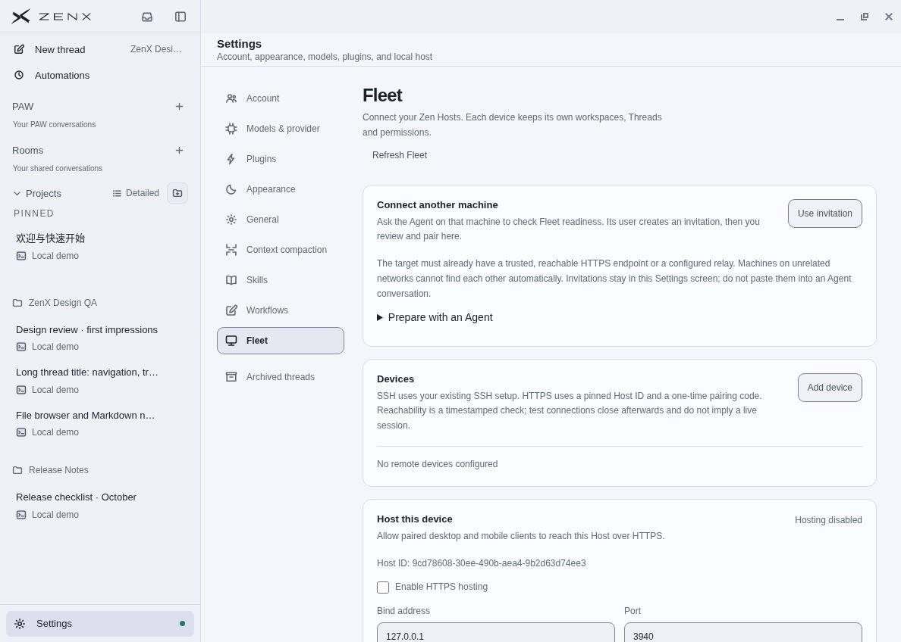
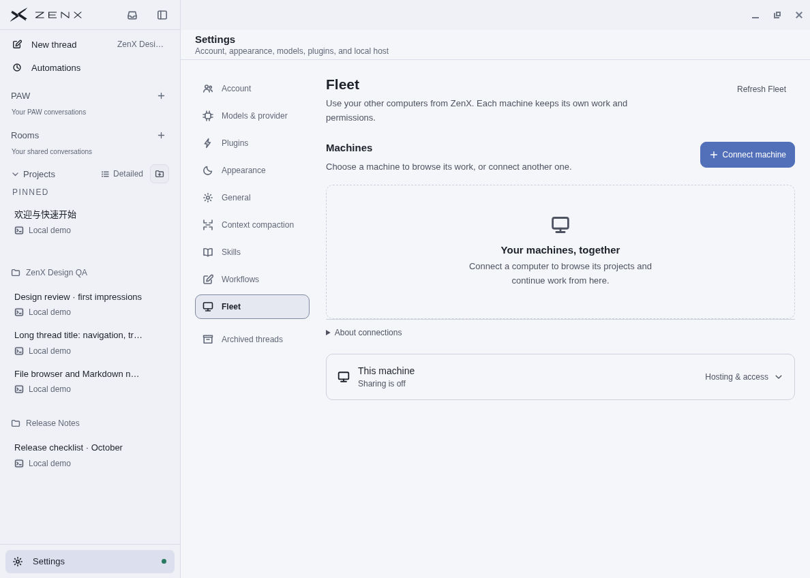
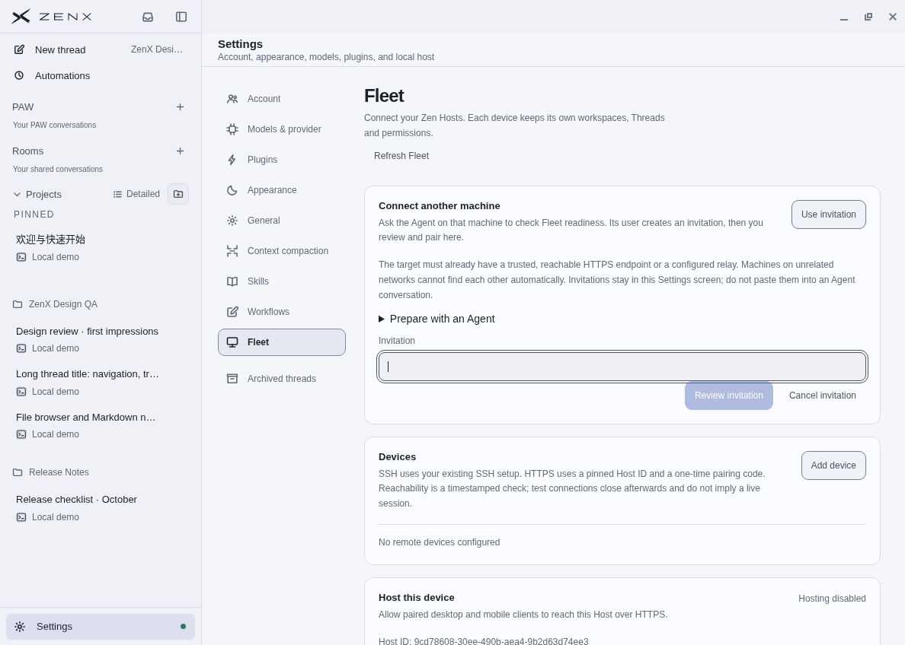
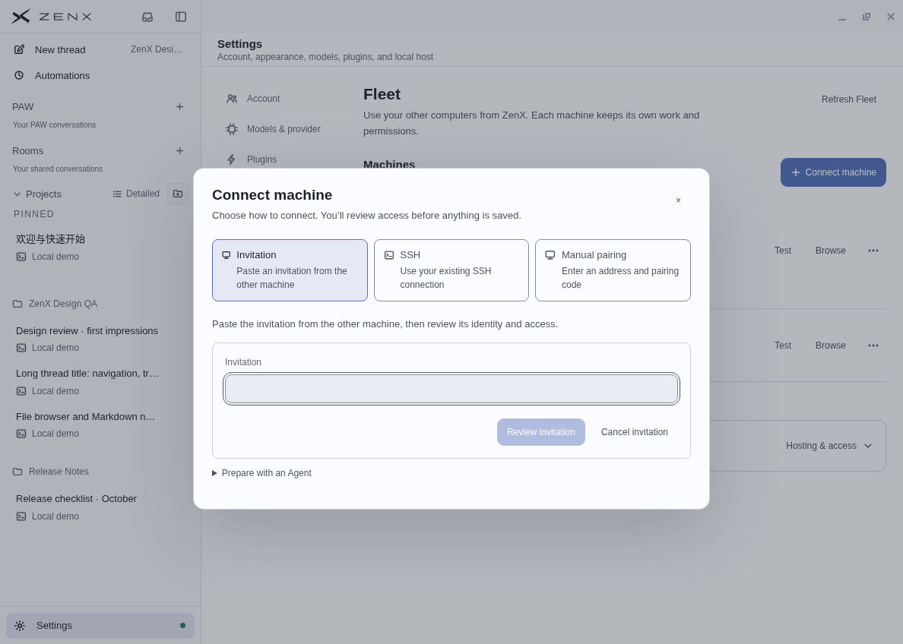
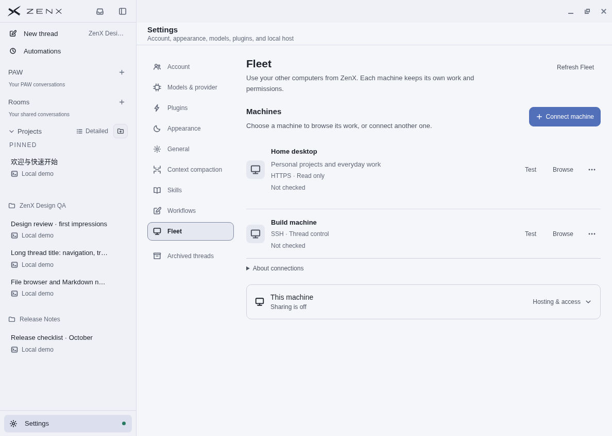
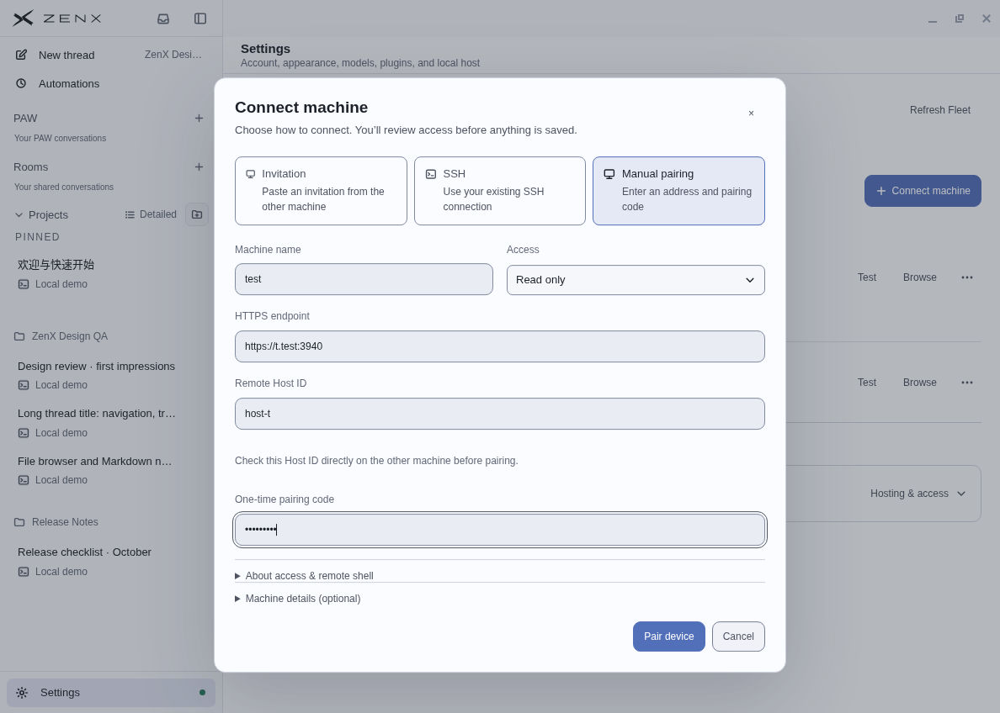
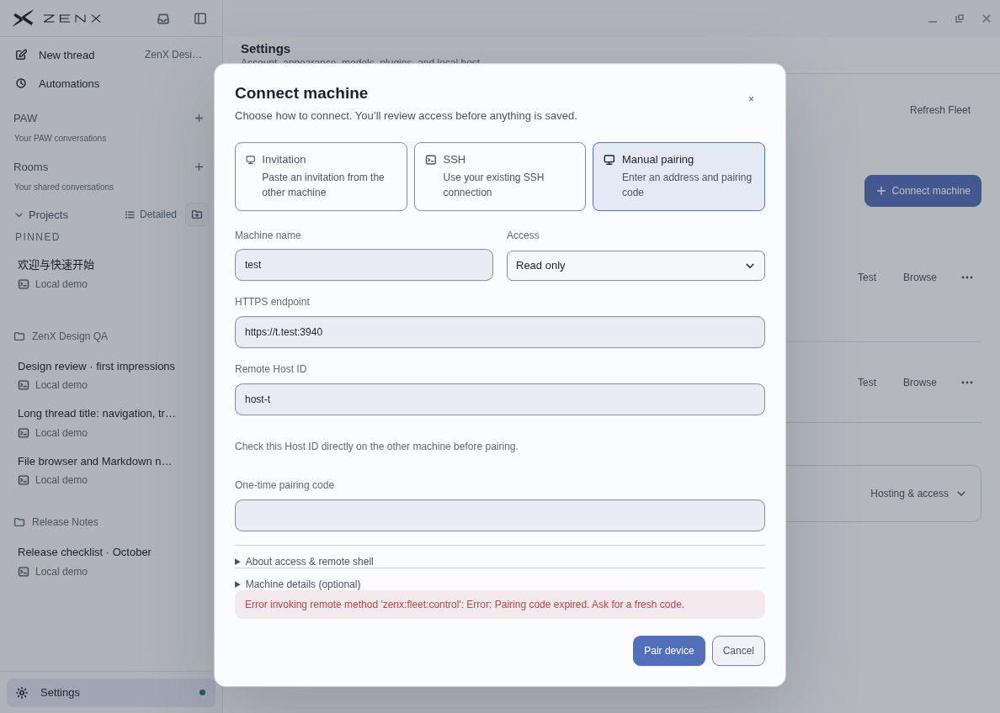
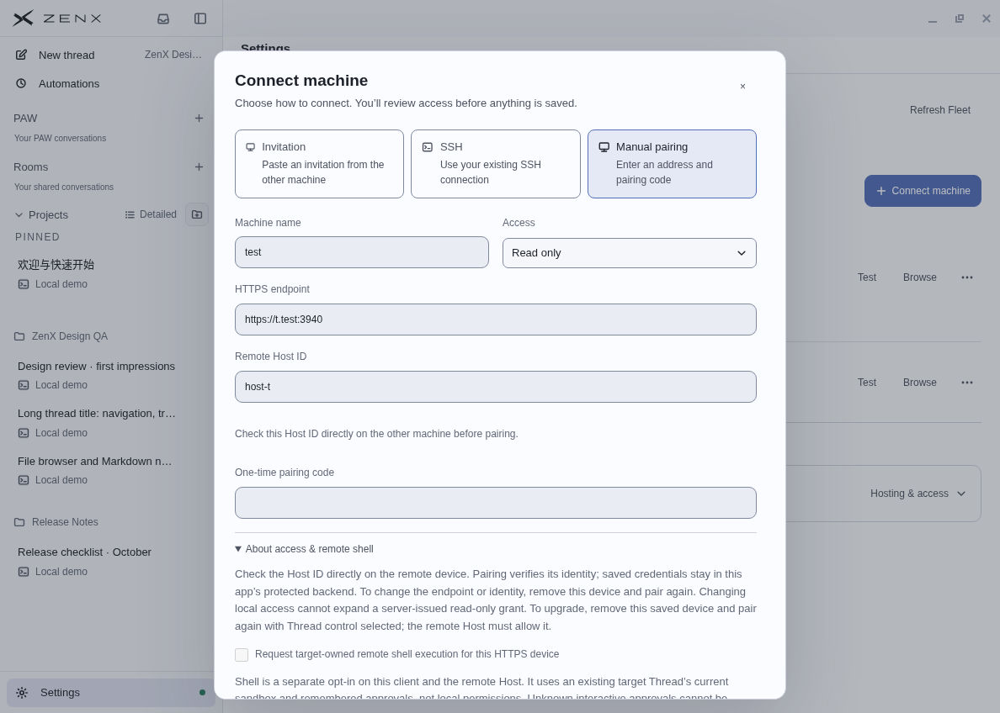
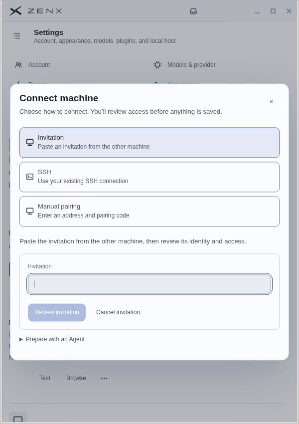
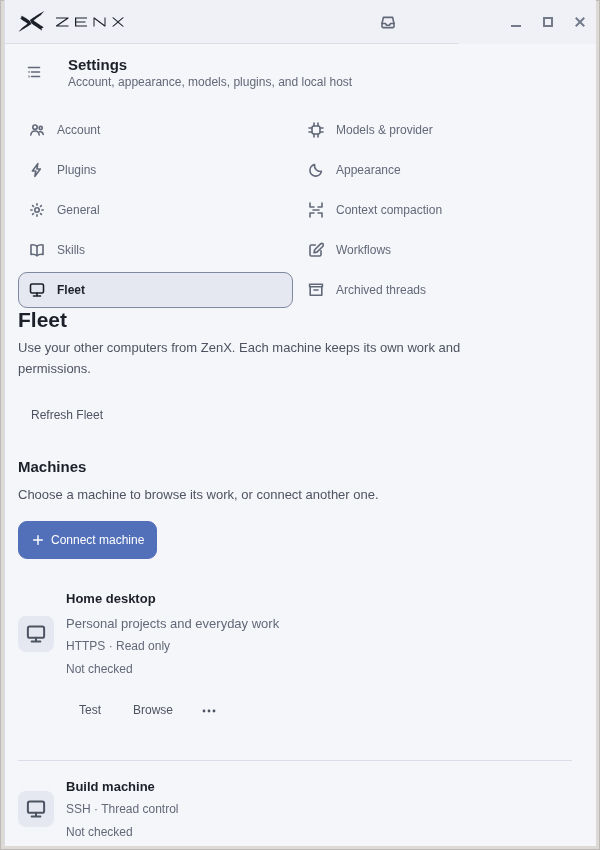

# Fleet connection redesign: visual and interaction evidence

Captured October 6, 2026. This is a focused Fleet UI change, not a new remote-access architecture.

## Reference actually inspected

Official T3 Code current source: [9bd1d800](https://github.com/pingdotgg/t3code/tree/9bd1d8009a6b7c50f9dd9458e2bf27d481ff3b43). The official hosted product redirected an anonymous Connections visit to its first-run Connect wizard. The actual hosted flow was inspected with **Add a computer** expanded. No account, machine pairing, or reference dev server was used.

Source-grounded settings patterns:

- [ConnectionsSettings](https://github.com/pingdotgg/t3code/blob/9bd1d8009a6b7c50f9dd9458e2bf27d481ff3b43/apps/web/src/components/settings/ConnectionsSettings.tsx): machine-first grouping and one add action
- [EnvironmentRow](https://github.com/pingdotgg/t3code/blob/9bd1d8009a6b7c50f9dd9458e2bf27d481ff3b43/apps/web/src/components/settings/EnvironmentRow.tsx): glyph, name, connection/access state and compact overflow
- [WelcomeWizard](https://github.com/pingdotgg/t3code/blob/9bd1d8009a6b7c50f9dd9458e2bf27d481ff3b43/apps/web/src/components/onboarding/WelcomeWizard.tsx): focused pairing input and nested preparation help

Adopted those hierarchy and interaction treatments in ZenX’s own existing theme and accessible controls. T3 authentication, relay products, route switching and backend semantics were not copied. The authenticated settings/SSH dialog were read in current source; they were not visually captured.

## Before and after

The empty-list comparison uses the same real Electron app, deterministic fake-provider profile, English/light appearance and 1188 × 848 native window. Baseline source is main `4d6b27004cd441847d86db92200a280e25800e7b`.

### 1. Fleet entry: clearer

Before: separate invitation and device cards compete, with listener/certificate controls already expanded below.

After: machines and Connect machine lead; connection explanation and local hosting/access are on demand.

### 2. Invitation entry: focused

Before: pairing expands inline among other settings.

After: one dialog, explicit method choices, focused invitation field and nested preparation help. The background machines in this capture are a public-data fixture.

### 3. Populated machines: sound

Real renderer/preload with test-only Fleet IPC data. Read/control and Not checked remain distinct facts; timestamps do not imply a live session. Edit/remove are behind the compact action button; Test and Browse stay direct.

### 4. Manual HTTPS: sound

Name, access, address, Host ID and one-use code are primary. A short Host ID verification instruction remains visible. Optional identity/description and shell explanations are disclosures; the Pair/Cancel footer fits the native window.

### 5. Error and repeat submission: sound

Two immediate Pair clicks sent one mocked IPC request. The test-only host rejected an expired fixture code. The editor stayed open, ordinary fields were retained, and the submitted code was cleared. A fresh fixture code then succeeded, closing the dialog, adding a read-only/Not checked peer, and restoring Connect focus. Two total mocked pair requests were logged, one failed and one succeeded. No real token, remote grant or network connection was created.

### 6. Optional shell disclosure: corrected

Checkboxes remain compact inside the portaled dialog. The default read-only path cannot opt into shell. Access choices and existing remote grant constraints are unchanged.

### 7. Narrow layout: sound

Native 600 × 850 window. Method controls stack; dialog and page remain horizontally contained. Long forms/page lists keep vertical scrolling. Machine glyphs stay beside their names, with actions on the following row.

## Behavioral checks

- Invitation trust review defaults to read-only with shell off; no grant is made before explicit pairing
- Cancel/Escape clear imported bearers and dismiss; reopening starts with an empty invitation input
- Manual ordinary new-connection fields survive method changes and page-local reopen; secrets and trust acknowledgments do not
- Existing-machine Cancel discards its edits; saving an existing machine does not clear a separate unfinished new connection
- Failed manual submission keeps ordinary fields and nearby errors; one-use code is cleared before the request
- Repeated Pair/Save clicks admit one request; controls cannot dismiss an in-flight submission
- First Escape closes a nested Access listbox only; a second Escape closes the dialog, including the imported-invitation path
- Edit returns focus to the initiating machine action; removal moves focus to Cancel and Cancel/Escape restore the action, while successful removal returns to Connect
- Route identity, explicit workspace choice, hosting consent, relay disclosure and existing client grants remain covered by existing tests

Latest source-focused checks: 44/44 UI/onboarding/localization/theme checks. Independent review additionally covered invitation parsing and embedded invitation Escape. The final two-line narrow-row CSS refinement passed the five theme/source checks and native recapture. All Fleet-focused checks before review-only refinements: 215/215; final focused regressions cover the refinements.

## Provenance and limits

Final product code: local `9cb041697a83a7ab120498d27eb8e1f154374d26`, complete tree `3b4306369c389dc66aabc54764f11864567254e2`. GitHub API product-code commit `5efb347b0c2838b4431f0222177f47e88332e5fa` has the identical complete tree. The screenshot/report commit adds evidence only.

Screenshots are actual Linux Electron pixels, captured and inspected through the cloud desktop. Fleet IPC was substituted only for populated-list/pairing fixtures; empty-list baseline/after use the real local service. Invitations and fixture codes are synthetic, never real credentials. No automatic pairing, grant expansion, user-computer install, merge or deployment occurred.

This does not verify native Windows/macOS presentation or live remote networking/TLS/SSH. Screenshots do not establish full accessibility compliance; focused DOM tests and keyboard probes support the tested interactions.

## Aggregate check limits

ZenX brand/typecheck/first-party preparation and production build passed. Normal tsx CLI cannot create its Unix socket in this shell; equivalent tests use node --import tsx.

Root aggregate: plugin SDK 25/25, IMZenX 36/36, and core 785 passed / 1 known unchanged Node URLSearchParams guest mismatch / 2 skipped. The full ZenX run encountered plugin-profile fixture timeout failures outside the changed UI. A focused retry passed the public fixture and reproduced three dev-control fence/timeout failures (1–3 second fixture deadlines). Aggregate success is not claimed; CI remains a separate exact-commit result.
