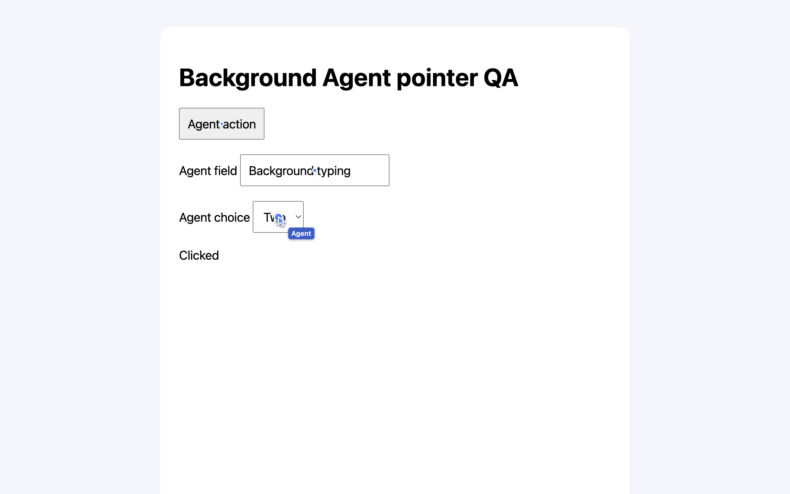
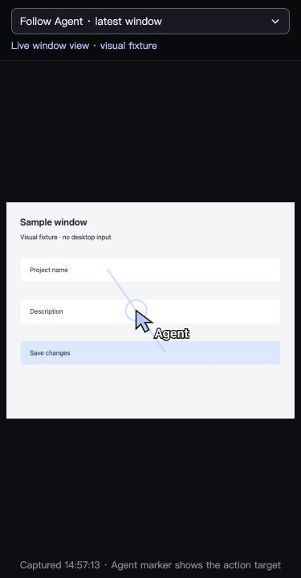

# Background automation validation

2026-10-05. Scope: the Agent pointer change, not whole-product acceptance.

## Real Electron behavior

`scripts/smoke-background-pointer.ts` runs the actual WorkspaceBrowser in a
disposable Electron profile against a local HTTP fixture. It verifies successful
click/type/select, rejection of a stale observation, and clearing after scroll,
resize and navigation. The before/after macOS frontmost application remained
`com.openai.codex`; the system pointer remained at the same position. No global
input was sent. The real probe also found the select option object-key-order
bug, now covered by a regression test and a passing real select operation.

The screenshot comes from the hidden target's WebContents, not a mock page of
the ZenX shell. The Agent label and dots are visual feedback for the three
semantic actions, not recorded physical mouse travel.

## Computer preview UI

The actual ComputerThreadPanel was rendered with deterministic frame/metadata
fixtures in the Codex in-app browser. Light desktop and dark 375 px views were
checked. Cursor size remains readable when the screenshot shrinks, and geometry
shares the screenshot's letterboxing. Reduced motion hides the trail/ring;
computed overlay pointer-events is `none`. No new keyboard focus target is
introduced. Component tests cover expiry, frame timing, resize and target change.

This is UI evidence with synthetic Computer metadata, not native AX end-to-end
evidence. The embedded Swift helper passed `swiftc -typecheck`; native permission
granting, physical multi-display input, daily installed ZenX, actual external
Chrome, Playwright and Windows were not exercised by this local visual probe.
Existing provider tests supply regression coverage, not a cross-platform visual
certification. See [implementation scope](../../background-automation.md).

## Automated checks

The local ZenX suite passed 1622 tests with 11 environment skips and no failures.
Focused additions cover Browser DOM isolation/no focus/stale actions and option
comparison; Computer transient metadata, frame geometry and continuous capture;
and pointer rendering/freshness/target isolation. TypeScript and the desktop
production build are checked separately. Exact final commit, review findings,
CI and any subsequent targeted rechecks are recorded in the PR.
