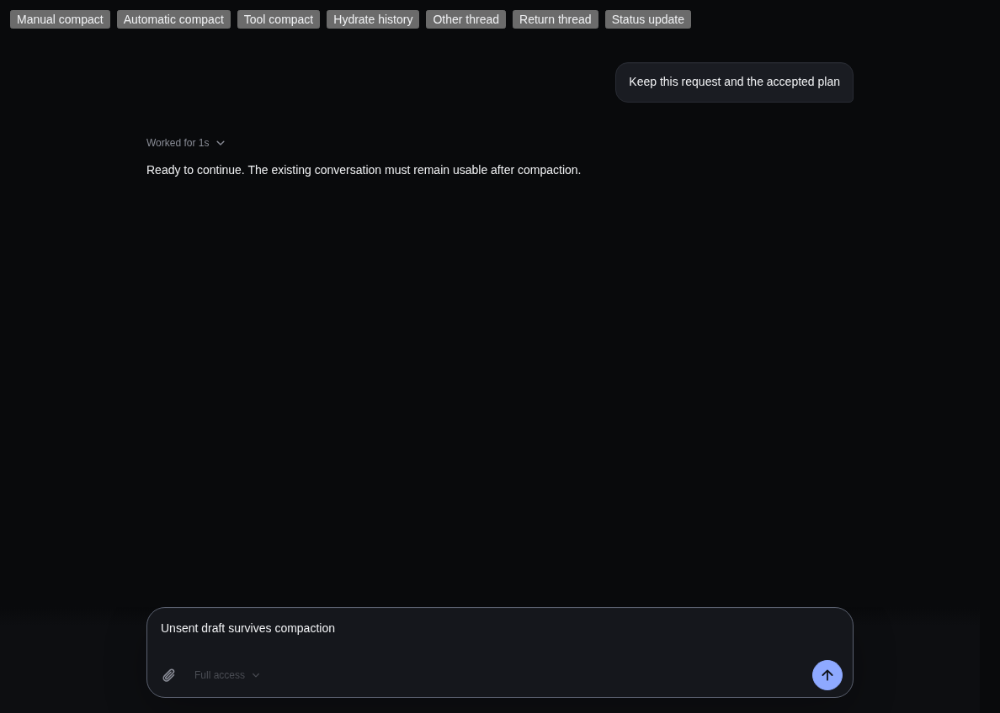
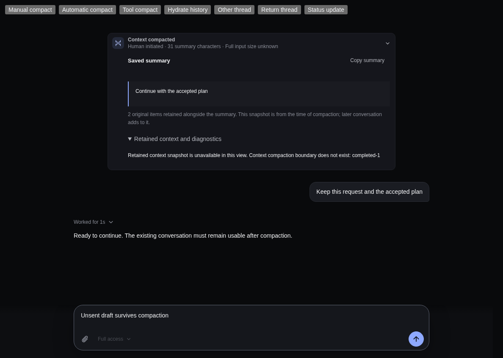
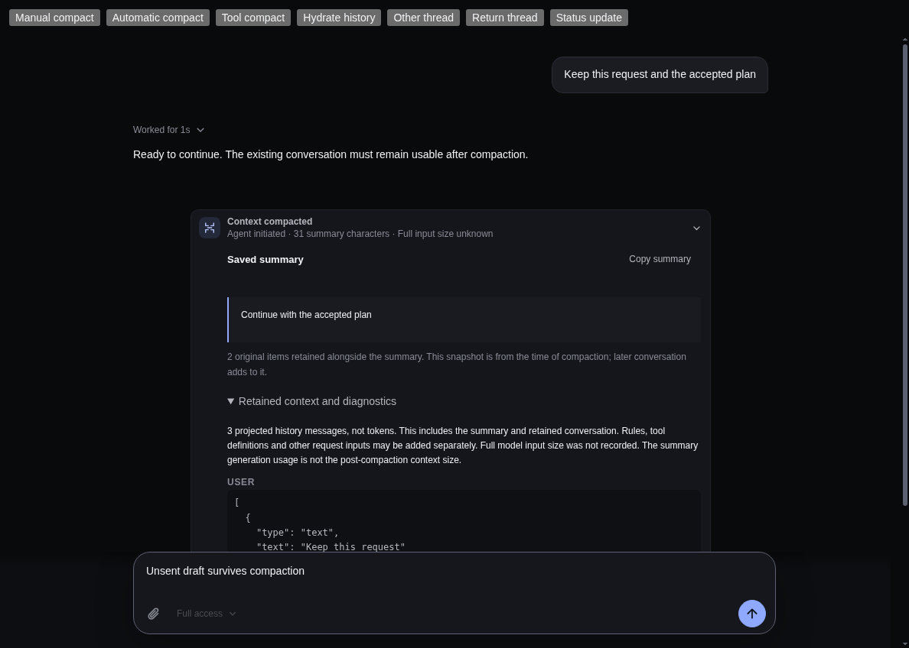

# Compaction rendering correction

## Behavior

A committed compaction summary remains visible even when the display history does not yet contain the canonical boundary or retained items. Retained-context diagnostics explicitly report that the snapshot is unavailable. An authoritative canonical read restores the exact diagnostic projection. Core completeness validation, compaction policy and request execution remain unchanged.

## Why the renderer blanked

A fresh display Thread can have no `canonicalItems`. Receiving a live `context_compaction` event creates a partial array containing the compaction, but not necessarily its earlier boundary or retained items. `ThreadView` eagerly compiled that incomplete array during rendering. Core correctly threw `Context compaction boundary does not exist` or `Retained context Item does not exist`; the uncaught exception unmounted the React root.

[The earlier related correction in PR #249](https://github.com/albert-zen/zen/pull/249) was still draft and unmerged when this investigation began on 6 October. This focused correction preserves the current main presentation and localization without importing that feature branch.

## Native before and after

These are native official Electron captures of the production `ThreadView` and native-event reducer with synthetic preload/main-process IPC. The window was isolated and offscreen. No API keys, real model accounts, paid calls, production Host writes or user conversation data were used. Baseline production source is main `4d6b27004cd441847d86db92200a280e25800e7b`; corrected production source is independently reviewed local `fa09f3d29b1224438517a20022fb500af0c8ac1e`, tree `3dd8ab8a8a2d2723d0f7efffc5ed9850a7c61f9c`, identical to the published source commit `04e6cf033e525a3779d4beca9f636d6026dab251`. This evidence-only commit does not change that implementation.

### Baseline

After the manual, automatic and tool/agentic events, the baseline unmounted the root (`root.children.length = 0`) with the same missing-boundary console exception:

[Manual blank](before-manual-partial.png) · [Automatic blank](before-automatic-partial.png) · [Tool/agentic blank](before-tool-partial.png)

### Corrected partial history

[Automatic summary and diagnostics](after-automatic-details.png) · [Tool/agentic summary and diagnostics](after-tool-details.png)

All three kept their summary, existing conversation and unsent draft. Duplicate events, status updates and switching away/back were covered. The corrected native pass had zero renderer console errors.

### Authoritative hydration

The retained-context list is absent while references are missing and present after hydration. Manual and automatic hydration followed the same verified path.

## Verification and limits

- Four new regressions failed on the unchanged baseline and passed after the fix
- Owner: 98/98 affected ThreadView, event-reducer and compact-command tests
- Independent Astra review: 101/101 focused tests, both ZenX TypeScript projects, full-history parity, nonmutation, duplicate/foreign event handling and per-compaction error isolation; no blocking finding on the exact source commit/tree
- ZenX Node/Web types, prepared production Electron build, repository-wide Prettier and diff whitespace passed
- Standard root check with Node 22 and workspace caches passed formatting, Python format/lint, Core/SDK types, builds, SDK 25/25 and IMZenX plugin 36/36. Core finished with 784 passes, 2 skips and 2 empty-stderr assertion failures receiving the runtime-injected `EnvHttpProxyAgent` warning. Relevant Core/CLI/SDK/plugin source is unchanged from the baseline. Python/integration tests were not reached after those failures
- The first broad ZenX attempt lacked required first-party-plugin preparation and the default npm cache was unavailable. It is not a clean aggregate validation

This is focused native component/event-boundary evidence, not full provider-to-Core-to-production-App end-to-end certification. Native Windows/macOS, real provider quality and screen-reader behavior were not tested. No clean aggregate pass or merge approval is claimed.
