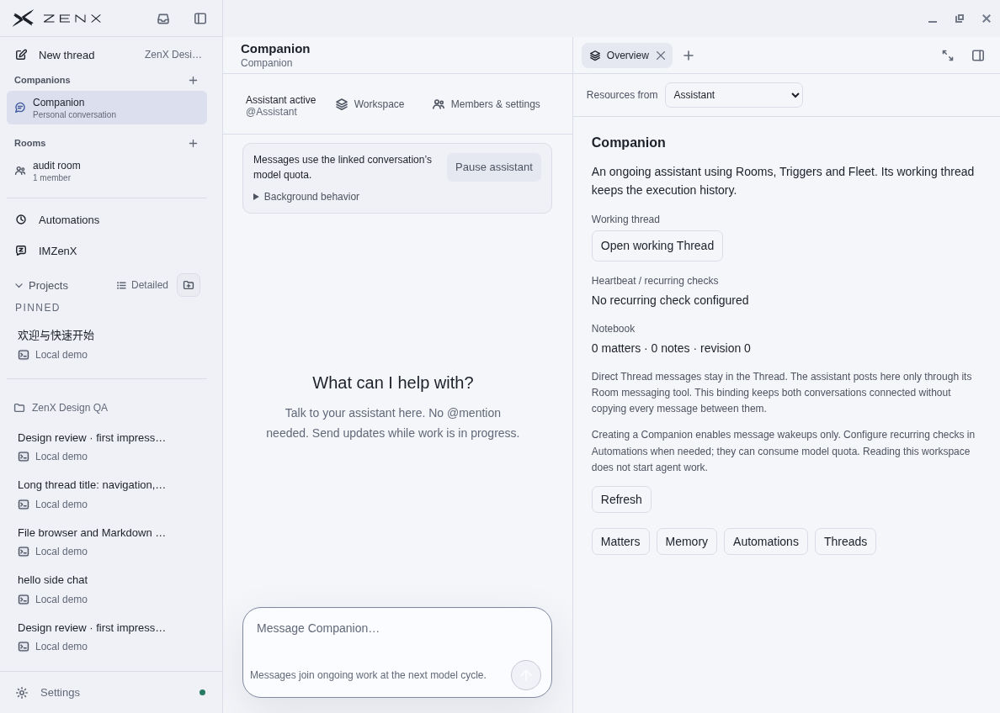
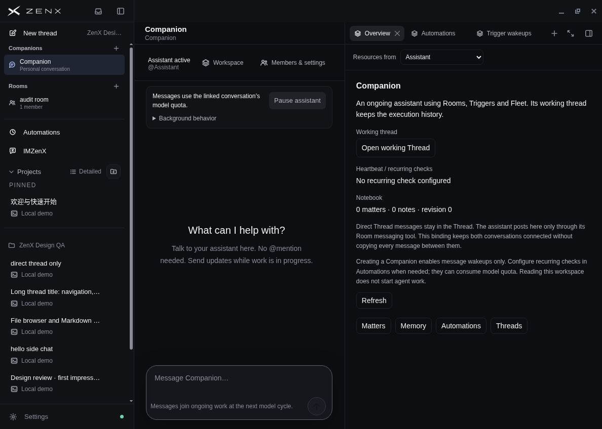
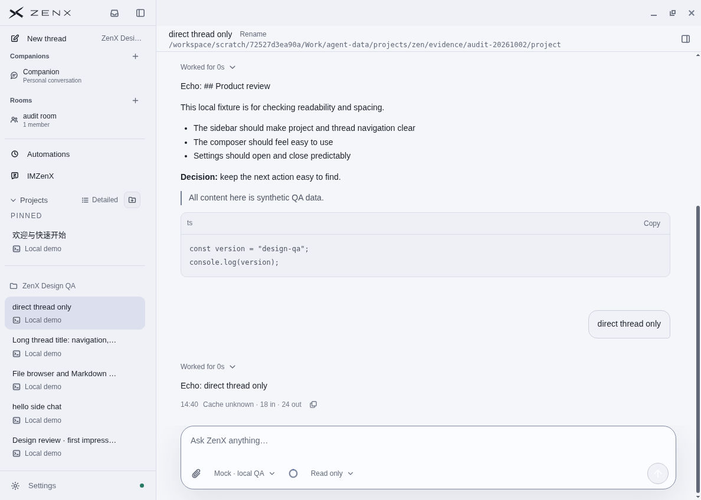
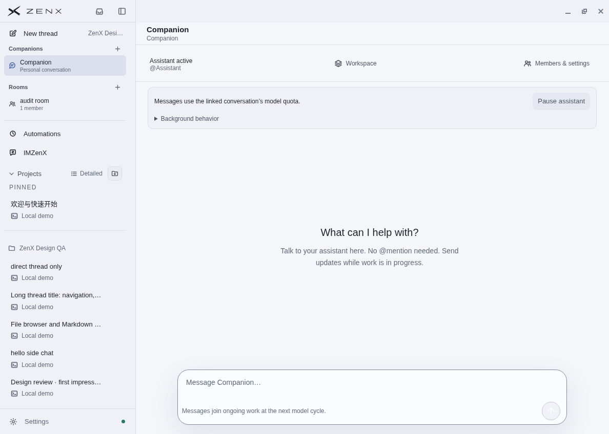
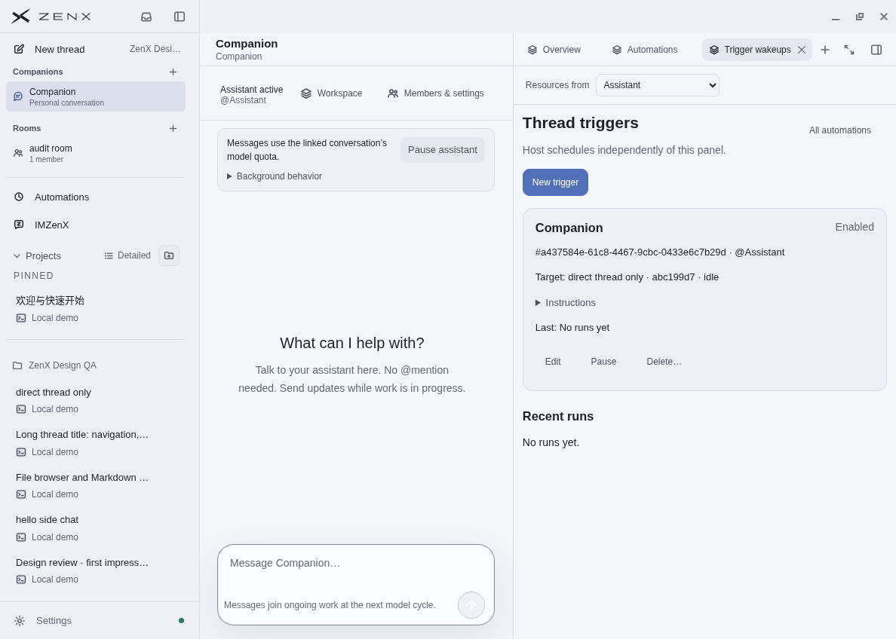

# Companion follow-up verification — 3 October 2026

All current screenshots below were captured from the integrated product build at `bac6f09`, in a real Linux Electron window using an isolated synthetic profile and a deterministic local mock model.

## Current appearance

The native operations row shares the Sidebar top surface; the conversation title and auxiliary tabs sit below it. Companion uses a conversation bubble icon. Both themes were opened and checked.

## Direct Thread and Room separation

Clicking **Open working Thread** opened the bound Thread in the main conversation area. Sending `direct thread only` produced a local mock response there. Returning to the Companion Room showed its existing empty history: neither the direct message nor the mock response was copied into the Room.

This verifies the direct-Thread-to-Room boundary and navigation. It does not evaluate a real model's choice of when to call the explicit Room-post tool.

## Follow-up controls

The Overview distinguishes message wakeups from recurring checks and displays **No recurring check configured**. Automations → Configure automations opened the existing Thread triggers panel, showing the exact bound target and the New trigger entry. Viewing these controls did not create a recurring timer.

## Verification limits

This is a focused follow-up to the [2 October whole-product walkthrough](../ui-2026-10-02/README.md), which is historical evidence. It is not a new all-page audit. No user credentials, real model API, native Windows/macOS, or external Fleet device was used. Mock responses establish UI wiring and channel separation, not autonomous task quality. Message receipts, quote replies and reactions are reviewed separately.
