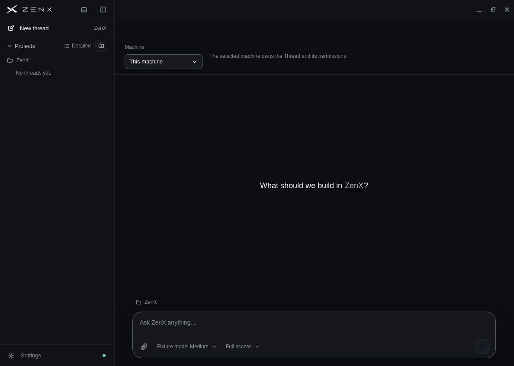
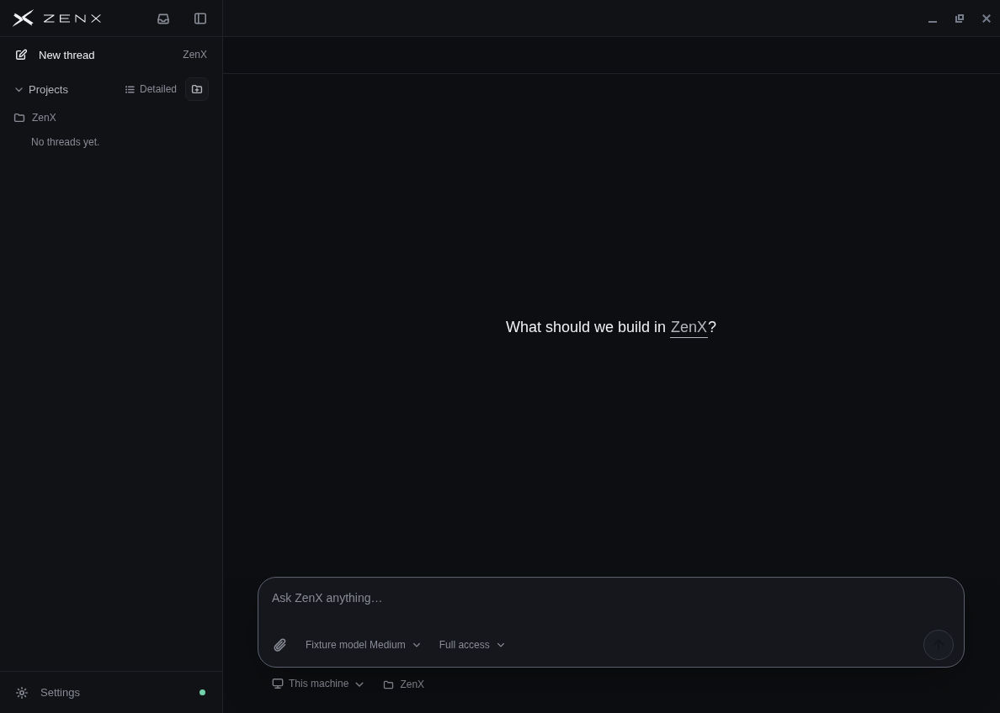
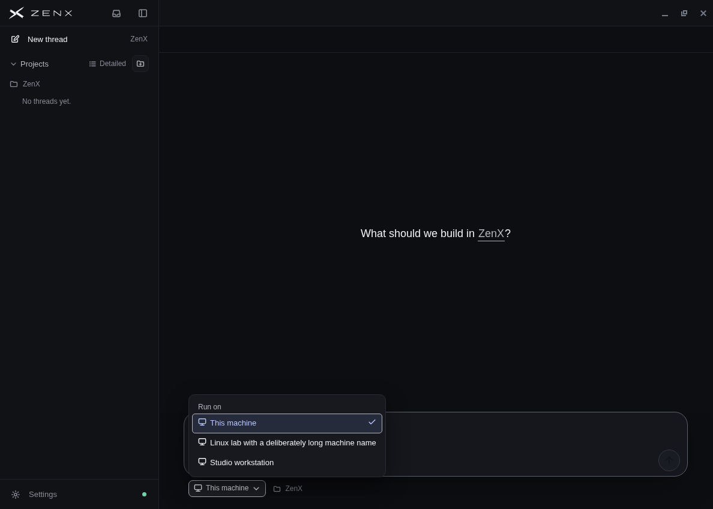
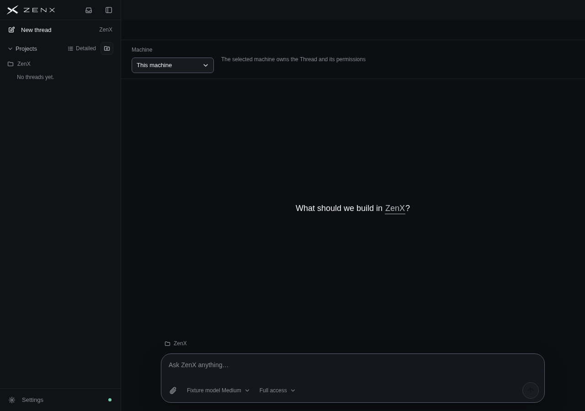
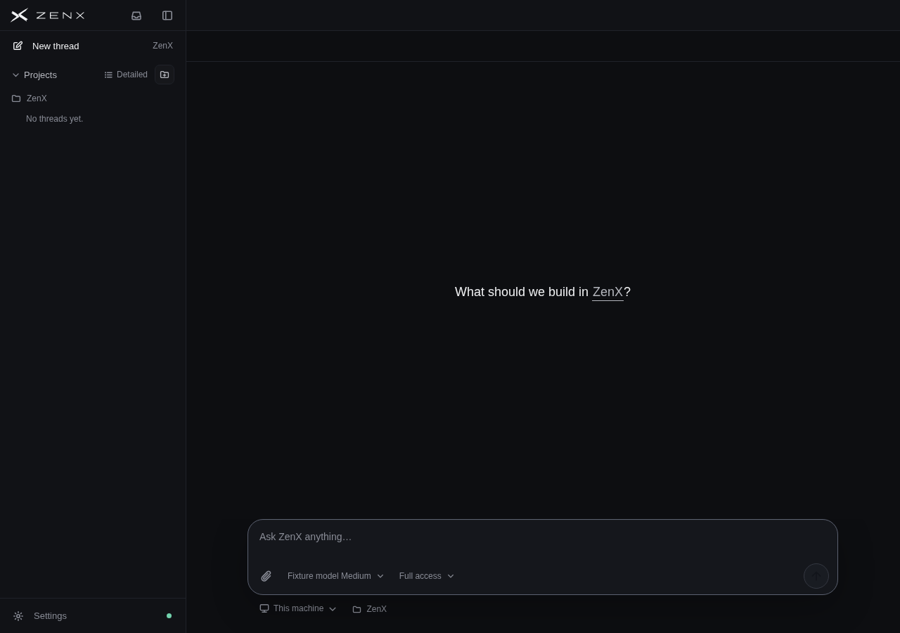
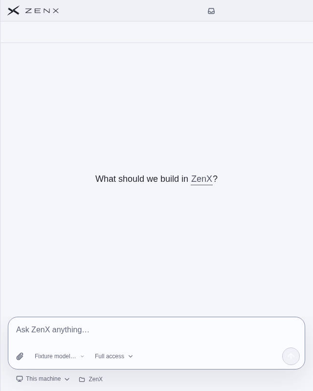
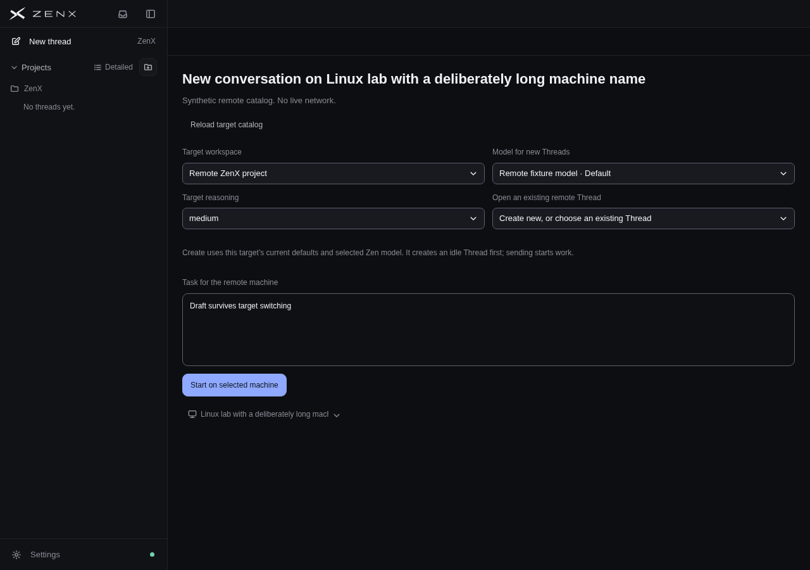
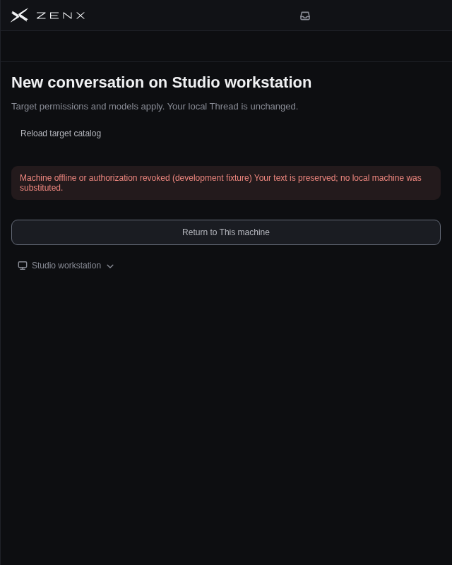
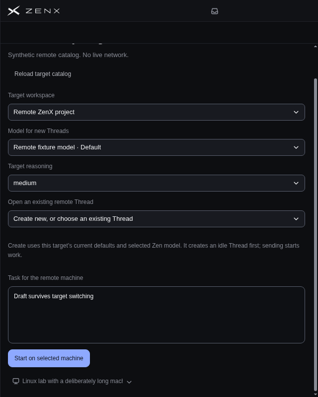
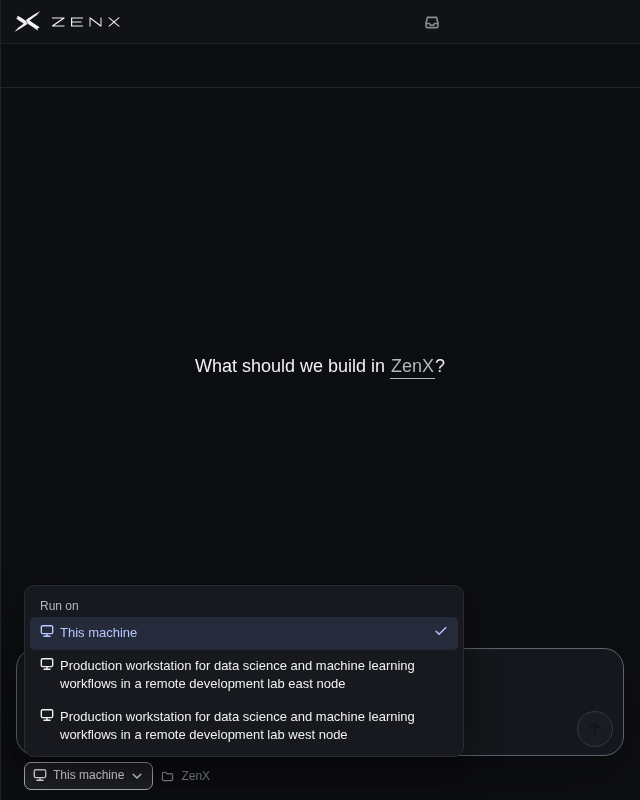

# New-thread machine choice and caption-row separator

Code reviewed: `165338b170fde3b01480ca7bbac280a6a75b07f2`  
Baseline: `838910493b41283171c4e095b1486b8b62df2fe7`  
Date: 2026-10-07

## Before / After: native Linux

These are actual Electron 43.2.0 windows on the Linux cloud desktop, with the production native caption controls. The App uses a synthetic API; no configured user machines, credentials, pairing, or live remote execution were used.

| Before                                                                                                                                      | After                                                                                                                    |
| ------------------------------------------------------------------------------------------------------------------------------------------- | ------------------------------------------------------------------------------------------------------------------------ |
|  |  |

The native screenshots retain the pixels returned by the desktop capture. That capture returns JPEG; the PNGs are lossless re-encodings of those pixels. The caption detail is an explicitly enlarged inspection crop, rather than a separate rendering.

## Windows platform fixture

Windows layout is rendered in Electron on Linux with a Windows platform/User-Agent fixture. These images check the Windows renderer selectors and geometry; they are **not** a native Windows caption-control test.

| Before                                                                                  | After                                                                                 |
| --------------------------------------------------------------------------------------- | ------------------------------------------------------------------------------------- |
|  |  |

## Scope and implementation

- Removes the page-wide machine settings strip from the new-thread surface
- Places a compact icon/name **Run on** menu beside workspace, in the lower input context row
- Keeps the shared accessible Select primitive for keyboard navigation, Escape, typeahead, focus, and viewport-aware positioning
- Keeps This machine as the default. Changing targets preserves text, clears only the previous target's ephemeral catalog/workspace view, and fences late replies
- Blocks target changes during local submission and after a remote locator is created. The remote machine identity remains readable
- Retains existing catalog, workspace, model, read-only, create/send/read, uncertain-outcome, and attachment behavior. No backend or Provider experiment changes
- Draws one pointer-transparent 1px seam across the Windows/Linux native caption row, using the same `--color-border-subtle` token and y=43 position as the sidebar border
- Leaves existing conversation context placement unchanged; only new-thread input requests the lower context position

## T3 reference

Latest official T3 main fetched for this task: [`cd41c4ada0c70cc2eec95ecd7266f3dab010c58c`](https://github.com/pingdotgg/t3code/commit/cd41c4ada0c70cc2eec95ecd7266f3dab010c58c), committed 2026-10-07 08:38:47 UTC.

- [Machine selector source](https://github.com/pingdotgg/t3code/blob/cd41c4ada0c70cc2eec95ecd7266f3dab010c58c/apps/web/src/components/BranchToolbarEnvironmentSelector.tsx): compact icon/name trigger, Run on group, machine options, and locked identity
- [Composer context placement](https://github.com/pingdotgg/t3code/blob/cd41c4ada0c70cc2eec95ecd7266f3dab010c58c/apps/web/src/components/BranchToolbar.tsx#L603-L721)
- [Official app image](https://github.com/pingdotgg/t3code/blob/cd41c4ada0c70cc2eec95ecd7266f3dab010c58c/apps/marketing/src/assets/app-desktop.webp), also [verified on the official site](https://t3.codes/_astro/app-desktop.BOCg1ktw.webp)

The official image was inspected and shows the attached lower composer context strip. It does not show an open machine dropdown because its primary-host indicator is hidden. The machine-dropdown details above are verified from current official source, rather than attributed to a live screen we could not access. No T3 account or environment setup was performed.

## Interaction and visual checks

Whole-App synthetic fixtures covered Linux and Windows renderer platforms, dark/light themes, 1280×900 and 640×800:

- Keyboard opening and Escape dismissal; focus returns to the machine trigger
- Local → remote → local selection with typed text preserved
- Late catalog responses cannot replace a newer target
- Offline/revoked target stays selected; no local substitution, creation, or send
- Catalog retry and return-to-local preserve the text
- Long names and popup collisions, including two 108-character names whose distinguishing east/west suffixes remain visible
- No renderer errors or horizontal document overflow in checked states
- Local footer remains visible. Narrow remote configuration uses ordinary vertical scrolling; its footer is reachable and focus reveals it
- Collapsed sidebar and full-width separator

Native Linux additionally verified the exact production overlay configuration: transparent `#00000000`, symbol color `#737b8a`, height 44. The y=43 seam remains visible beneath the native right controls. Actual caption minimize, restore/maximize, and close work; the input controls do not overlap the caption region.

## Independent review and automated checks

First independent review of `6f14b9c` reproduced one P2: long names were clipped identically in popup options. Fix `165338b` restricts ellipsis to the trigger and lets popup labels wrap inside a constrained ItemText span. A fresh independent review verified both 108-character suffixes and option client/scroll widths of 428/428px, compared with the previous 428/685–687px.

Passed locally:

- Final Fleet/titlebar focused tests: 12/12
- Prior combined Fleet/localization/ThreadView/state/titlebar run: 98/98, plus the new context-order regression
- First independent reviewer Fleet/ThreadView/titlebar run: 82/82
- Final ZenX typecheck and production build
- Changed-file formatting and diff checks
- Isolated IMZenX UI rerun: 18/18

The broad local ZenX suite encountered three plugin-development timeout tests which also reproduce on untouched baseline `8389104` in this environment. An IMZenX UI file-level failure from the broad run passed all 18 tests when rerun alone. No plugin runtime or installer code was changed. Full-suite completion and hosted CI results must be reported separately; the checks listed above do not imply every local or hosted check is green.

This is a draft correction. It does not merge the existing compaction, plugin-layout, or send-control drafts, and does not publish an app release.

Publication boundary: the proposed supplementary architecture sentence was omitted because publication of that document was not approved. `ARCHITECTURE.md` stays identical to the base; the existing Fleet new-thread target and shared UI control contracts continue to describe the unchanged ownership model. The reviewed implementation files retain their exact reviewed contents.
