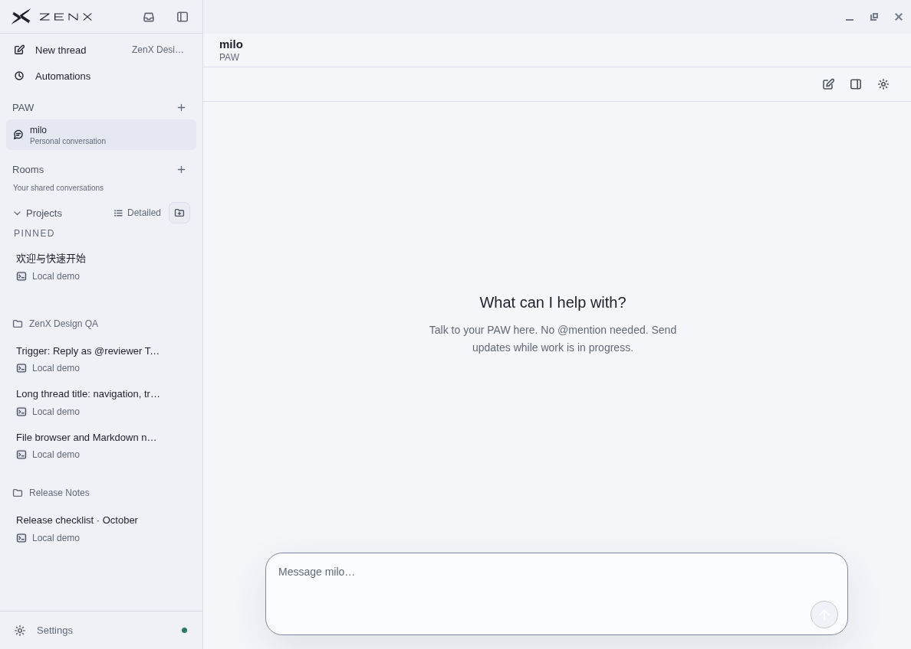
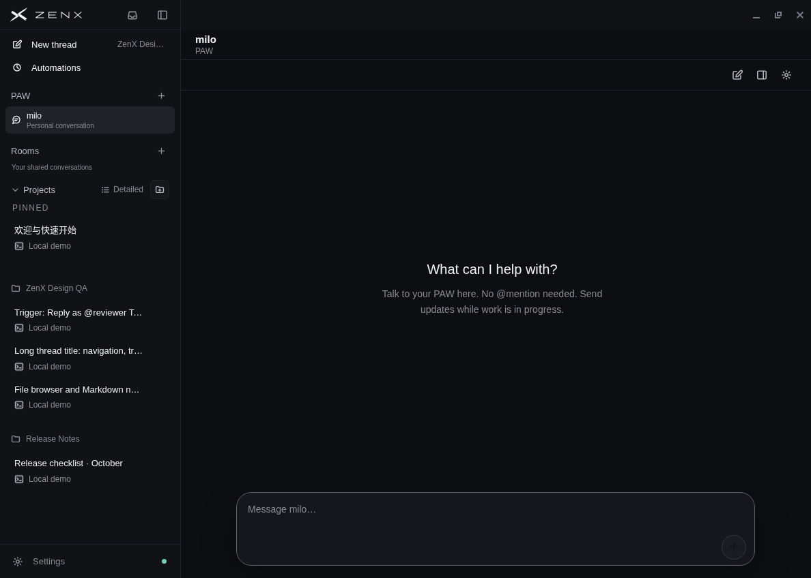
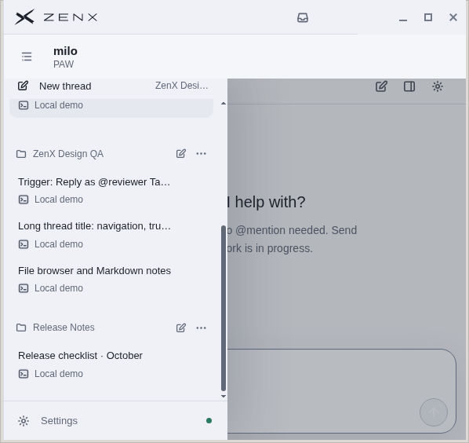
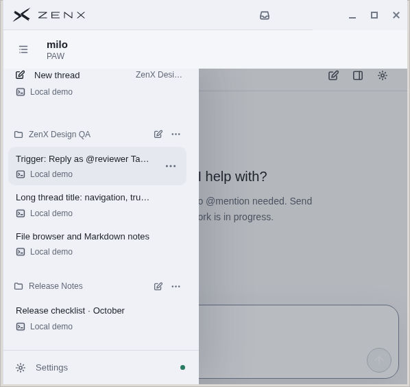
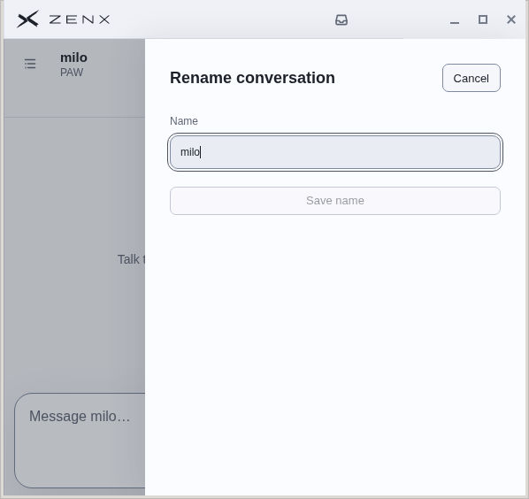

# PAW conversation cleanup — 2026-10-04

Source verified: `493d35781b48c0ddd33aee3e1f92fc5de62422ca` (on PR 247).

## Changes

- PAW and Rooms now appear below plugin entries, as peer sections with Projects. Conversation rows use neutral selected surfaces.
- Normal PAW chat no longer shows active-state, model quota, background implementation or model-cycle instructions. Compact rename, workspace and settings actions have tooltips and accessible names. Paused replies and delivery errors remain explicit; Pause/Resume is in settings.
- Rename opens a focused name field with Save name and Cancel. It changes the display name while preserving the Room ID and working Thread binding. Escape does not submit. A delayed save cannot dismiss a newer reopened dialog or erase its newer name draft.
- Redundant Room and pinned-list separators were removed. Group headings and spacing remain; no divider ends early beside the native scrollbar gutter.
- Existing native scrollbar behavior is retained: transparent tracks, theme-linked thumbs, visible during activity/edge dragging, transparent at rest. No scroll container was disabled or replaced.

## Actual Linux checks

An isolated profile with synthetic data and a deterministic local provider was used; no real account, provider key or remote device was involved. The test app was built from the source above.

Verified wide (1188 px) light/dark layouts and a short narrow (598 × 564 px) window; PAW creation, rename and Escape, pause/resume; sidebar wheel scrolling and native thumb dragging; plugin settings scrolling; visible thumb during activity and hidden thumb after moving away and resting. The sidebar footer stays outside the scroll region. No renderer error was observed in these flows.

### Current light and dark chat

### Short viewport: active scrollbar and idle scrollbar

The track blends into the sidebar, and group boundaries no longer leave truncated horizontal rules. The two screenshots preserve the same scroll position and gutter geometry.

### Rename in a narrow window

## Automated evidence and review

- Relevant Room/Sidebar suite: 131/131 at `736ae08`; final delta is one CSS border removal
- Final CSS/sidebar/scrollbar review checks: 28/28, independent R3
- ZenX production build and Node/Web type checks passed for the functional changes; final CSS build passed
- R1 found a pending-rename/new-dialog lifetime bug; it was fixed and covered by a deferred-command regression. Independent R2 passed, including a separate same-kind Rename → Cancel → Rename probe
- Independent R3 passed the final one-line separator cleanup

These are bounded UI checks, not certification of every page or platform. Native Windows/macOS appearance, real touch input, real-provider behavior and remote devices were not exercised in this pass. Forced-colors fallback was inspected in source, not visually tested.
