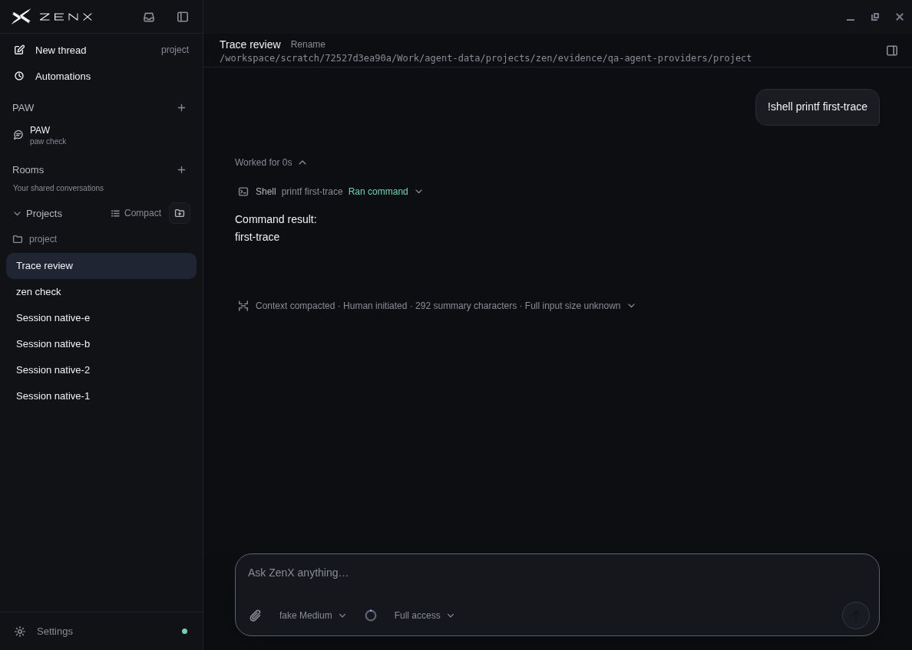
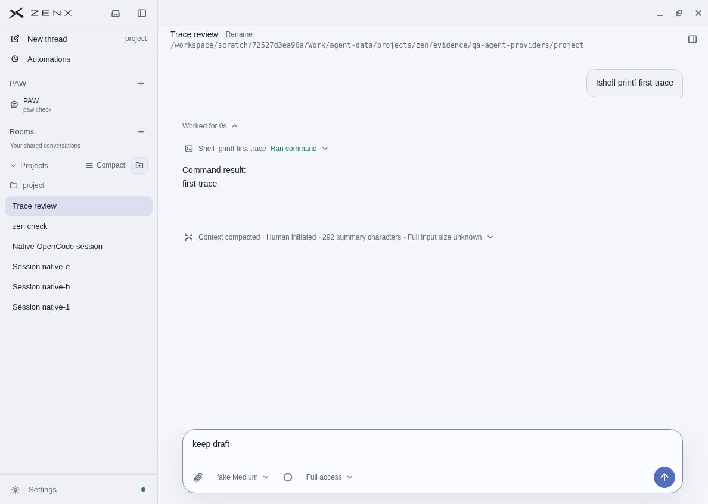
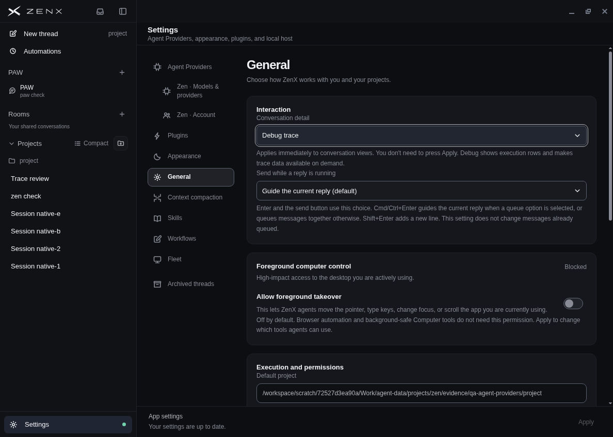
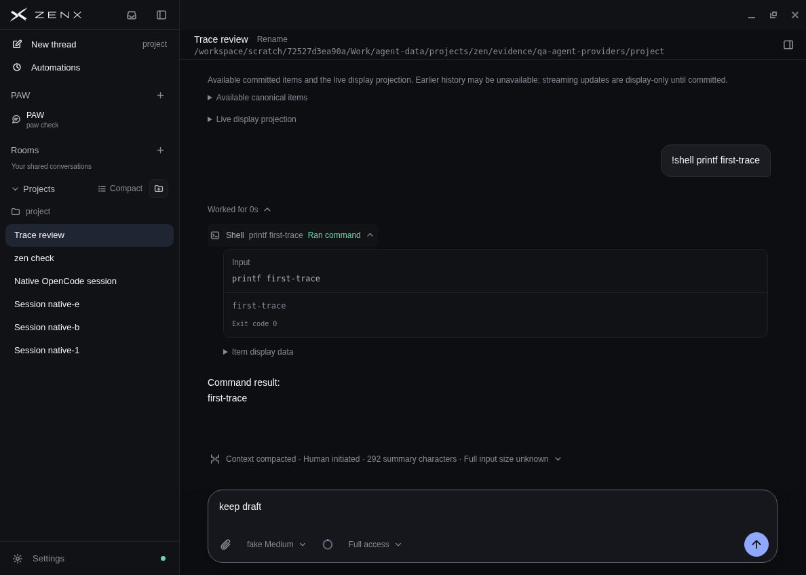

# Provider navigation and trace polish

Zen, Codex and OpenCode conversations now share the ordinary Project list. A single Composer picker controls the Agent Provider and its models; existing native sessions retain their exact provider identity. Normal traces stay compact, with optional debug detail in the same transcript.

## Current screenshots

Conversation and Settings captures show product build `4837bc0472da35c5b723a58fcf40060f788d3af8` (`02b1a6b` adds test-only selector changes). The unchanged narrow provider-picker capture is from `228041b9f5aa0b2b729a69035fdecf11543aecaa`. The final retention/compaction smoke and its three proof captures use `0dcbb4d61eb8b9648c47ca1789aa847b154e0ee6`; later copy-only changes are identified below.

### Normal trace, dark and light

### Optional debug detail

Conversation detail applies immediately through Settings → General → Interaction. Normal mode adds no transcript toolbar. Native debug data is explicitly a display projection; it does not claim access to the engine's complete native history.

### Narrow provider picker

[Provider picker at 598px](narrow-picker.png), [normal conversation](narrow-normal.png), and [raw debug disclosure](narrow-debug.png).

Earlier evidence is historical: [before navigation](before-navigation.png) and [initial Agent Providers review](../agent-providers-2026-10-04/README.md). It is not the current design.

## Actual user-flow checks

1. Opened the same Project's Zen, Codex and OpenCode conversations. Both sidebar densities retain normal row selection, and native titles no longer repeat engine/cwd subtitles. Existing native sessions lock their exact provider and show only that provider's models.
2. Switched a new draft from Zen to Codex without losing text, sent through the offline native peer, and stopped a subsequent turn. The UI showed Interrupted. Returning to the Zen thread and visiting Settings preserved its unsent draft.
3. Used the shared Settings Select with mouse and keyboard. Its mode changes immediately. Actual App navigation initially reset open tool/Turn disclosures; the final correction was retested through the real Settings route for both Zen and OpenCode. Open bodies, explicit Turn choices, drafts and an older-history reading position now survive. Raw data stays behind separate disclosures.
4. Reopened the exact history that previously blanked the renderer after manual compaction. The summary and retained context now render. A fresh first send followed immediately by Compact context also succeeds.
5. Checked 1188×848 and 598×848, light and dark. The native title row remains separate, the narrow sidebar can be reopened, menus fit the viewport, and diagnostic JSON wraps within its own scrollable disclosure. PAW retains its separate IM view; direct Thread tool messages do not appear in its Room.

The Zen fixture requested a harmless local `printf` command to produce a real tool trace. The model and compaction response were synthetic; the visible echoed summary is not an assessment of model quality.

## Reference choices

- [T3 Code Sidebar](https://github.com/pingdotgg/t3code/blob/5cc99e1c23980d7995a13c47f969b47cb68ed1be/apps/web/src/components/Sidebar.tsx#L1401) uses one neutral row surface model and reserves surface changes for interaction/selection. Secondary provider/environment information belongs in a tooltip. ZenX adopts this hierarchy while preserving its own Project identity.
- [T3 provider/model picker](https://github.com/pingdotgg/t3code/blob/5cc99e1c23980d7995a13c47f969b47cb68ed1be/apps/web/src/components/chat/ProviderModelPicker.tsx) scopes models by exact provider instance. ZenX reuses its own shared Composer controls and does not imply cross-engine continuation.
- [DeepSeek Harness presentation modes](https://github.com/deepseek-ai/deepseek-harness/blob/639ed015397290b3745d163aafe02ffee4aa3f84/packages/client/ui-chat/src/client/conversation-nodes/README.md#display-modes) progressively expose work while preserving individual disclosures and item order. ZenX's normal/debug split is an adaptation, not DSH's exact four-mode design.
- [DSH compaction marker](https://github.com/deepseek-ai/deepseek-harness/blob/639ed015397290b3745d163aafe02ffee4aa3f84/packages/client/ui-chat/src/client/chat/CompactionItem.tsx) is a compact row with an optional summary. ZenX uses a lightweight standalone marker and keeps tool-associated compaction with its matching tool.

These references were inspected in pinned source checkouts. Their full apps were not run during this audit.

## Final smoke and limits

On final GUI build `0dcbb4d`, both Zen and native Settings round trips preserve manual disclosures and drafts; reading older native history stays in place after Settings. Switching to another engine shows its own history/model/draft. A fresh Zen first send followed by Compact context succeeds and its summary expands with five retained items. The earlier renderer crash is resolved. See [Zen retention](zen-retention.png), [native retention](native-retention.png), and [fresh compaction](fresh-compaction.png).

The final retention correction was verified by its owner and this actual GUI pass after the third independent review. It did not receive a fourth independent review. Final source `4445bceef49219d7967622a4ea76086f48858007` changes only an incomplete-history diagnostic sentence and its matching test after this GUI build. It says “Only the current display projection is available,” avoiding an incorrect native-engine implication for a fresh Zen thread before hydration. This report is not a merge approval.

Implementation verification: **287/287 affected tests passed on `0dcbb4d`**, with Node/Web typechecks and prepared Electron build passing. The final copy-only `4445bce` delta passed **7/7 trace tests** and the prepared build. The broader earlier aggregate on `96e4e9` had **1,713 passing, two reproduced baseline plugin-development failures and 11 skipped tests**. One 1,024-model Settings heap case was explicitly excluded after the same failure reproduced on unchanged baseline; 65 other Settings tests passed. The final aggregate was not fully green and was not rerun in full after the bounded correction.

All GUI checks used Linux Electron and isolated fake models/native protocol peers. No real provider account, authentication or paid model call was used. Windows/macOS, screen readers, real native engine behavior and a full product audit were not covered. Tool-associated compaction matching is automated coverage; this GUI pass exercised standalone manual compaction.

One OpenCode peer terminated during the pass; its cause was not established. This occurred while memory-heavy aggregate tests were running. The UI showed the error and restart guidance, and switching the draft back to Zen worked. Restarting the app on `4837bc0` restored models and successful native send/approval/Stop, without changing the earlier uncertainty about the termination cause.

The old synthetic profile's missing executable aliases were repaired to exact shared-workspace fixture paths while the app was stopped, preserving native IDs/history. That setup repair is not evidence of a production migration.
