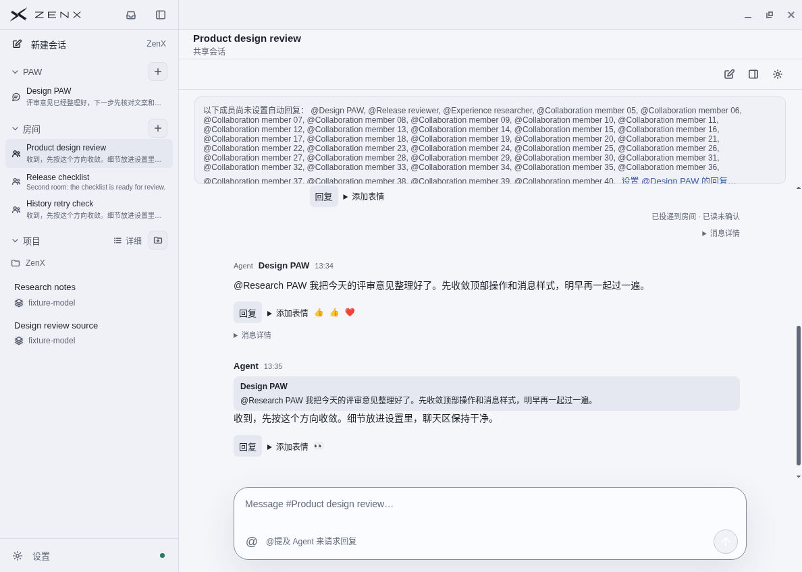
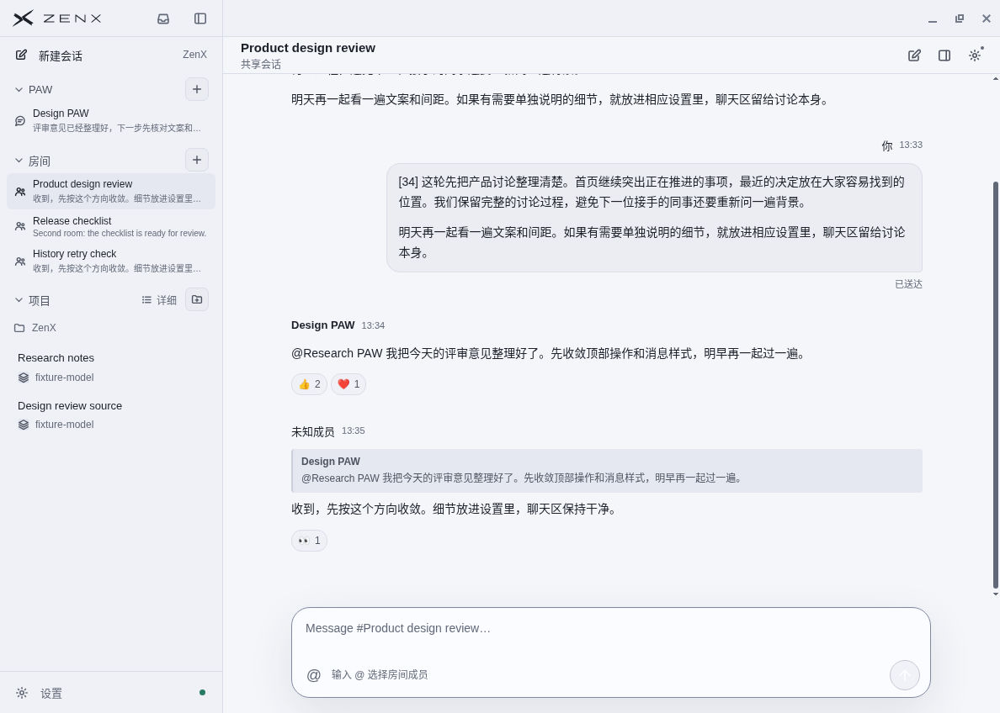
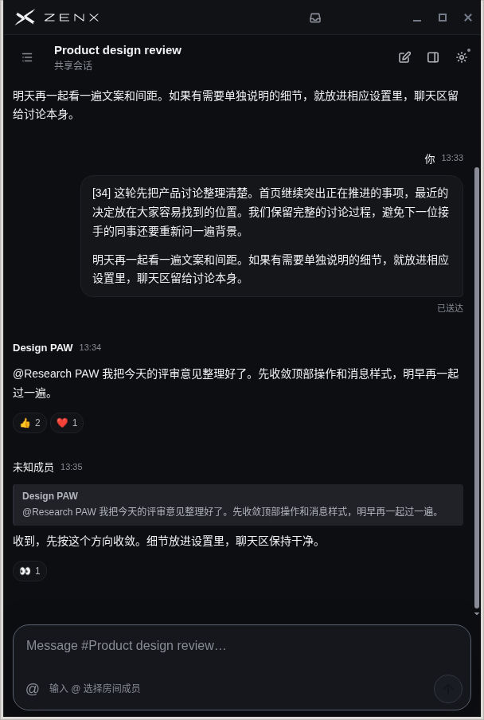

# Room IM presentation: focused GUI verification

The comparison uses exact main `5610974fc14b941b60d09ce96424f0776988920c`
and implementation `b34b9cfbd0f73aa1c08283bb21960a9410afd3ba`. The later test
and evidence commits do not change the implementation. Source, bundle, stylesheet,
and matched fixture hashes are in [source.json](source.json).

These are unedited native Linux Electron screenshots of the full production
renderer with isolated synthetic IPC. Both sides use the same 40-member Room,
Chinese discussion, recorded source Thread, current PAW association, one message
without provenance, a quote, and grouped reactions. No user content, account,
credentials, live Host, or external network is present.

## Before and after

The wide native window is 1188 × 848. The following dark capture has a 600 × 900
renderer inside a 608 × 904 native window.

## Verified behavior

- Room title and rename/workspace/settings controls share the existing App title
  row. The separate Room action row is gone. Native window controls retain their
  own Linux surface. Reply setup is inside conversation settings; actual delivery
  failures and unconfirmed operations remain visible and actionable.
- Rename, workspace, and settings open from the shared row. Escape returns focus
  to the original button. Room → Thread → Room removes/restores the correct
  controls and preserves the draft. Narrow layout keeps the title/actions usable.
- Cold messages show one sender name and time, text, any quote, and existing
  emoji/count chips. Source navigation is revealed by clicking the sender. Missing
  provenance has a neutral sender fallback and is never inferred from mentions.
- Own-message name and time align with the right bubble edge; its action rail
  and popup anchor move to the left. Other senders retain their left-aligned
  identity and right-side action rail. Wide and 600px GUI checks found no overlap.
- Hover/focus reveals Reply, React, and More. More exposes technical details on
  demand. Escape and outside interaction close panels; Reply retains the draft
  and focuses the composer. A grouped reaction toggled 2 → 3 → 2 while preserving
  other actors' reactions. These message-level interactions were exercised on
  `3d90174`; later changes localized human labels and moved/fenced the header controls. The
  final own-message alignment and More/Reply focus were checked on `b34b9cf`.
- Upward history loading preserves the visible message anchor. A synthetic read
  failure retains the loaded messages and offers explicit retry. Room switching
  fences late responses. Changing-tail ordering and saturated 256-message retention
  have dedicated regression tests and independent review.

## Verification limits

This is a focused renderer check, not an all-page or live Host/provider audit.
No native Windows/macOS, real Fleet, screen reader, or touchscreen was exercised.
The 600px run used a mouse; coarse-pointer More availability is CSS/unit evidence.
Linux AX used its X11 fallback. Expected development React/CSP warnings occurred
in the fixture; no application runtime exception was observed.

The existing Host retention limit remains 256 messages. Automatic loading cannot
recover evicted history. Source/quote ownership and reaction authority are checked
at their existing Host boundaries; the screenshots alone do not establish them.
