# Send action panel: design and verification

This is evidence for the focused send-control redesign. `apps/zenx/docs/ui-ux.md` remains the durable product authority. Send, queue, steer, replace and preference ownership remain in their existing callers.

## What the baseline showed

The current production `ThreadView` was rendered in native Electron with synthetic conversation data. At 1120×800, idle hover showed a flat Send row and a native preference selector; running hover showed five flat rows with no explanation of their execution differences. The primary button claimed `aria-haspopup="dialog"` even though clicking it submitted. Touch had no visible options control. The idle/running panels differed in content and height, and lacked a shared primary-action explanation.

The current revision follows the requested quiet first-level UI: a single send orb at the composer’s right edge, with hover disclosure and no adjacent expansion button. Running with an empty or whitespace-only draft keeps the existing red Stop/interrupt action. Attachment-only drafts remain sendable under the existing content predicate.

Before source: main `c5855dc0f681177985915219fe912ec88fc278f4`. Current production source: `623d0dd9dc5f93cefe4dc323ee27d367359179c1`, on integrated main `838910493b41283171c4e095b1486b8b62df2fe7`. After captures use the production components and theme CSS, with synthetic data and callbacks. No Host or model account is connected.

## Design references and interaction

[Fluent 2 Button](https://fluent2.microsoft.design/components/web/react/core/button/usage) informed the hierarchy between the primary action and alternatives inside the panel. The user’s existing hover interaction defines the visible surface: there is no split button or permanent chevron. The orb remains the rightmost control and retains its 44×44 hit target and smaller visible circle.

The panel contains focusable commands and an existing global preference field. The [W3C Tooltip pattern](https://www.w3.org/WAI/ARIA/apg/patterns/tooltip/) distinguishes this from a tooltip; the existing [Radix Popover](https://www.radix-ui.com/primitives/docs/components/popover) supplies the nonmodal dialog and focus/dismissal behavior. [Radix Hover Card](https://www.radix-ui.com/primitives/docs/components/hover-card) is unsuitable as the sole route to focusable commands. A pure ARIA menu is also a poor fit for the mixed command/preference surface.

The [WCAG hover/focus guidance](https://www.w3.org/WAI/WCAG22/Understanding/content-on-hover-or-focus.html) supports the pointer bridge, leave delay, Escape dismissal and focus persistence. From the same orb, Up/Down enters the panel; Tab visits normal controls; Escape restores owned focus to the orb. When sending is disabled, the same location stays keyboard-focusable for preference access. Touch tap directly sends or stops, without opening a menu first or introducing another permanent control. This revision does not add a touch-only options gesture.

Send, steer, batch-next, queue and replace dispatch remain in their existing caller. The primary appears once in the panel, with its consequence and real Enter hint. Alternate hints match the existing editor’s modifier-Enter behavior. Default while running stays in the panel footer and uses the shared themed Select; changing it never submits the draft. Failed saves preserve the prior value and expose the error.

## Resting alignment and empty running action

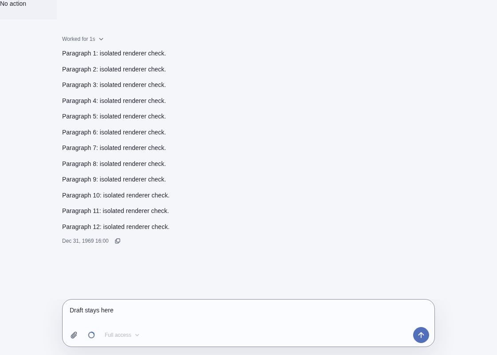
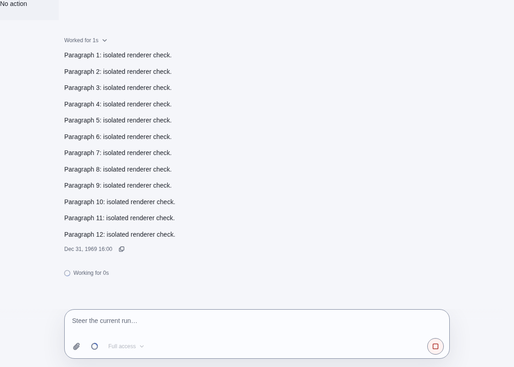
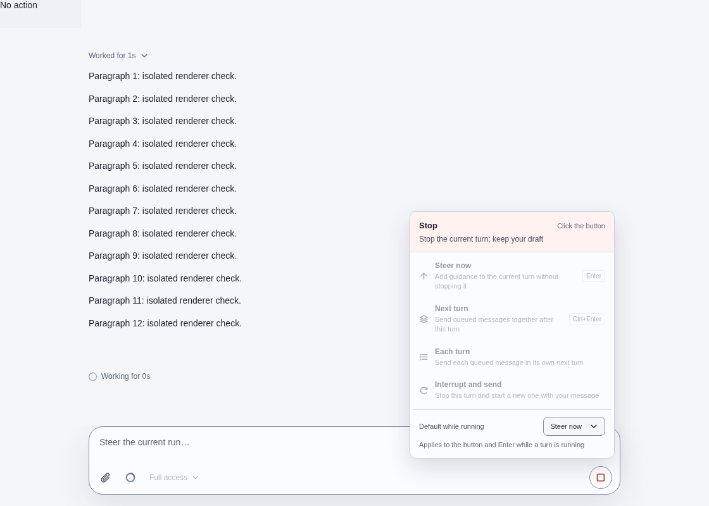

## Typing and clearing while running

The same orb changes action without moving. Whitespace-only text returns to Stop. The component regression also verifies attachment-only drafts remain sendable and retain the attachment.

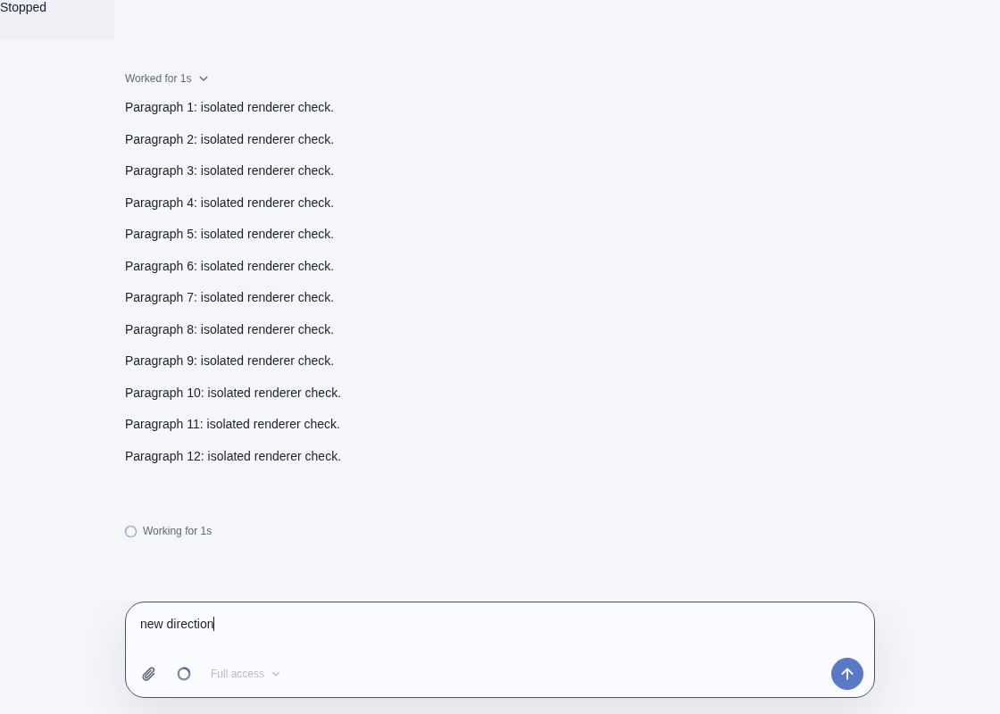
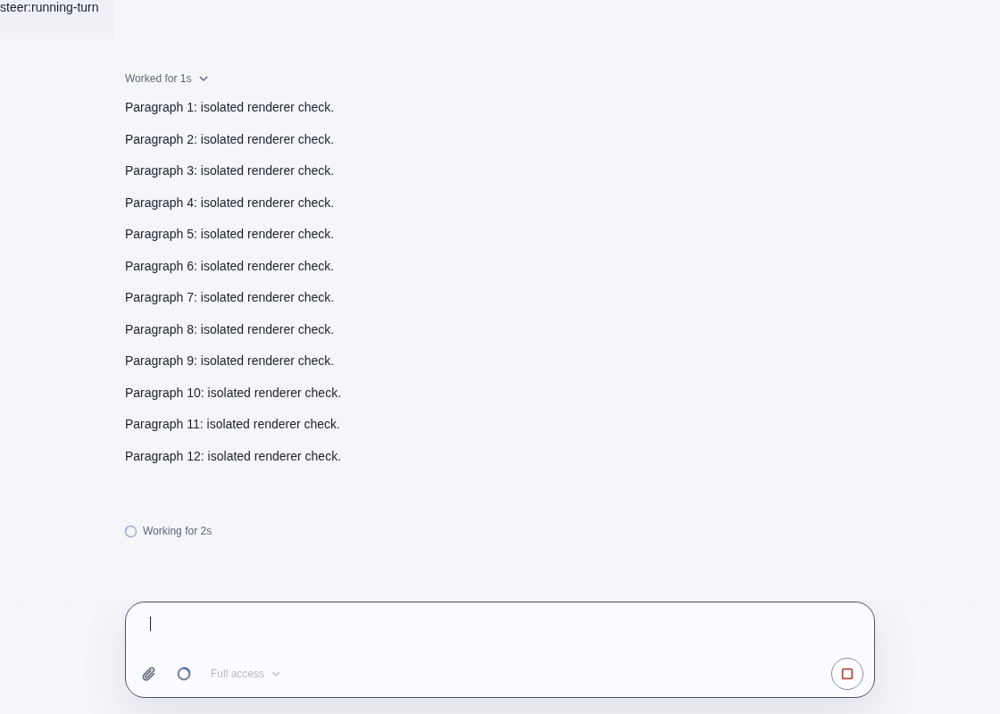

## Validation

Current focused composer/state/theme/i18n suite: 98/98 passed. Root and ZenX TypeScript checks and the fixture production build passed. The native Electron matrix completed 24 scenarios with assertions passing; the exact-source record is [matrix.json](matrix.json).

The matrix verifies idle/running hover, empty Stop, typing/clearing and turn-completion transitions, all running modes, one callback per native pointer or keyboard click, hover gap, keyboard Up/Down and Escape, preference access, dark theme, 360×640 narrow and 620×420 short layouts. Every capture asserts one permanent 44×44 orb and no adjacent disclosure. Focus restores to the orb after closing a keyboard-owned panel, while outside focus remains untouched. Continued hover may display fresh current actions after a state transition.

The first native driver assertion expected the word “interrupt” where the UI correctly said “Stop the current turn”; that harness assertion was corrected before the complete passing run. The screenshots establish native renderer layout and interactions with synthetic callbacks. They do not establish physical touch or manual screen-reader usability, full WCAG conformance, or a live provider round trip.

Fresh independent review approved this revision after 77 ThreadView tests, adversarial focus/stale-turn/attachment probes, and settled native screenshots. Root/ZenX types, brand, first-party preparation, Prettier and production build pass. The shell TSX CLI test launcher is blocked by its Unix IPC socket (EPERM); the loader-equivalent full suite and exact-head CI results are reported in the PR as they finish.

## Representative native screenshots

### Idle hover, before and after (1120×800)

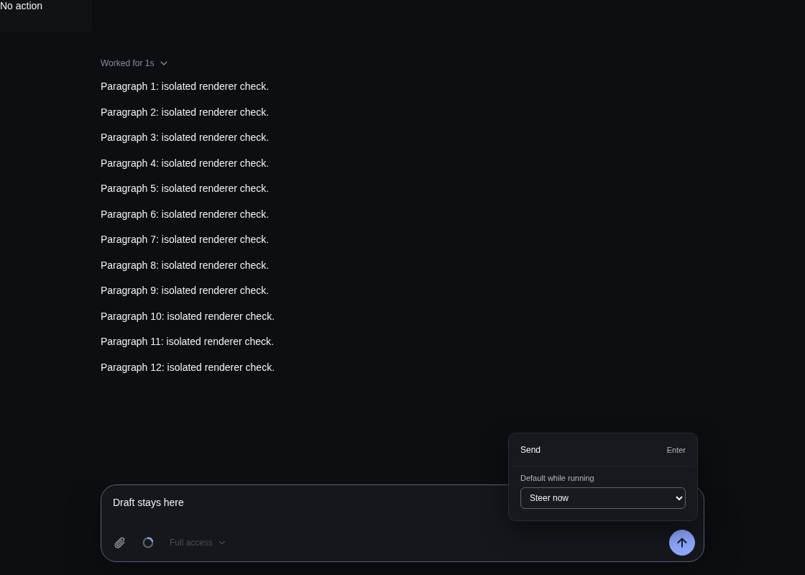
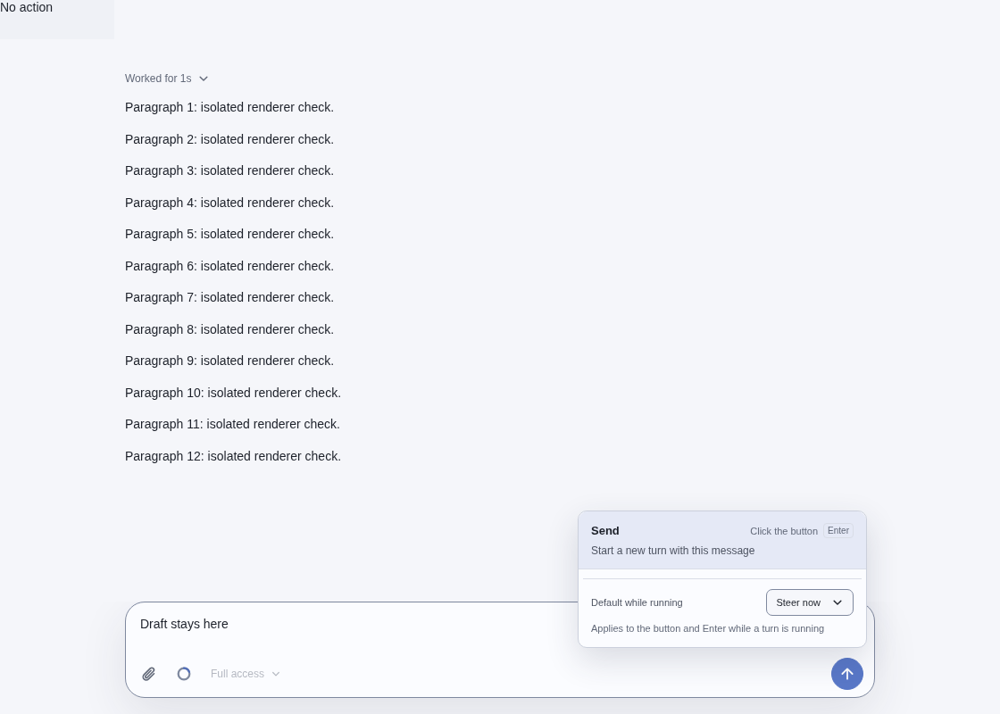

### Running hover, before and after (1120×800)

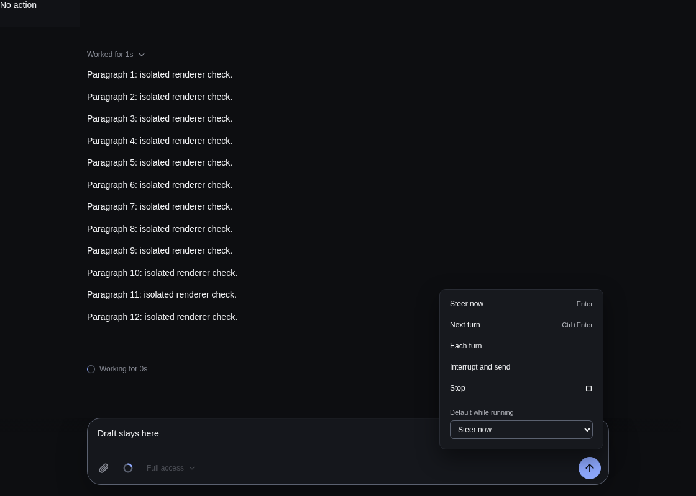
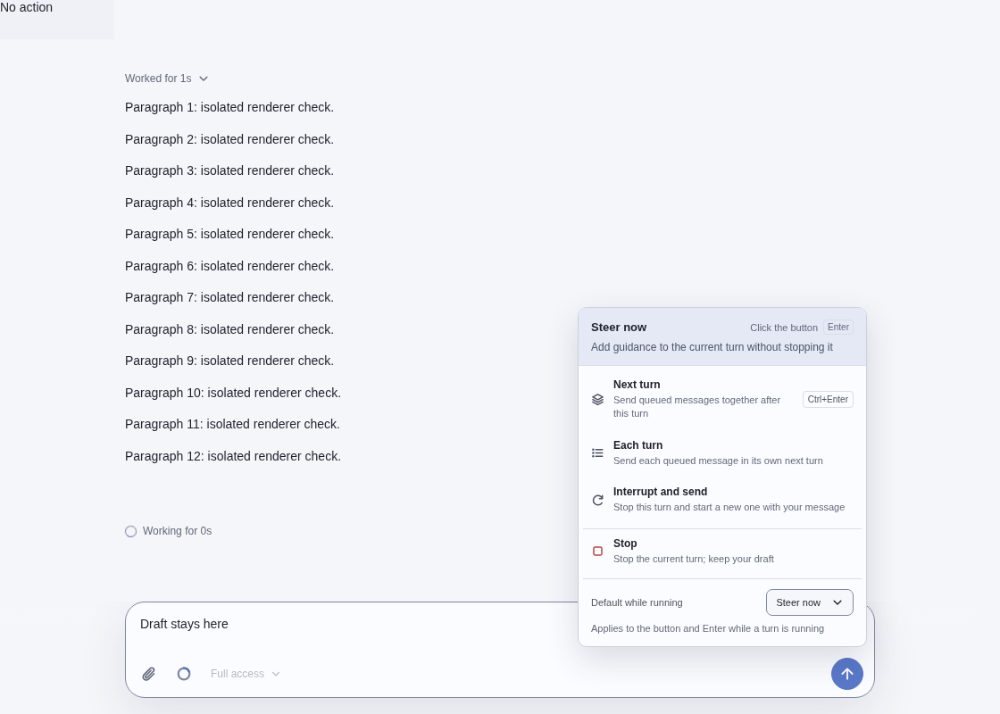

### Shared preference selector

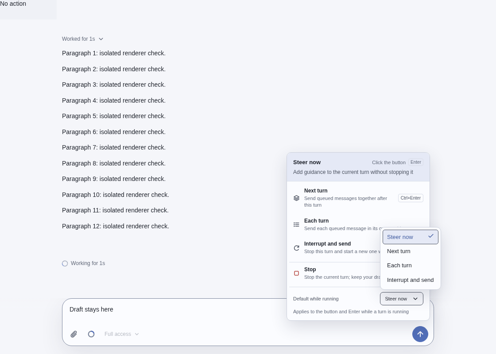

### Narrow and constrained height

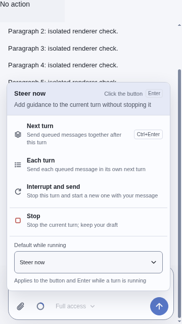
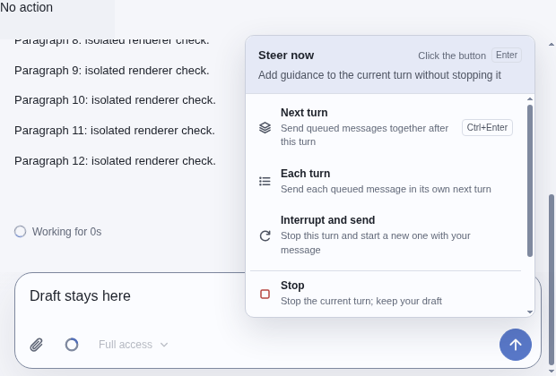
