# Sidebar disclosures and PAW creation, 2026-10-06

Base: official main `4d6b27004cd441847d86db92200a280e25800e7b`. This branch excludes experimental Agent Provider PR #249. Screenshots are actual Electron windows on the cloud Linux desktop with an isolated synthetic profile and a deterministic fake provider. No user machine, account, model key, remote device or live model was used.

## Verified behavior

- PAW, Rooms and Projects share disclosure/add styling; PAW and Room expansion persist separately across navigation and an app restart. Add remains available when collapsed
- PAW defaults to a new working Thread in a configured Project, using a preview of current Host defaults. Existing binding is an explicit alternative
- Opening, changing options and canceling the form left the fixture at 5 Threads / 1 Room. Explicit Create of `nova` produced 6 Threads / 2 Rooms. Its new Thread journal contained one canonical metadata Item and no Turn; the Room binds that exact new Thread and owns its reply Trigger
- Background discovery no longer moves Projects. The same MutationObserver probe on official-main rendering recorded Projects alternating between y=270.5 and y=253.5 on each 3-second poll when the shared-Room list was empty. After the fix, more than a minute of polls produced no navigation mutation or position change; intentional user collapse still changed its height
- Independent review additionally reproduced a fresh PAW form losing its Project and preview when an equivalent SDK wrapper replaced it on parent polling. Setup reads now belong to a semantic form session and selected target, and retain published state through equivalent SDK replacement. Delayed-read tests cover both unchanged wrappers and real Project/mode changes
- Keyboard selection, repeated create/cancel, interrupted/delayed submissions, stale navigation, duplicate submits, explicit existing recovery, and acknowledged creation with failed list refresh have automated regressions
- Actual light/dark wide windows and a 598 × 564 dark window were inspected. The short creation form scrolls to its model/permission summary and Create button. Escape closes it without an extra Thread

## Screenshots

### Before

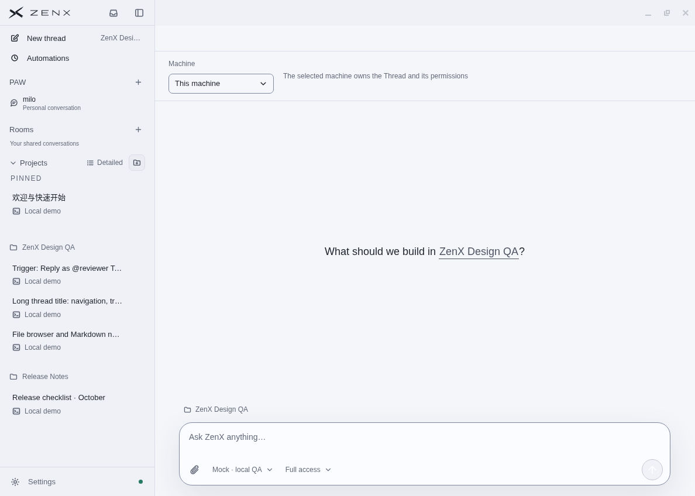
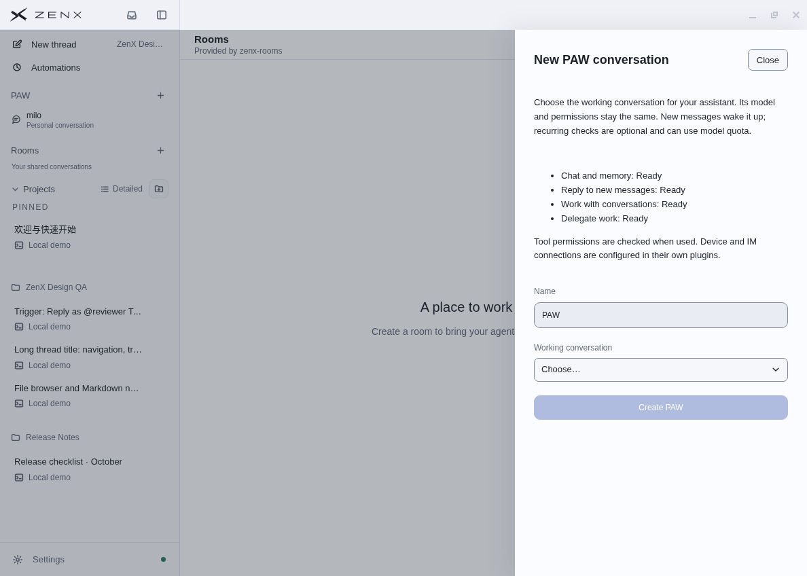

### After

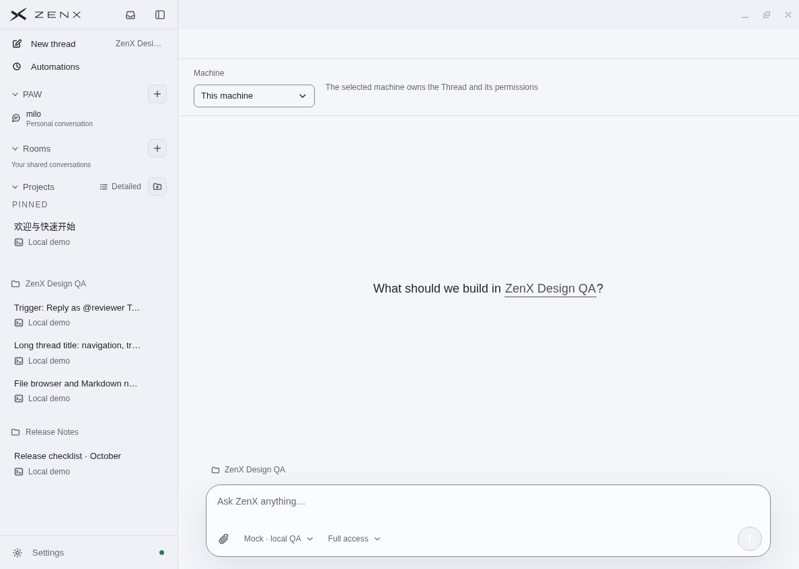
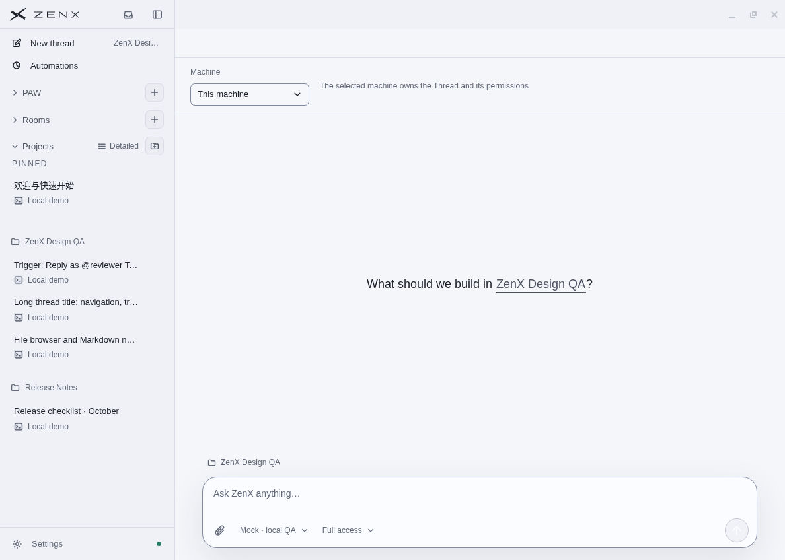
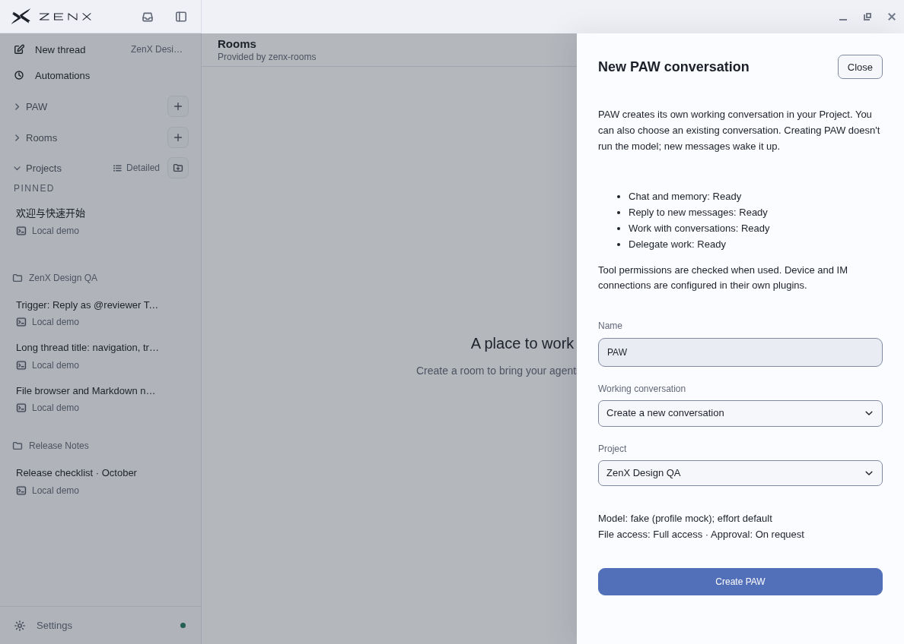
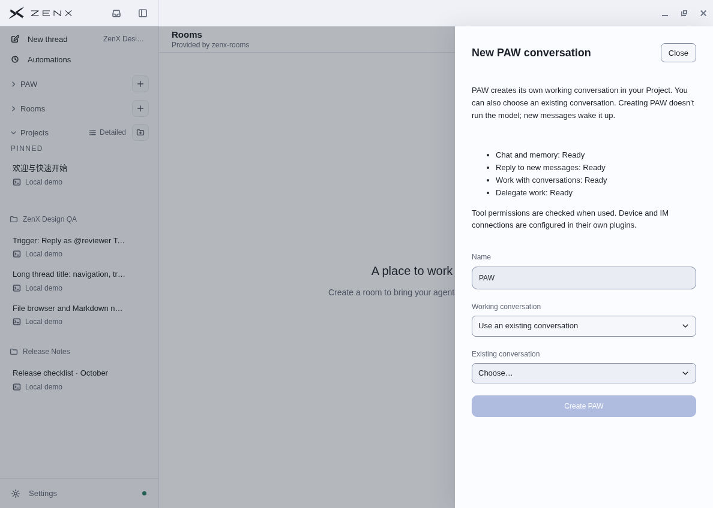
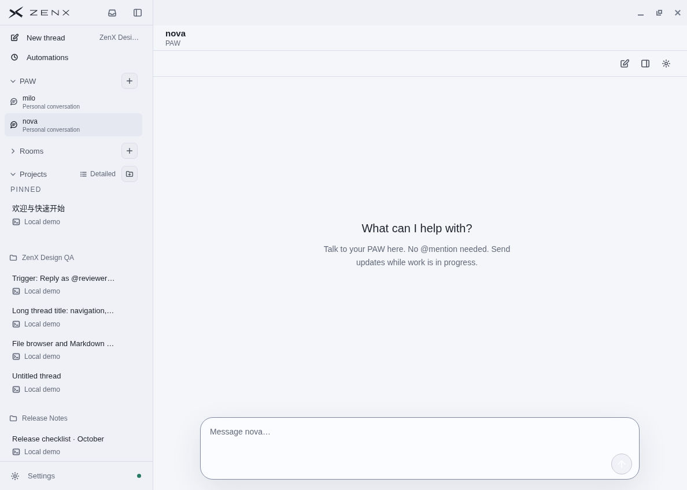
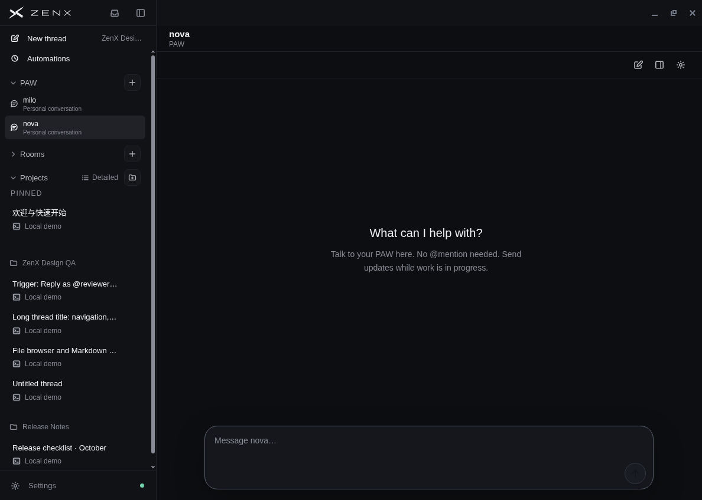
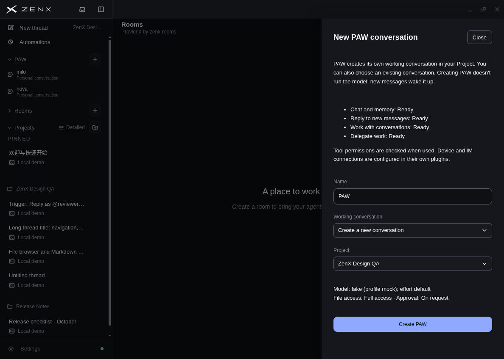
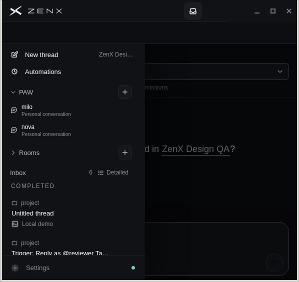
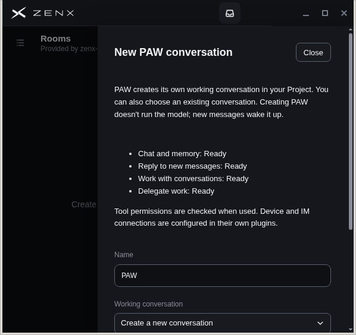
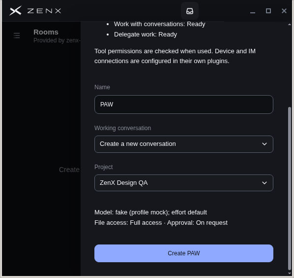

## Validation and limits

- Final Node/Web typecheck and production build passed
- Final focused renderer/navigation/retirement/assistant run: 32 passed; service/assistant/physical-target/manifest run: 38 passed; real packaged trusted-UI command integration passed
- Core Node 22 run: 786 passed, 2 skipped, with the cloud proxy's experimental warning suppressed. Python: 102 passed. Actual IM SDK/ZAS integration: 1 passed
- Full ZenX Node 22 run: 1774 passed, 11 skipped, 5 failures. These are outside the changed PAW/navigation code: a Fleet shell JSON assertion affected by the cloud proxy warning, three plugin-dev fixture timing failures, and a Settings test process reaching its 2 GiB heap limit. Focused reruns passed the Fleet case and same-version update case; two plugin fixture timeouts and Settings heap failure remain disclosed. This is not a full local check pass
- The same Settings heap failure was independently reproduced on an isolated official-main `4d6b270` checkout, in the unchanged 1024-model discovery test
- The stock `tsx --test` wrapper cannot create its Unix IPC pipe in this executor. The suite used the supported `node --import tsx --test` entry instead
- Native Windows/macOS, touch, real-provider execution and remote Fleet were not tested here
- Existing production shared Select/Combobox controls emitted inline-style CSP warnings when opened. The same shared controls and production CSP predate this change; security policy was not broadened. This pass does not claim a clean renderer console
- In the narrow new-Thread screen, the existing mobile sidebar control is partially obscured by the titlebar session row; keyboard Tab/Enter opened its drawer for this check. The PAW/Room drawer rows and PAW form themselves were inspected. That pre-existing titlebar issue was not folded into this focused patch

Creation receipts are bounded and Host-lifetime only. A failed provisioning attempt can leave a known idle Thread, which is identified for explicit inspection/binding. No durable rollback/recovery workflow or silent retry was added. After a Host restart, uncertain outcomes still require inspection before starting a new setup.

Independent final-code review and exact-head remote CI are required before merge.
