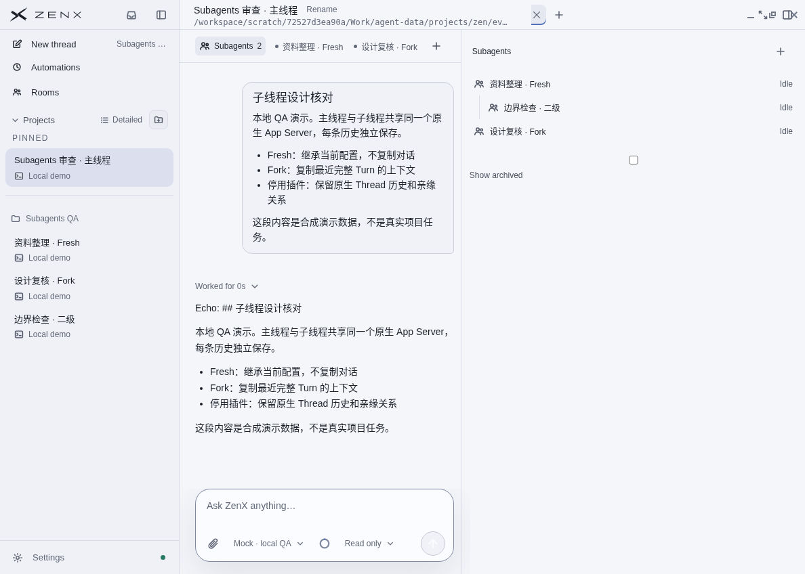
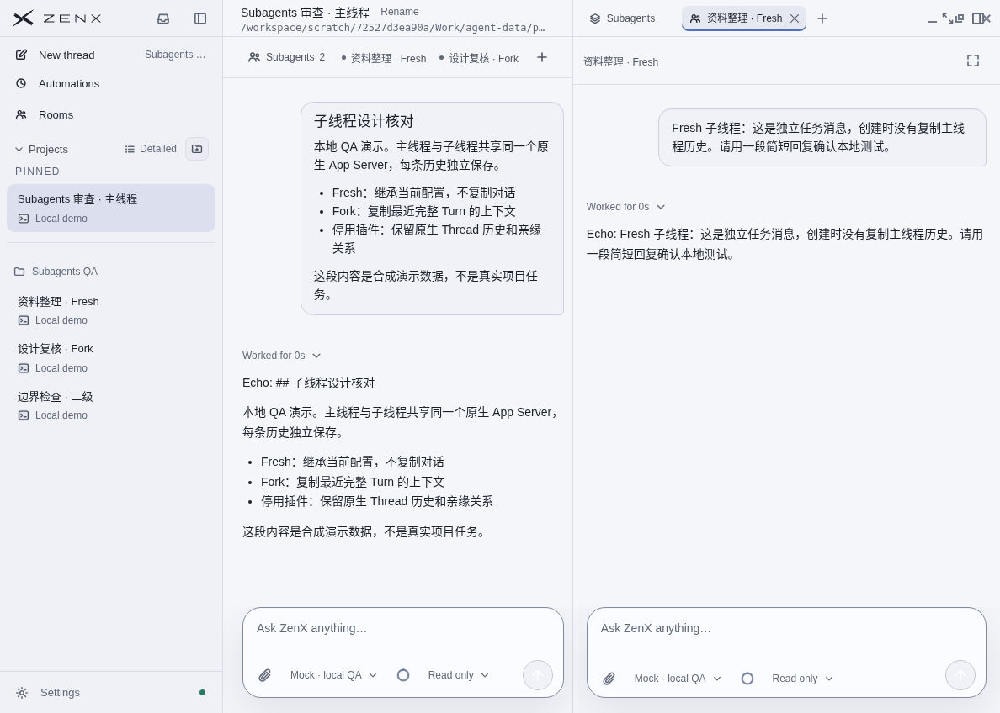
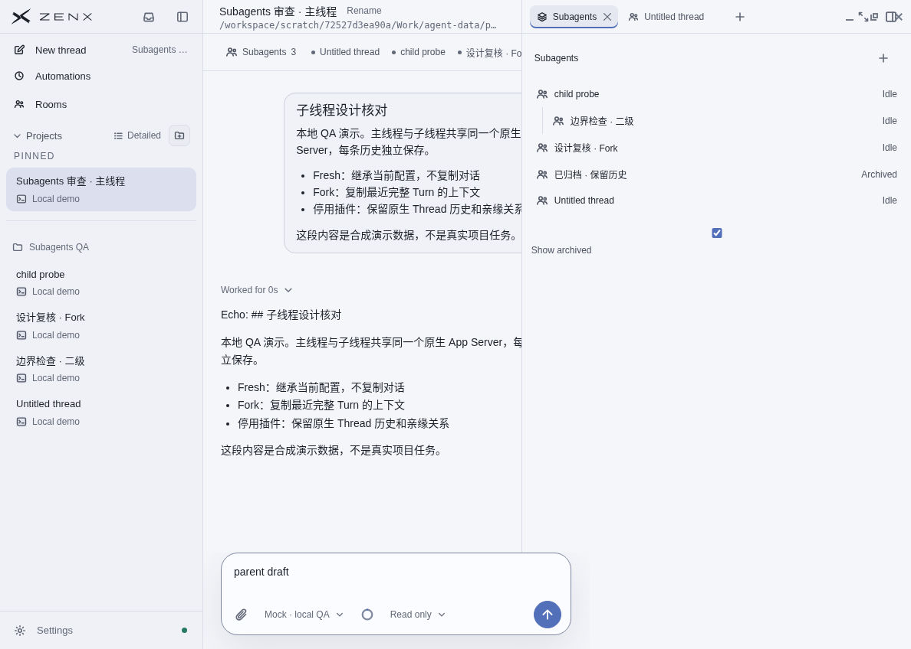

# Subagents：主线 UI 审查截图

截图来自 2026-10-01 对主线提交 `ba0232e0ae9ee5d2086feee744eb0e7a29c48c7b` 的桌面实测。使用隔离的 Linux 测试配置和 Fake Echo provider；画面中的任务与消息均为合成数据，没有调用真实大模型，也没有连接用户设备。

这些图记录主线 Subagents 的表现，不代表本 PR 的 Companion 页面。

## 1. 子线程目录

右侧显示主线程的直属子线程及嵌套后代。各线程有独立历史，并复用原生 Thread 关系。

## 2. 主线程与子线程并排对话

右侧打开子线程的正常会话视图，可独立发消息；图中 Echo 回复来自模拟 provider。

## 3. 已发现的布局问题

三个直属子线程时，顶部子线程栏的固有宽度会把主会话和输入框挤到右侧面板下面，造成裁切（P2）。另外，“Show archived” 复选框与文字分离（P3）。这些是审查时发现的主线问题，本次截图文档提交没有修复它们。

