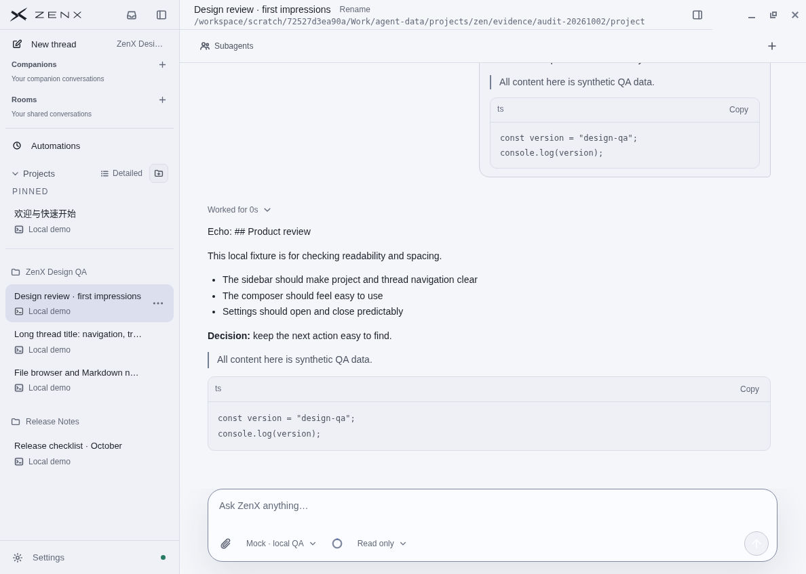
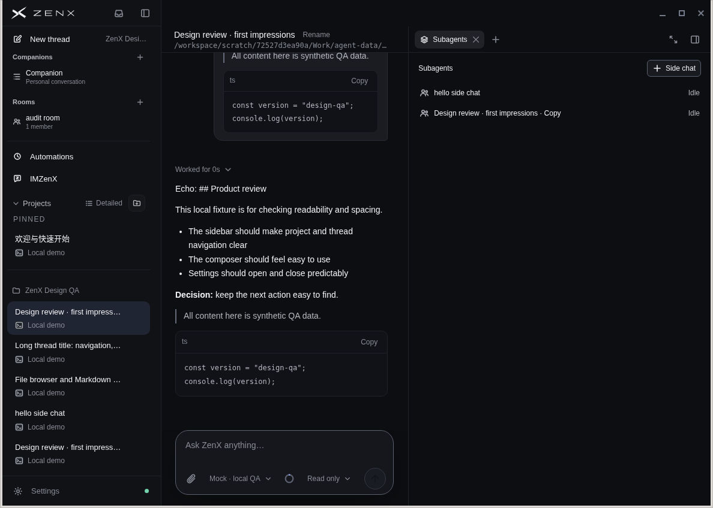
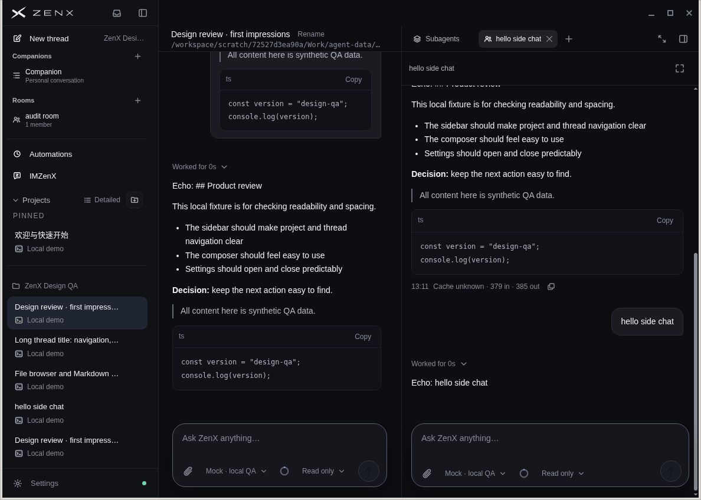
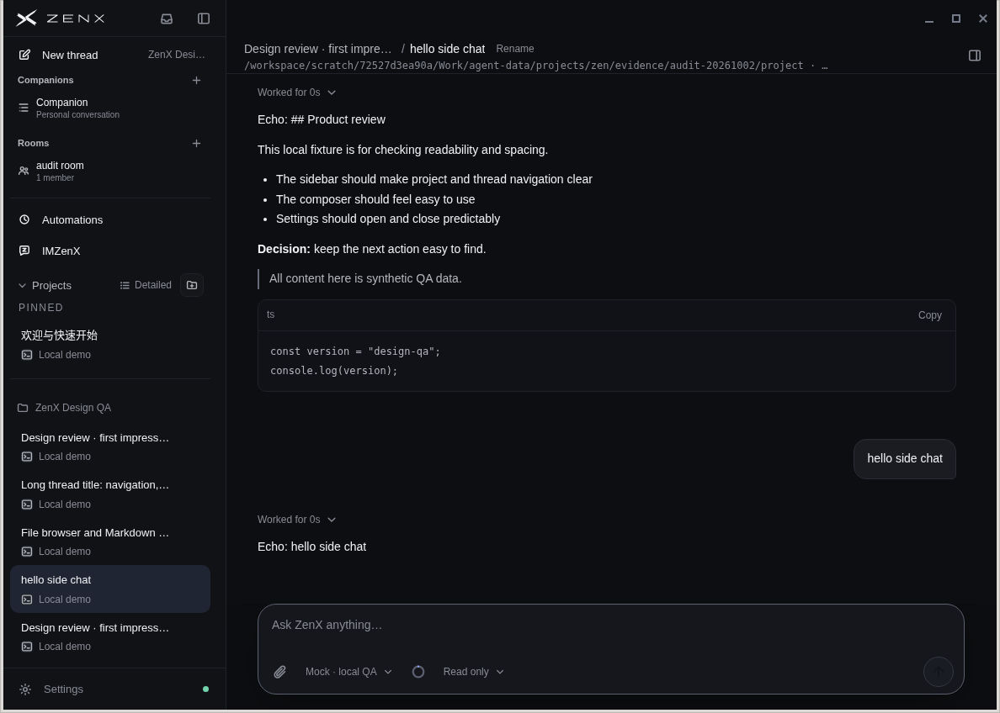
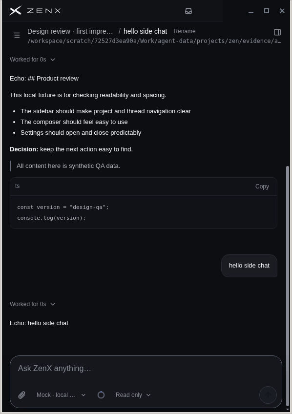
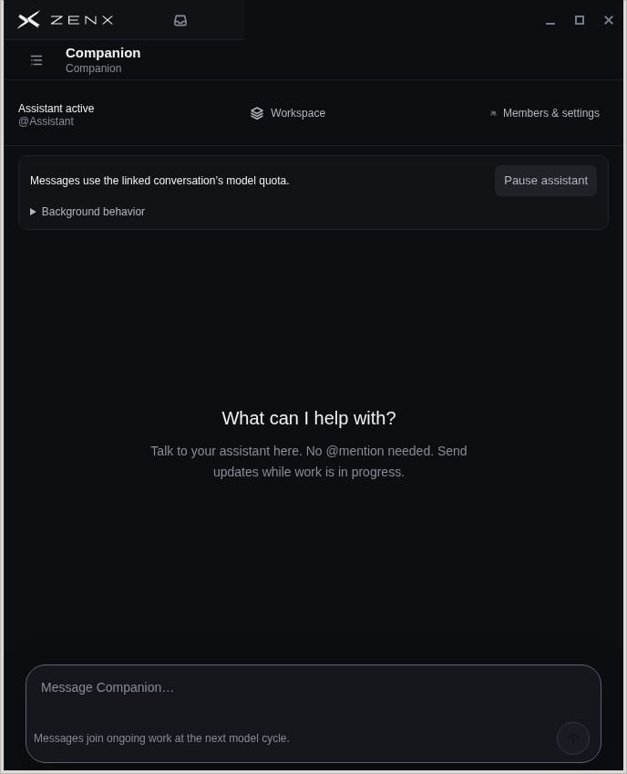
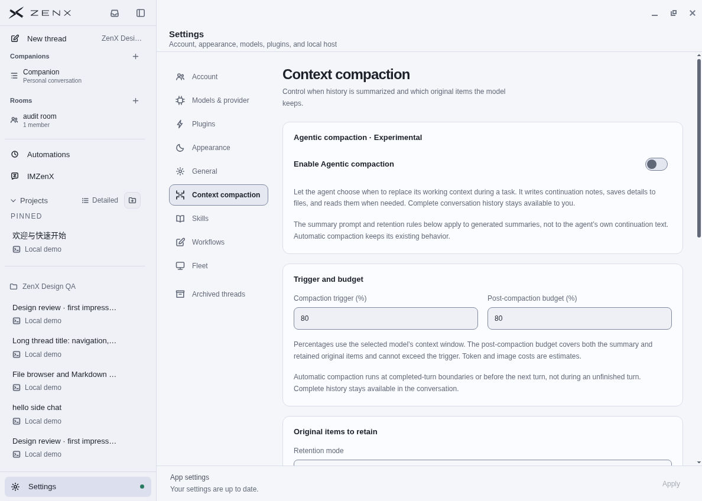
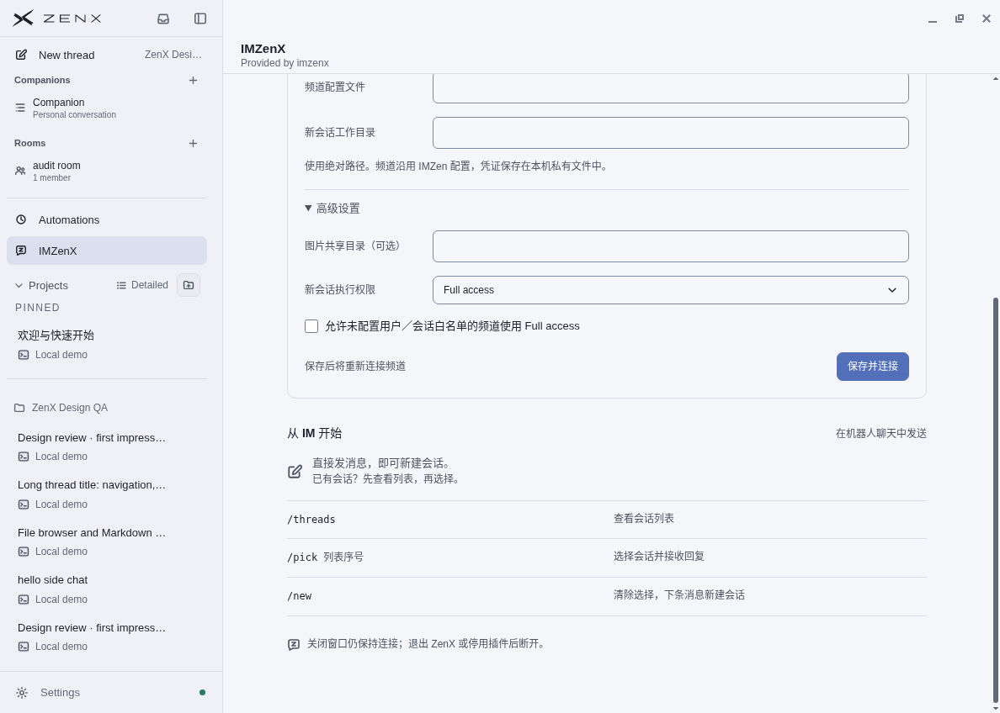
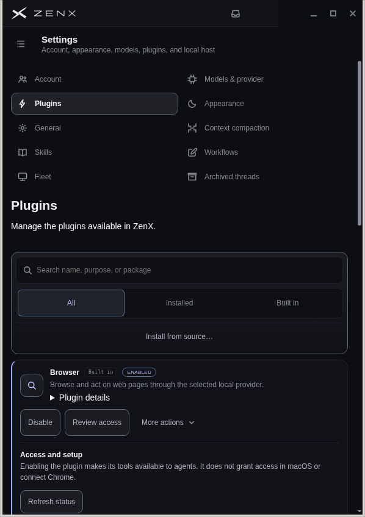

# ZenX UI walkthrough — 2 October 2026

## Scope

This walkthrough uses a real Linux Electron window with an isolated local test profile and a deterministic mock model. The initial build is commit `6b28c69`; integrated side-chat checks use `078d574`, and narrow settings checks use `723c62e`; later screenshots record successive layout fixes. It covers the desktop routes and visible built-in plugin surfaces, rather than every possible account, network, and runtime state.

## Coverage and observations

| Step | Surface / flow                                           | Observed health                                                                                                                                                                                                                                                                                                                    |
| ---- | -------------------------------------------------------- | ---------------------------------------------------------------------------------------------------------------------------------------------------------------------------------------------------------------------------------------------------------------------------------------------------------------------------------- |
| 1    | New conversation and existing Markdown/code conversation | Main composer and message rendering work at desktop width; initial titlebar/panel collisions were corrected and pointer-tested                                                                                                                                                                                                     |
| 2    | Account settings                                         | Signed-out state is clear; authenticated usage not tested                                                                                                                                                                                                                                                                          |
| 3    | Models/provider list and custom-provider editor          | Fields, defaults, cancellation and scrolling usable; no secrets entered                                                                                                                                                                                                                                                            |
| 4    | Plugins and access cards                                 | Built-in availability is clear; Linux Computer provider correctly marked unavailable                                                                                                                                                                                                                                               |
| 5    | Appearance                                               | Light/dark modes readable; selected tabs use neutral surface depth                                                                                                                                                                                                                                                                 |
| 6    | General and Context compaction                           | Initial cross-tab scroll bug corrected; General bottom → Context compaction starts at heading in build 078d574                                                                                                                                                                                                                     |
| 7    | Skills                                                   | Empty state, local synthetic skill import and populated Manual-use state checked                                                                                                                                                                                                                                                   |
| 8    | Workflows                                                | Empty and new-command draft editor checked; draft not applied                                                                                                                                                                                                                                                                      |
| 9    | Fleet                                                    | Empty device list and hosting form checked; no pairing, hosting, remote device or relay configured                                                                                                                                                                                                                                 |
| 10   | Archived conversations                                   | Empty state, synthetic child archive and successful restore checked                                                                                                                                                                                                                                                                |
| 11   | Automations                                              | Empty state and timer editor checked; no timer submitted                                                                                                                                                                                                                                                                           |
| 12   | Room creation and settings                               | Synthetic Room created; members/settings viewed; drawer Close overlapped native chrome before fix                                                                                                                                                                                                                                  |
| 13   | Companion creation and workspace                         | Synthetic Companion created; Overview, Matters, Memory, Automations and Threads visited; empty notebook clearly identified                                                                                                                                                                                                         |
| 14   | Subagents                                                | Child fork, inline conversation and open-as-main conversation visited; redesigned Side chat creates an idle fork, waits for an explicit question, replies only in the child, and opens with a parent breadcrumb                                                                                                                    |
| 15   | File panel                                               | Workspace picker and Markdown preview checked                                                                                                                                                                                                                                                                                      |
| 16   | Browser panels                                           | Isolated blank browser tab and unattached-browser state checked; real browser integration not exercised                                                                                                                                                                                                                            |
| 17   | Trigger wakeups                                          | Companion-created Room trigger visible; no timer execution tested                                                                                                                                                                                                                                                                  |
| 18   | Inbox and project folder picker                          | Navigation and folder-picker cancellation checked                                                                                                                                                                                                                                                                                  |
| 19   | IMZenX                                                   | Bundled plugin installed in test profile; disconnected setup and advanced fields checked; checkbox label alignment defect corrected                                                                                                                                                                                                |
| 20   | Keyboard, resize and narrow view                         | Tab ArrowRight works with visible focus; divider resize works; 598px Settings wraps navigation into two columns; pointer open/close works for Thread and Room/Companion panels, including expanded and 688/598px layouts; Room Escape restores focus to Workspace and Tab advances to Members/settings after the final focused fix |

## Corrections verified during this run

The final Room focus-return adjustment (`adc3ac7`) was checked with owner regression tests and this GUI walkthrough after the last independent review; it is not claimed as a new independent review round.

1. Reserved the native Windows/Linux control row across the main area. Place the main conversation title and side-panel tab bar beneath it, each within its own column. Do not move the left navigation down again.
2. Moved Subagent discovery inside the right sidebar. Fullscreen child conversations should show parent ancestry in the main top bar, without an extra child strip under the title.
3. Preserved panel controls when expanded or narrow. Remove hidden overlapping main-title controls rather than leaving a Rename link over the first tab.
4. Reset the actual Settings scroll container when changing sections. Resetting a non-scrolling inner element does not solve the visible problem.
5. Use a common horizontal checkbox-and-label row in plugin surfaces. Both archived Subagents and IMZenX advanced configuration exhibited this defect; both were corrected.
6. Use a darker selected-tab surface and visible keyboard focus. Avoid the accent underline.

## Further polish

- Companion repeated heading and runtime notice were compacted during this run; background details remain available in a disclosure.
- Align Automation editor width and spacing with the rest of Settings.
- Skills helper text was muted during this run; keep this hierarchy consistent in future plugin settings.
- Review localization consistently: IMZenX currently uses Chinese while the surrounding desktop is English.

## Evidence limits

The Linux accessibility tree exposes only the native window in this environment. Visual keyboard behavior was tested, but this is not screen-reader compliance certification. Real sign-in, credentials, provider quality, user-machine integration, remote Fleet operation and production schedules remain outside this run. Windows/macOS layout requires platform-specific verification in addition to Linux evidence.

## Side-chat behavior evidence

The actual UI created a child from the Subagents panel without submitting a turn. Its history showed inherited parent messages. A separate question produced a mock reply in the child while the parent draft stayed intact. The child journal contained an appended instruction identifying it as a side chat, distinguishing inherited context from a request to resume parent work, and requiring an explicit user request before acting. This verifies wiring and lifecycle; model compliance with the instruction is not evaluated by an echo provider.

## Screenshot guide

All images below show synthetic test content. They contain no account credentials or real user conversations. The before image is from `6b28c69`; current Subagent/breadcrumb/narrow images use the product built at `ec265a9` (included in `42d0efd`). Settings and checkbox fixes were verified on `078d574` and remain in the final build; narrow plugin settings were checked on `723c62e`.

### Baseline conversation strip

### Current Subagent directory

### Side chat

### Fullscreen child

### Narrow child conversation

### Compact Companion header

### Other page fixes

Final focused check: Room Workspace → Escape restores visible keyboard focus to Workspace; Tab advances to Members/settings. This was rechecked in the actual Electron app at `adc3ac7`.
