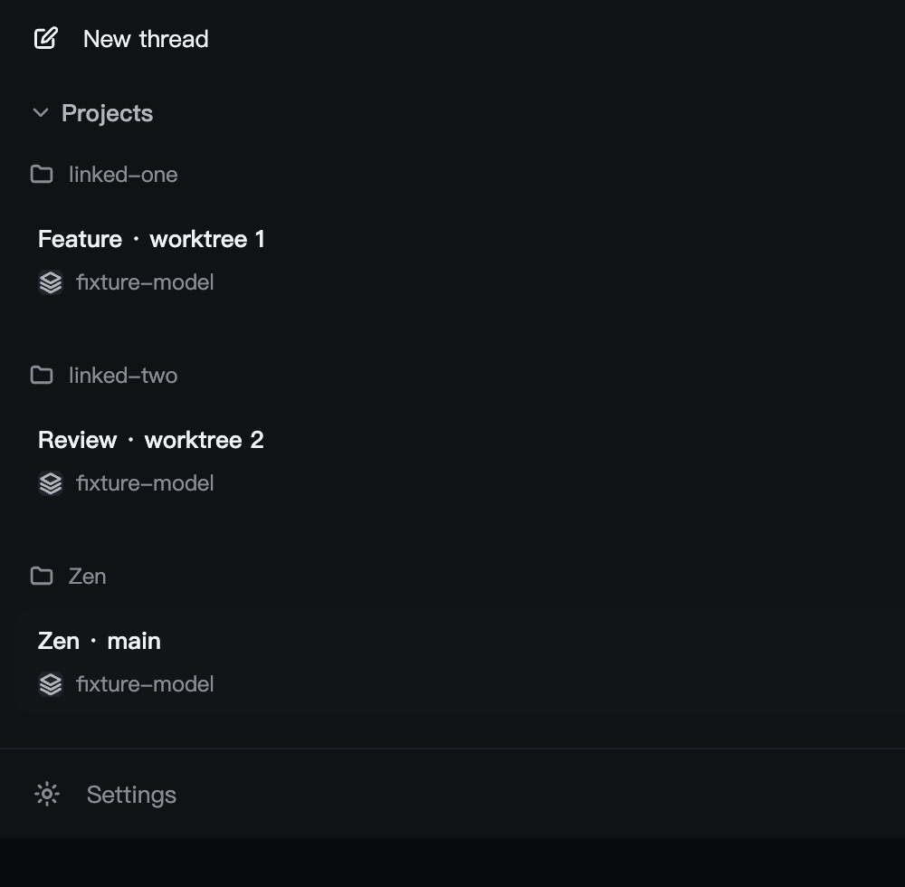
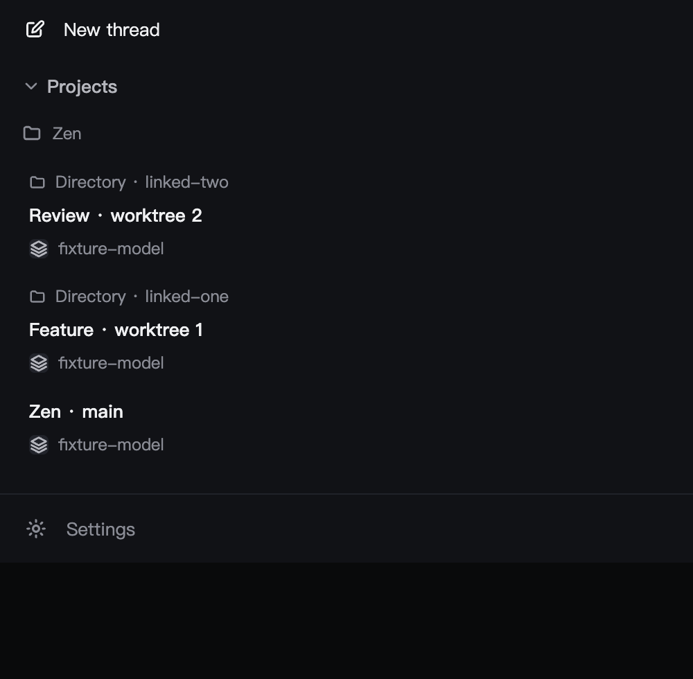

# Worktree Project grouping visual evidence

These are **actual browser screenshots of the production `Sidebar` component** rendered from the source in this change, via `test/fixtures/project-grouping-visual.html` on an isolated localhost Vite server. Thread summaries and `/fixture/...` paths are synthetic; this is **not** a capture of the installed daily ZenX app or real user Threads. The real `git init` + linked worktree, independent clone, nested repository, symlink and deleted worktree behaviors are exercised by `test/project-projection.test.ts` instead. No user profile or journal was modified.

| Before (path-only projection)                          | After (same three IDs / cwd, one Project)                        |
| ------------------------------------------------------ | ---------------------------------------------------------------- |
|  |  |

Screenshots were captured at 2560 × 1600 with ZenX's ephemeral Browser tool and cropped to the top-left 1000 × 980; rendered content is not recreated by image editing. To reproduce the visual fixture, serve `apps/zenx/test/fixtures` with local Vite, visit `project-grouping-visual.html?before` and `?after`. This visual fixture is illustrative and does not claim to prove Git discovery or a daily-app rollout.
