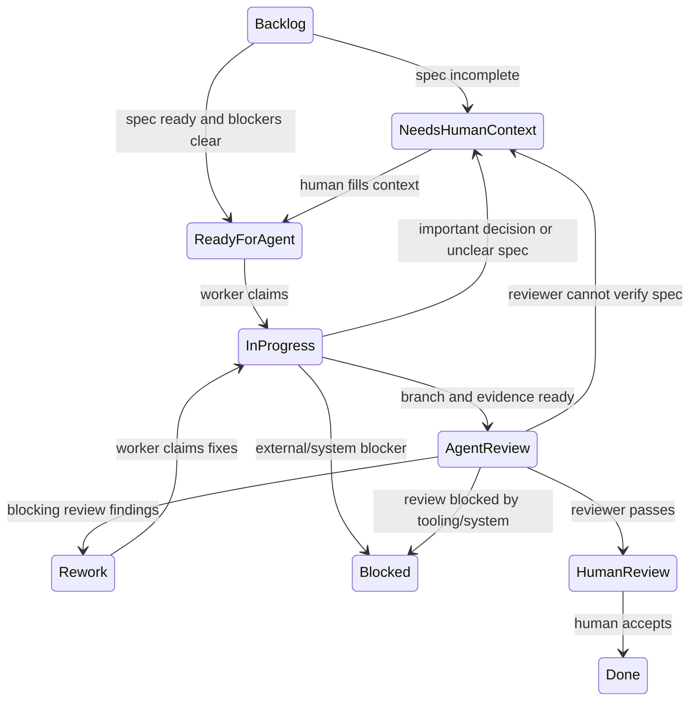

# Issue Tracker: Linear

Use Linear as the canonical issue tracker for Zen agent work.

## Workspace

- Team: `Albert's house`
- Team key: `ALB`
- Project: `Zen agent`
- Project URL: https://linear.app/alberts-house/project/zen-agent-04d56f75dcff

## Local Artifacts

Use paths from `docs/agents/artifact-paths.md` for durable local specs and evidence:

- PRDs remain in `docs/prd/`.
- Issue DAGs and execution evidence remain in `docs/implementation/`.
- Linear issues should link back to the relevant local PRD/DAG paths when possible.

## Linear States

Use these states for the agent build workflow:

- `Backlog`: parked work, design notes, or DAG nodes that are not ready for an agent.
- `Needs Human Context`: the issue lacks enough context, acceptance criteria, dependency state, or decision authority for an agent to proceed safely.
- `Ready for Agent`: the only normal state a worker Symphony instance should poll for new implementation work.
- `In Progress`: a worker has claimed the issue and is implementing or validating it.
- `Agent Review`: worker handoff queue. The branch, latest `## Codex Worker Note`, validation evidence, and review packet must be ready before a worker moves an issue here.
- `Rework`: reviewer found bounded blocking findings. The worker should address only the recorded findings and return through `Agent Review`.
- `Human Review`: reviewer passed the issue and human review, merge, or final acceptance remains.
- `Blocked`: a tool, credential, environment, dependency, CI, deployment, or system condition prevents progress. This is not for missing product context.
- `Done`: terminal success.
- `Canceled`, `Cancelled`, `Duplicate`: terminal non-success outcomes.

## State Machine



## Symphony Routing

Run separate Symphony instances for worker and reviewer roles.

Worker workflow:

```yaml
tracker:
  dispatch_states:
    - Ready for Agent
    - Rework
  active_states:
    - Ready for Agent
    - In Progress
    - Rework
  terminal_states:
    - Agent Review
    - Human Review
    - Needs Human Context
    - Blocked
    - Done
    - Canceled
    - Cancelled
    - Duplicate
```

Reviewer workflow:

```yaml
tracker:
  dispatch_states:
    - Agent Review
  active_states:
    - Agent Review
  terminal_states:
    - Rework
    - Human Review
    - Needs Human Context
    - Blocked
    - Done
    - Canceled
    - Cancelled
    - Duplicate
```

## Issue IDs

Use Linear issue IDs as the canonical IDs after issues are created.

When drafting local issue DAGs before publishing to Linear, use temporary local IDs:

```text
<slug>-001
<slug>-002
```

Replace or annotate temporary IDs with Linear issue IDs after publishing.

## Dependencies

- Keep the local DAG artifact as the planning source for dependency shape.
- Reflect dependency edges in Linear with blocker/blocked relations after issues are created.
- Do not rely only on issue descriptions for dependency state.

## DAG Release

Use Linear blocking relations as the execution DAG. A DAG node is releasable only when:

- all non-terminal blockers are resolved,
- the issue brief satisfies the readiness contract below,
- the work is worker-safe rather than manager-owned,
- dependencies that require integration are completed before dependent issues are released.

Keep unreleased DAG nodes in `Backlog`. Move exactly the ready nodes to `Ready for Agent`. Do not use `Todo` as an automation queue.

## Agent Notes

Use append-only Linear comments as the issue version ledger:

- Worker round N creates one new comment whose first line is `## Codex Worker Note` and includes `Round: N`.
- Reviewer round N creates one new comment whose first line is `## Codex Review Note` and includes `Round: N`.
- Rework creates the next worker round and the next review round. Prior notes are not edited or overwritten.
- Runtime-owned `## Symphony Control` comments are not human progress notes and should normally disappear after claim release.

## Agent Brief Readiness

An issue can enter `Ready for Agent` only when it has enough information for a worker and reviewer to judge success independently:

```markdown
## Agent Brief

**Category:** bug / enhancement / docs / chore
**Summary:** one-line description

## Current Behavior

## Desired Behavior

## What To Build

## Key Interfaces

## Acceptance Criteria

- [ ] Observable criterion

## Required Tests

## Required Evidence

## Dependencies

- Blocked by:
- Blocks:

## Decision Policy

- Agent may decide:
- Return to Needs Human Context when:

## Out Of Scope
```

For existing Zen agent issues created before this readiness contract, apply the default decision policy from `docs/agents/worker-model.md` unless the issue explicitly overrides it.

## Status

Linear issue status is canonical. Local artifacts should record publication status and Linear links.
