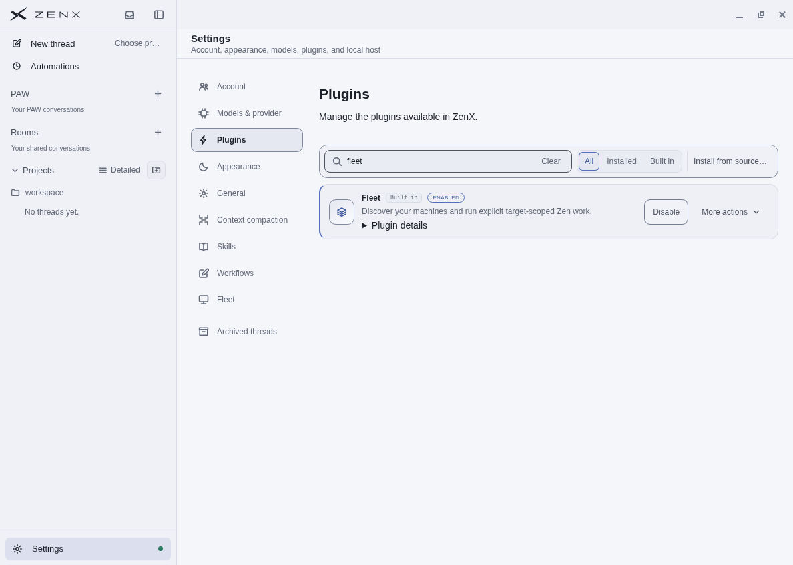
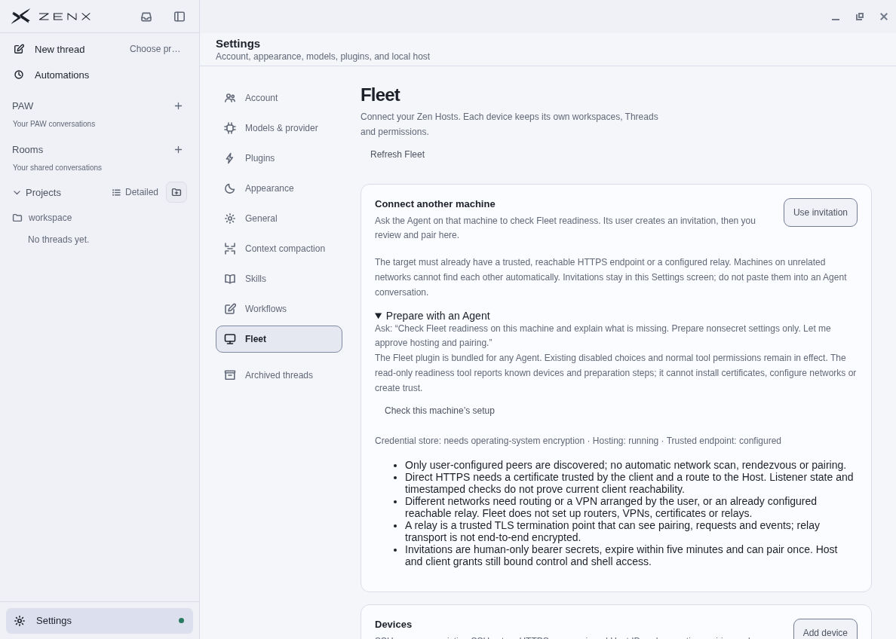
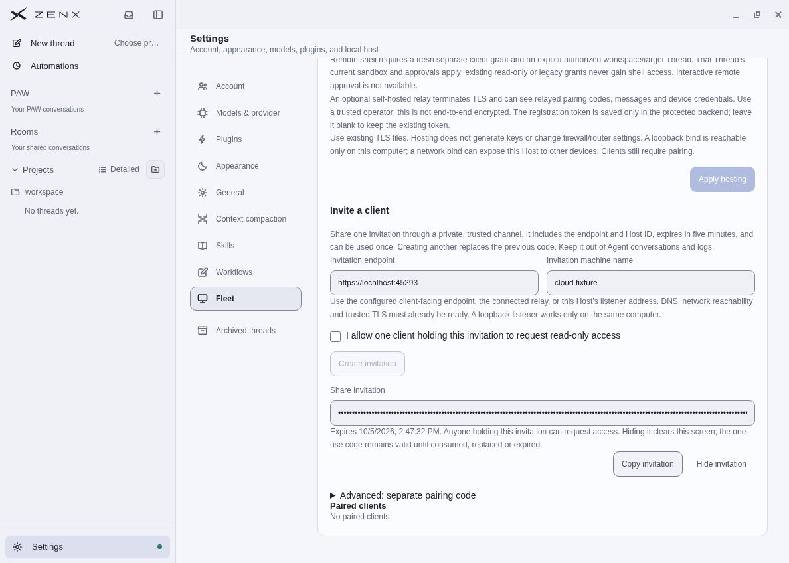
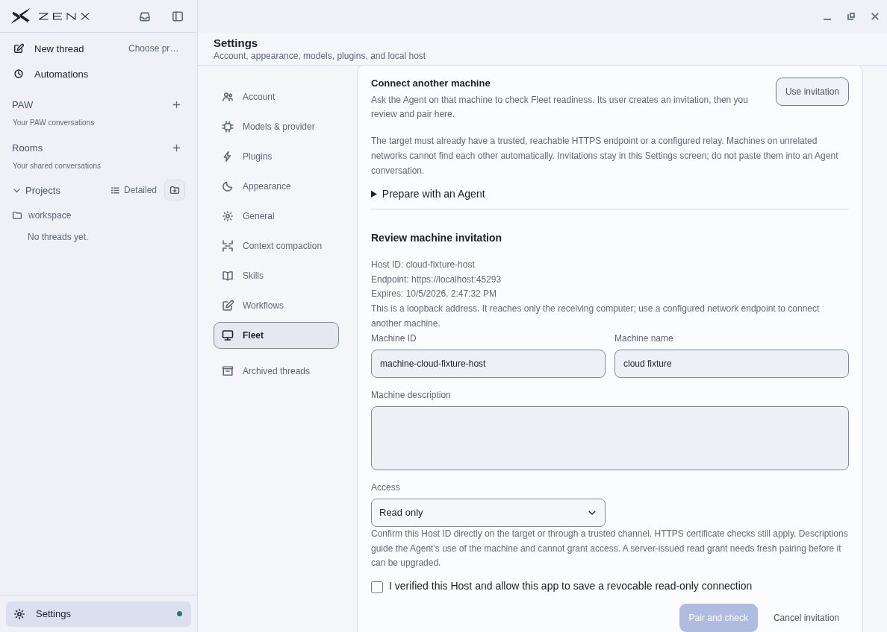
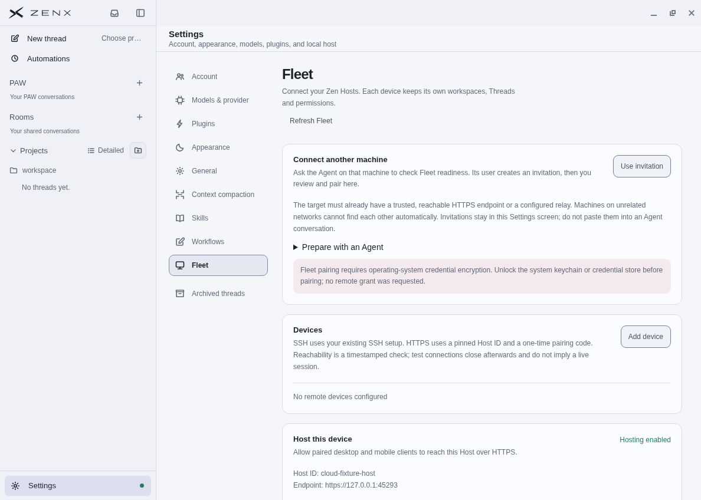
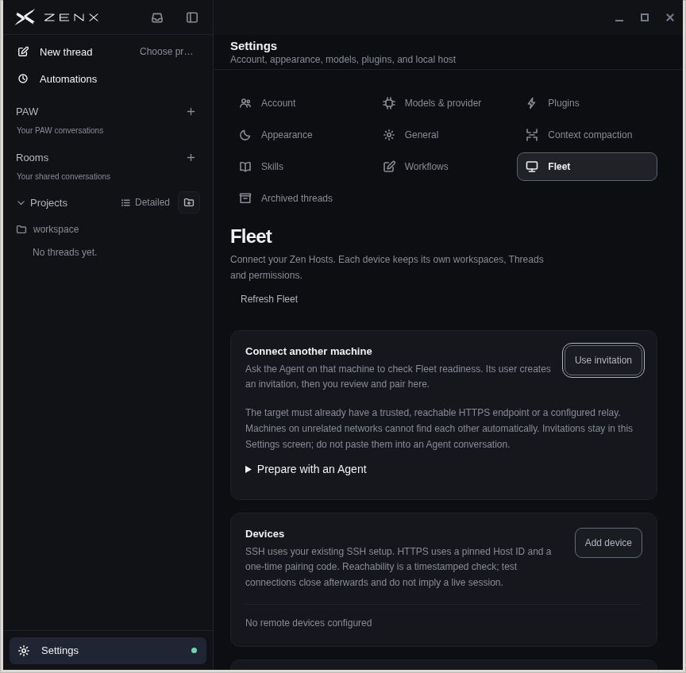

# Fleet onboarding desktop QA

Native Linux screenshots captured on 5 October 2026, 05:41–05:49 UTC, from built
source `0986487a249aa114b737c99754594f8472f64b0c`, tree
`077dc8ee80ac840ddd9258e7bd461ef8c59232ff`. The screenshots were inspected and copied
without image edits. This evidence follow-up changes only this report and images;
product source and CSS match the captured, reviewed build.

The isolated cloud profile uses a fake provider and one real loopback TLS Host
with throwaway certificate/configuration. No personal Windows or company Mac was
accessed. The cloud OS credential store is unavailable, so GUI pairing correctly
stops before requesting a grant. Successful pairing, replay/expiry rejection and
scope preservation are covered by separate throwaway TLS protocol tests; these
screenshots do not establish physical-machine enrollment, trusted public TLS,
unrelated-network discovery, paid-model use or a working OS vault on Windows/macOS.

The native pass exercised ordinary default plugin availability after restart,
read-only setup checks, explicit invitation sharing consent, create/copy/hide,
cancel and empty reopen, exact Host review with read-only default, explicit Pair,
safe-storage rejection, navigation clearing, focus return, and light/dark layouts.
The narrower dark window is 864 × 848; the other captures are 1188 × 848. The
fixture clipboard was cleared and its app/Host stopped afterward.

## Default plugin availability

Fleet is enabled through the ordinary bundled startup path, with no manual plugin
installation. Existing disable/uninstall choices and permissions remain authoritative.

## Agent preparation and network limits

Readiness shows nonsecret prerequisites and known-device discovery limits. It
creates no connection, invitation or authorization.

## One-use invitation

Human sharing consent produces a transient masked invitation for the configured
Host. It expires in five minutes; Copy and Hide are explicit actions.

## Review before trust

The imported invitation supplies the endpoint and stable Host ID. Pairing defaults
to read-only, and the Pair action remains disabled until the person acknowledges
the reviewed scope. Loopback is clearly identified as same-computer access.

## Protected-storage guard

The actual GUI rejects before requesting a grant when OS credential encryption is
unavailable, clears the invitation and shows the actionable cause without an IPC
implementation prefix. No client was enrolled during this native pass.

## Narrow dark layout

The invitation was discarded, focus returned to its entry action, and the compact
native layout keeps the preparation text and actions visible.

## Automated validation

On the same frozen source: 154 affected Fleet/startup/storage tests passed,
four ordinary first-party packaging tests passed, and the two affected profile
repair checks passed. Both ZenX typechecks, Core/Electron builds, formatting and
whitespace checks passed. Independent review passed with 36 focused/startup tests
and the original stale-window probe now rejecting changed Host/access/shell scope.
The previous Fleet machine/workspace/Thread workflow evidence remains in
[the separate Fleet QA report](fleet-qa.md).
