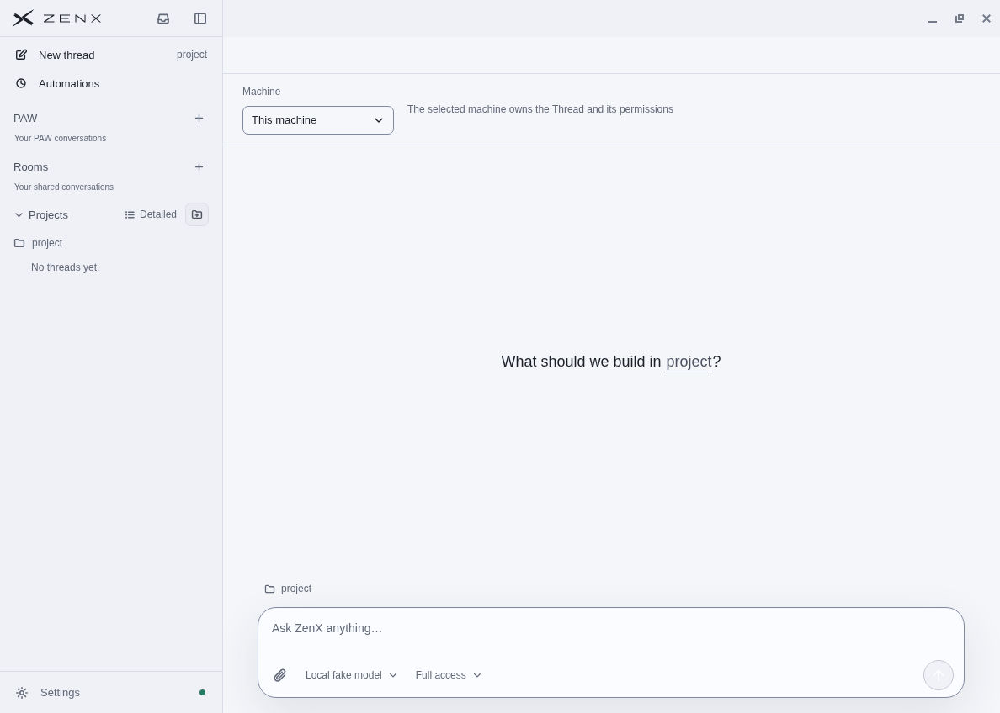
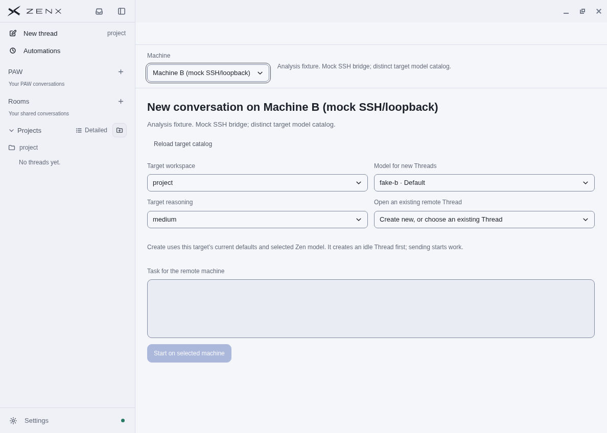
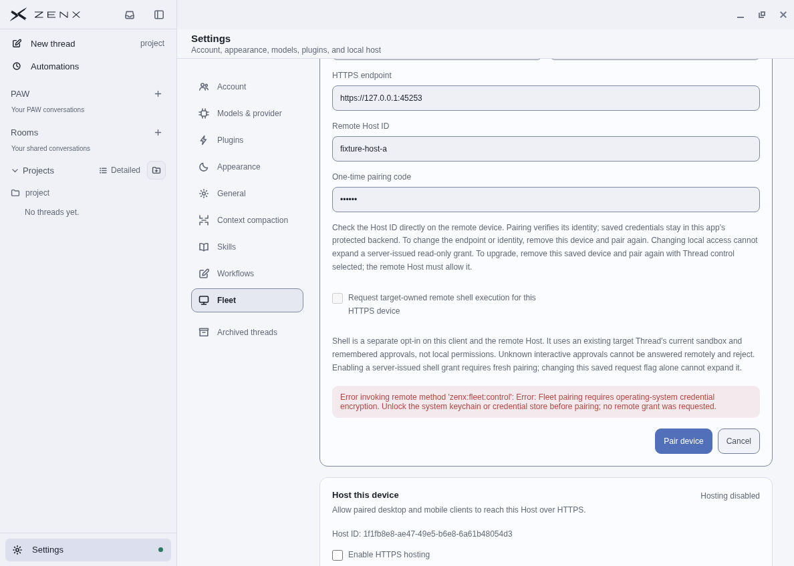

# Fleet desktop QA

These native Electron screenshots were recaptured on 2026-10-04, 20:04–20:07 UTC,
using the built product from commit `18d805b2119b666ecb1cd5dd0e8c314188f7c1dc`
(tree `21d4715681791705b1b2782bb5d8b726a519a749`). The follow-up commit changes
only this report and three PNGs; the reviewed product source is unchanged.

Earlier R2 captures preceded a small Settings action-row CSS specificity fix.
The images below were recaptured after that fix and the final backend admission,
shell-preview and route-precondition repairs. There is no later product-source
or CSS delta to qualify these three images.

## Local default

New thread opens on **This machine**, retaining the existing local Composer.
The visible project and model are synthetic QA data.

## Target catalog

Selecting **Machine B (mock SSH/loopback)** loads its own workspace and `fake-b`
model catalog. The user-authored description remains usage guidance. These are two
real in-process loopback Zen Hosts behind a fixed mock SSH launcher and the actual
stdio bridge, with distinct fake model catalogs and an isolated profile. This is
not a second physical machine or real SSH/LAN/public-network connection.

A prior bounded native pass exercised create/send/read and the locked Thread
locator through this same fixture. The final recapture above checks catalog
selection; it does not pretend to be another create/send/read trace. Final TLS
and bridge regressions cover exact IDs, route changes, archived-state races and
no wrong-target mutations.

## Secure-storage guard

The cloud desktop's OS credential encryption is unavailable. The form uses a
loopback fixture identity and a masked, noncredential dummy string. Pairing rejects
before requesting a remote grant, with an actionable notice beside the button.
No OS security settings were changed and no saved peer token was created.

This demonstrates the GUI guard, not successful HTTPS vault enrollment. TLS and
pairing protocol tests use throwaway protected fixture stores separately.

## Final verification boundary

- 182 affected Fleet/remote/selector tests passed
- Relevant compiled AppServer tests: 269 passed, two platform skips
- Full compiled Core: 658 passed, two skips; one existing URLSearchParams guest
  normalization failure reproduced on untouched main `42b74727`
- Ordinary tarball packaging: four passed; marketplace platform checks: three passed
- Node and renderer typechecks, Core/Electron builds, formatting and diff checks passed
- Final independent review passed, including archive admission and output-preview probes

All fixtures use fake or mock model endpoints. Paid models, physical machines,
public reachability, native Android builds and successful GUI OS-vault enrollment
remain unverified. All native fixture processes were stopped after capture.

See [Fleet usage](fleet.md) and [foreground headless Host](fleet-headless.md).
