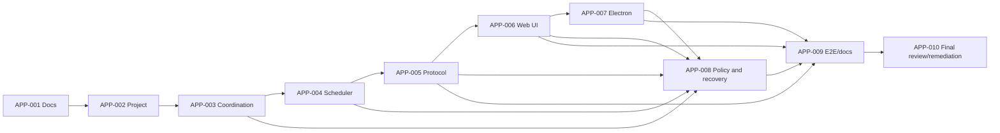

# Agent App DAG

## Scope

This DAG implements the Project/Thread-centered Zen Agent App. It is local
planning evidence only; no Linear issue was created or updated in this wave.

| ID      | Work                                       | Depends on                |
| ------- | ------------------------------------------ | ------------------------- |
| APP-001 | PRD, ADR, DAG, tracker, evidence           | none                      |
| APP-002 | Project aggregate and persistence          | APP-001                   |
| APP-003 | Project coordination log and ThreadMailbox | APP-002                   |
| APP-004 | Initial scheduler and thread tools         | APP-003                   |
| APP-005 | AppServer project/thread protocol          | APP-002, APP-003, APP-004 |
| APP-006 | Project/Thread Web UI                      | APP-005                   |
| APP-007 | Electron thin desktop shell                | APP-006                   |
| APP-008 | Recovery, capability, and resource policy  | APP-003 through APP-007   |
| APP-009 | E2E, packaging, and docs                   | APP-005 through APP-008   |
| APP-010 | Global review and remediation              | APP-009                   |

APP-010 is one consolidated implementation node. Its internal order is the
unified durable command pipeline, Turn-level executor scheduling and durable
wait continuation, authority/archive barriers, atomic next-Turn runtime policy,
transport/desktop hardening, retired-surface removal, then one serialized
release gate.

APP-010 completed this DAG and superseded APP-004's former in-memory wait
model with durable wait dependencies and separately scheduled continuation
Turns. All nodes are Complete.

## Wave Policy

Each implementation issue uses TDD and self-verification. Intermediate issues
do not receive independent review. After the wave gate, one global high-intelligence
review, one consolidated remediation pass, and fresh final verification are
allowed, with at most two total review rounds.
