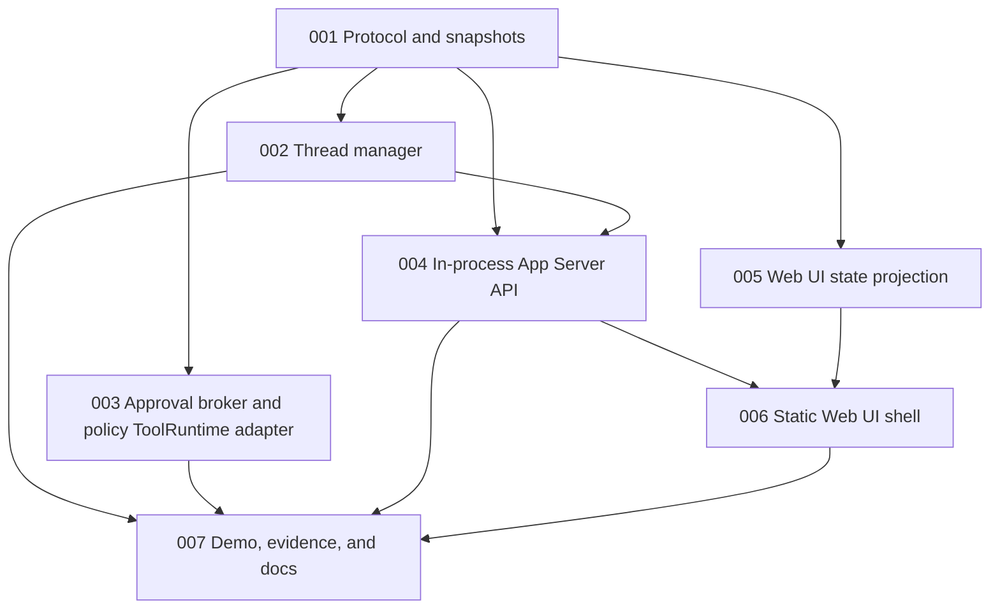

# Issue DAG: App Server And Web UI

Source PRD: `docs/prd/app-server-web-ui.md`

Linear publication:

| Local ID | Linear ID | State |
| --- | --- | --- |
| app-server-web-ui-001 | ALB-80 | Ready for Agent |
| app-server-web-ui-002 | ALB-81 | Backlog |
| app-server-web-ui-003 | ALB-82 | Backlog |
| app-server-web-ui-004 | ALB-83 | Backlog |
| app-server-web-ui-005 | ALB-84 | Backlog |
| app-server-web-ui-006 | ALB-85 | Backlog |
| app-server-web-ui-007 | ALB-86 | Backlog |

## Issue Table

| Local ID | Title | Mode | Depends On | Parallel Safety |
| --- | --- | --- | --- | --- |
| app-server-web-ui-001 | Define App Server protocol and snapshots | AFK | none | safe to parallelize |
| app-server-web-ui-002 | Add thread manager around item-first kernel | AFK | 001 | serializes runtime integration |
| app-server-web-ui-003 | Add approval broker and policy ToolRuntime adapter | AFK | 001 | safe with disjoint files |
| app-server-web-ui-004 | Add in-process App Server request/subscription API | AFK | 001, 002 | serializes server integration |
| app-server-web-ui-005 | Add Web UI state projection over protocol notifications | AFK | 001 | safe to parallelize |
| app-server-web-ui-006 | Add static Web UI shell for fake runtime | AFK | 004, 005 | serializes UI integration |
| app-server-web-ui-007 | Integrate demo path, evidence, and docs | AFK | 002, 003, 004, 006 | integration checkpoint |

## Mermaid DAG

## Execution Waves

- Wave 1: `app-server-web-ui-001`.
- Wave 2: `app-server-web-ui-002`, `app-server-web-ui-003`, and `app-server-web-ui-005` can proceed in parallel after protocol lands.
- Wave 3: `app-server-web-ui-004`.
- Wave 4: `app-server-web-ui-006`.
- Wave 5: `app-server-web-ui-007` integration and manager review.

## Issue Briefs

### app-server-web-ui-001: Define App Server protocol and snapshots

## Agent Brief

**Category:** enhancement
**Summary:** Define the stable protocol shapes used by App Server clients.

## Current Behavior

The kernel exports `Item`, `AgentLoop`, `ModelGateway`, `ToolRuntime`, and hook types, but no Thread/Turn protocol exists.

## Desired Behavior

Callers can import JSON-safe request, response, notification, Thread, Turn, and snapshot types that wrap core Items without exposing mutable kernel state.

## What To Build

Add an App Server protocol Module defining:

- Thread and Turn identifiers.
- Thread and Turn snapshots.
- request/response payloads for `thread/start`, `thread/read`, `turn/start`, and approval decisions.
- notification payloads for thread, turn, item, and approval lifecycle.
- a visibility filter that excludes `visibility: "internal"` Items by default.

## Key Interfaces

- `AppServerRequest`
- `AppServerResponse`
- `AppServerNotification`
- `ThreadSnapshot`
- `TurnSnapshot`
- `toProtocolItem`

## Acceptance Criteria

- [ ] Protocol shapes are exported from the public package entry point.
- [ ] Protocol Items are clones and cannot mutate the source Item.
- [ ] Internal Items are filtered from default snapshots and notifications.
- [ ] Unit tests cover JSON-safe snapshots and item visibility filtering.

## Required Tests

- Protocol unit tests for item projection, cloning, and request/notification discriminants.

## Required Evidence

- `npm run typecheck`
- `npm test`
- Summary of exported public interfaces.

## Dependencies

- Blocked by: none
- Blocks: app-server-web-ui-002, app-server-web-ui-003, app-server-web-ui-004, app-server-web-ui-005

## Classification

- Mode: AFK
- Risk: low
- Reversibility: reversible
- Testability: clear seam
- Review intensity: manager-single-pass
- Parallel safety: safe to parallelize

## Out Of Scope

- Running agent turns.
- Web UI rendering.
- Durable persistence.

### app-server-web-ui-002: Add thread manager around item-first kernel

## Agent Brief

**Category:** enhancement
**Summary:** Add a ThreadManager that owns item lists, turn records, and fake AgentLoop execution.

## Current Behavior

Callers must manually create an `InMemoryItemList`, `AgentLoop`, fake model, and fake tools for each run.

## Desired Behavior

App Server code can start a Thread, start a Turn, read snapshots, and observe item notifications without manually coordinating kernel objects.

## What To Build

Add a ThreadManager Module that:

- Creates threads with an `InMemoryItemList`.
- Creates deterministic run and turn IDs.
- Runs the existing `AgentLoop` with provided or default fake adapters.
- Records turn status and errors.
- Emits ordered notifications when Items append and when turns start/complete/fail.

## Key Interfaces

- `ThreadManager`
- `ThreadRuntimeFactory`
- `ThreadRecord`
- `TurnRecord`
- `ThreadManagerEvent`

## Acceptance Criteria

- [ ] Starting a thread returns a snapshot with no Items.
- [ ] Starting a fake turn appends kernel Items and records a completed Turn.
- [ ] Item notifications preserve Item sequence order.
- [ ] Failed fake model/tool execution records a failed Turn notification.

## Required Tests

- Thread lifecycle tests with fake model.
- Fake tool-call turn test proving notification order follows Item sequence.
- Failure path test.

## Required Evidence

- `npm run typecheck`
- `npm test`
- Item sequence from one fake turn.

## Dependencies

- Blocked by: app-server-web-ui-001
- Blocks: app-server-web-ui-004, app-server-web-ui-007

## Classification

- Mode: AFK
- Risk: medium
- Reversibility: reversible
- Testability: clear seam
- Review intensity: manager-single-pass
- Parallel safety: serializes runtime integration

## Out Of Scope

- Approval policy.
- Web UI.
- Durable persistence.

### app-server-web-ui-003: Add approval broker and policy ToolRuntime adapter

## Agent Brief

**Category:** enhancement
**Summary:** Add approval workflow outside AgentLoop through a ToolRuntime adapter.

## Current Behavior

`AgentLoop` can run tools and hooks can block tool calls, but there is no App Server approval workflow or pending decision mechanism.

## Desired Behavior

Tool execution can be allowed, denied, or paused for approval without adding permission policy logic to `AgentLoop`.

## What To Build

Add approval Modules that:

- Define `PolicyRuntime` decisions: `allow`, `deny`, `needsApproval`.
- Define `ApprovalBroker` pending request and decision APIs.
- Add a `PolicyToolRuntime` adapter that wraps a `ToolRuntime`.
- Emit approval requested/resolved Items or ToolRuntime events in a way that remains visible in the Item trace.
- Return a tool error/result when approval is denied.

## Key Interfaces

- `PolicyRuntime`
- `PolicyDecision`
- `ApprovalBroker`
- `ApprovalRequest`
- `ApprovalDecision`
- `PolicyToolRuntime`

## Acceptance Criteria

- [ ] Allow decision delegates to the wrapped ToolRuntime.
- [ ] Deny decision prevents wrapped ToolRuntime execution.
- [ ] Needs-approval decision waits for broker resolution before execution.
- [ ] Approval request and resolution are auditable as Items or protocol notifications.
- [ ] No permission policy branches are added to `AgentLoop`.

## Required Tests

- Allow, deny, approve, and decline tests using fake tools.
- Regression assertion that `AgentLoop` constructor/options do not gain policy-specific settings.

## Required Evidence

- `npm run typecheck`
- `npm test`
- Explanation of why the loop remains policy-free.

## Dependencies

- Blocked by: app-server-web-ui-001
- Blocks: app-server-web-ui-007

## Classification

- Mode: AFK
- Risk: medium
- Reversibility: reversible
- Testability: clear seam
- Review intensity: manager-strict-loop
- Parallel safety: safe with disjoint files

## Out Of Scope

- Real shell/filesystem/network policy.
- Browser approval UI wiring.

### app-server-web-ui-004: Add in-process App Server request/subscription API

## Agent Brief

**Category:** enhancement
**Summary:** Expose ThreadManager through a stable in-process App Server API.

## Current Behavior

ThreadManager behavior is not reachable through a client-shaped App Server Module.

## Desired Behavior

Tests and UI adapters can call an App Server Interface for thread and turn requests and subscribe to notifications.

## What To Build

Add an `AppServer` Module that:

- Dispatches typed requests to ThreadManager.
- Provides `subscribe(listener)` for notifications.
- Returns typed responses and errors.
- Keeps transport out of scope but keeps payloads JSON-safe.

## Key Interfaces

- `AppServer`
- `AppServerOptions`
- `AppServerClient`
- `AppServerSubscription`

## Acceptance Criteria

- [ ] `thread/start`, `thread/read`, and `turn/start` work through the App Server API.
- [ ] Subscribers receive ordered notifications.
- [ ] Unknown or invalid requests return typed errors.
- [ ] Tests do not import ThreadManager when exercising App Server behavior.

## Required Tests

- Request dispatch tests.
- Subscription order tests.
- Error response tests.

## Required Evidence

- `npm run typecheck`
- `npm test`
- Example request/notification transcript.

## Dependencies

- Blocked by: app-server-web-ui-001, app-server-web-ui-002
- Blocks: app-server-web-ui-006, app-server-web-ui-007

## Classification

- Mode: AFK
- Risk: medium
- Reversibility: reversible
- Testability: clear seam
- Review intensity: manager-single-pass
- Parallel safety: serializes server integration

## Out Of Scope

- HTTP/WebSocket/stdin transport.
- Authentication.

### app-server-web-ui-005: Add Web UI state projection over protocol notifications

## Agent Brief

**Category:** enhancement
**Summary:** Add a browser-independent Web UI state projection for Thread/Turn/Item notifications.

## Current Behavior

There is no Web UI state model. UI code would have to interpret raw notifications ad hoc.

## Desired Behavior

The Web UI can reduce snapshots and notifications into a stable timeline model without depending on DOM or kernel internals.

## What To Build

Add a Web UI projection Module that:

- Accepts thread snapshots and App Server notifications.
- Produces a current-thread view model.
- Groups assistant deltas under completed assistant messages where possible.
- Renders tool call/result/error and approval pending/resolved state as typed timeline rows.

## Key Interfaces

- `WebUiState`
- `TimelineRow`
- `createWebUiState`
- `applyAppServerNotification`

## Acceptance Criteria

- [ ] Snapshot load initializes timeline state.
- [ ] Item notifications append rows in order.
- [ ] Completed assistant messages are authoritative over deltas.
- [ ] Tool and approval Items produce clear timeline row types.

## Required Tests

- Projection tests for message, delta, tool, and approval item sequences.

## Required Evidence

- `npm run typecheck`
- `npm test`
- Example timeline state after a fake turn.

## Dependencies

- Blocked by: app-server-web-ui-001
- Blocks: app-server-web-ui-006

## Classification

- Mode: AFK
- Risk: low
- Reversibility: reversible
- Testability: clear seam
- Review intensity: manager-single-pass
- Parallel safety: safe to parallelize

## Out Of Scope

- DOM rendering.
- CSS styling.
- Network transport.

### app-server-web-ui-006: Add static Web UI shell for fake runtime

## Agent Brief

**Category:** enhancement
**Summary:** Add a minimal static Web UI that runs against the in-process fake App Server.

## Current Behavior

There is no browser entry point for interacting with Zen.

## Desired Behavior

A user can open a local static Web UI, start a fake thread, submit a message, and see an item timeline.

## What To Build

Add static Web UI files and a small browser adapter that:

- Starts a fake App Server client.
- Provides a message composer.
- Renders current thread/turn status.
- Renders timeline rows from the Web UI state projection.
- Shows approval controls when projection reports a pending approval row.

## Key Interfaces

- Static `web/index.html`
- Browser adapter module
- DOM renderer over `WebUiState`

## Acceptance Criteria

- [ ] Opening the Web UI shows a usable first screen, not a landing page.
- [ ] Submitting a message runs a fake turn and updates the timeline.
- [ ] Timeline rows do not require manual page refresh.
- [ ] UI uses restrained operational styling and stable dimensions.

## Required Tests

- Unit-level render smoke if DOM test support exists.
- Manual/browser smoke evidence if a dev server or static file route exists.

## Required Evidence

- `npm run typecheck`
- `npm test`
- Screenshot or clear manual smoke notes.

## Dependencies

- Blocked by: app-server-web-ui-004, app-server-web-ui-005
- Blocks: app-server-web-ui-007

## Classification

- Mode: AFK
- Risk: medium
- Reversibility: reversible
- Testability: partly browser/manual
- Review intensity: manager-single-pass
- Parallel safety: serializes UI integration

## Out Of Scope

- Full design system.
- Multi-thread browser persistence.
- Real model/tool adapters.

### app-server-web-ui-007: Integrate demo path, evidence, and docs

## Agent Brief

**Category:** enhancement
**Summary:** Integrate the App Server and Web UI slices into a documented fake-runtime demo path.

## Current Behavior

Individual modules may exist, but there is no end-to-end evidence tying App Server, approval seam, and Web UI together.

## Desired Behavior

The repo documents how the fake App Server and Web UI fit together, and final evidence proves the issue DAG is complete.

## What To Build

Add integration documentation and evidence:

- Public export summary.
- Fake runtime transcript.
- Web UI run instructions.
- Evidence file under `docs/implementation/app-server-web-ui-evidence.md`.
- Review notes for remaining productization gaps.

## Key Interfaces

- `src/index.ts`
- App Server public exports
- Web UI entry path
- Evidence artifact

## Acceptance Criteria

- [ ] Final public exports are coherent and documented.
- [ ] Evidence includes commands run and results.
- [ ] The fake runtime demo exercises thread start, turn start, item notifications, and Web UI projection.
- [ ] Remaining non-goal productization work is listed separately.

## Required Tests

- Full repo gates.
- Any integration tests added by prior issues.

## Required Evidence

- `npm run typecheck`
- `npm test`
- Demo transcript or screenshot path.
- Final changed file summary.

## Dependencies

- Blocked by: app-server-web-ui-002, app-server-web-ui-003, app-server-web-ui-004, app-server-web-ui-006
- Blocks: none

## Classification

- Mode: AFK
- Risk: low
- Reversibility: reversible
- Testability: clear integration gate
- Review intensity: manager-strict-loop
- Parallel safety: integration checkpoint

## Out Of Scope

- New product requirements.
- Real transport or real model provider.

## Open Questions

- None blocking.

## Readiness Recommendation

The DAG is ready for automated implementation. All issues are AFK, reversible, testable through public interfaces, and have explicit acceptance criteria. Publish to Linear and release only dependency-ready nodes into `Ready for Agent`.
