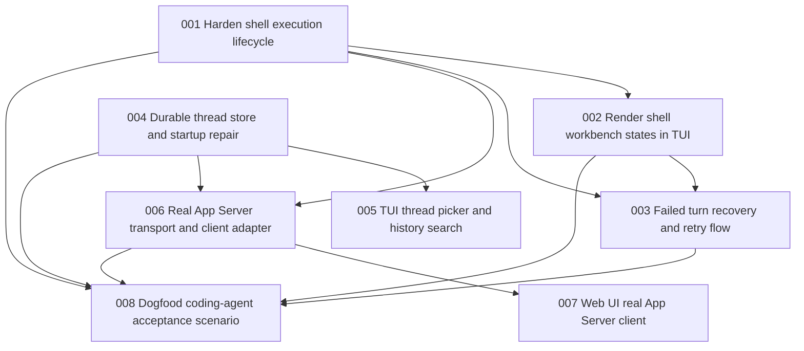

# Issue DAG: Coding Agent Productization

PRD: `docs/prd/coding-agent-productization.md`

## Issue Table

| Local ID | Title | Mode | Dependencies | Initial Linear State | Parallel Safety |
| --- | --- | --- | --- | --- | --- |
| coding-agent-productization-001 | Harden shell execution lifecycle | AFK | none | Ready for Agent | serializes shell runtime |
| coding-agent-productization-002 | Render shell workbench states in TUI | AFK | 001 | Backlog | depends on shell event shape |
| coding-agent-productization-003 | Add failed turn recovery and retry flow | AFK | 001, 002 | Backlog | serializes TUI/session behavior |
| coding-agent-productization-004 | Harden durable thread store and startup repair | AFK | none | Ready for Agent | safe with disjoint files |
| coding-agent-productization-005 | Add TUI thread picker and history search | AFK | 004 | Backlog | depends on store metadata |
| coding-agent-productization-006 | Add real App Server transport and client adapter | AFK | 001, 004 | Backlog | serializes protocol transport |
| coding-agent-productization-007 | Switch Web UI to real App Server client | AFK | 006 | Backlog | depends on transport |
| coding-agent-productization-008 | Add dogfood coding-agent acceptance scenario | AFK | 001, 002, 003, 004, 006 | Backlog | final integration checkpoint |

## DAG

## Execution Waves

- Wave 1: 001 and 004 in parallel.
- Wave 2: 002 and 006 after their blockers pass.
- Wave 3: 003, 005, and 007 after their blockers pass.
- Wave 4: 008 final integration and evidence.

## Issue Briefs

### coding-agent-productization-001: Harden shell execution lifecycle

## Agent Brief

**Category:** enhancement
**Summary:** Make the shell-first ToolRuntime reliable for real coding-agent work.

## Current Behavior

`LocalToolRuntime` exposes one `shell` tool and returns `exitCode`, `stdout`,
and `stderr` only after the command exits. Interrupting a turn does not provide
strong evidence that a running child process was stopped.

## Desired Behavior

Shell execution produces observable lifecycle evidence, supports cancellation,
handles non-zero exits as tool results, and leaves enough item trace for UI and
reviewers to understand what happened.

## What To Build

- Extend shell execution to emit output deltas while the command runs.
- Wire the turn `AbortSignal` through tool execution context so shell commands
  can be cancelled.
- Ensure cancellation terminates the child process and appends a clear
  `tool.error` or cancelled result item.
- Preserve non-zero command exits as completed shell results with exit evidence.
- Keep `shell` as the only local tool definition.

## Key Interfaces

- `ToolExecutionContext`
- `LocalToolRuntime`
- `appendToolExecutionItems`
- `ThreadManager` interrupt path

## Acceptance Criteria

- [ ] A long-running shell command can be interrupted from the TUI/session path.
- [ ] Shell stdout/stderr appears as ordered `tool.output.delta` items while the
      command is running.
- [ ] Non-zero exits produce a completed tool result with exit evidence, not an
      unhandled runtime exception.
- [ ] Unknown tool names still produce a tool error.
- [ ] `localToolDefinitions` exposes only `shell`.

## Required Tests

- Behavior tests for shell success, non-zero exit, streaming output, timeout or
  cancellation, and unknown tool.
- App Server or ThreadManager test proving interrupt reaches active tool
  execution.

## Required Evidence

- `npm run typecheck`
- `npm test`
- `npm run build`
- Worker note with command output snippets for shell success, failure, and
  interrupt.

## Dependencies

- Blocked by: none
- Blocks: 002, 003, 006, 008

## Decision Policy

- Agent may decide local cancellation mechanics and test fixtures.
- Return to Needs Human Context if public protocol item types must change in a
  way that breaks existing clients.

## Out Of Scope

- Approval policy, sandbox profiles, extra file tools, or network tools.

### coding-agent-productization-002: Render shell workbench states in TUI

## Agent Brief

**Category:** enhancement
**Summary:** Make shell activity readable in the component TUI.

## Current Behavior

The TUI distinguishes shell calls from generic tools, but it still has limited
running-state, output folding, and failure affordances.

## Desired Behavior

Shell activity reads like a coding workbench: command, running state,
stdout/stderr, exit code, collapsed/expanded output, and failure state are
obvious without exposing protocol noise.

## What To Build

- Render shell command rows with status: running, completed, failed, or
  interrupted.
- Show stdout/stderr deltas while a shell command is running.
- Keep collapsed output concise and expanded output readable via `/tools` or a
  renamed command if clearer.
- Preserve trace filtering and input editor stability.

## Key Interfaces

- `WebUiState` timeline projection
- `ZenTuiApp`
- `terminal-transcript`
- `tui-engine`

## Acceptance Criteria

- [ ] Running shell commands show a visible running row.
- [ ] Completed shell commands show exit code and concise output summary.
- [ ] Expanded tool view shows full stdout/stderr without raw JSON.
- [ ] Interrupted or failed shell commands show a clear failure row.
- [ ] Non-shell tool rows still render correctly for fake/runtime tests.

## Required Tests

- Timeline projection test for shell output deltas.
- Virtual terminal tests for collapsed and expanded shell output.
- Terminal transcript tests for non-interactive shell rows.

## Required Evidence

- `npm run typecheck`
- `npm test`
- `npm run build`
- Screenshot or transcript of a shell command running and completing.

## Dependencies

- Blocked by: 001
- Blocks: 003, 008

## Decision Policy

- Agent may decide exact wording and compact rendering.
- Return to Needs Human Context if new keyboard interaction patterns conflict
  with existing slash command design.

## Out Of Scope

- Full terminal scrollback engine or ncurses-style layout rewrite.

### coding-agent-productization-003: Add failed turn recovery and retry flow

## Agent Brief

**Category:** enhancement
**Summary:** Let users recover from failed or interrupted turns without losing
thread context.

## Current Behavior

Interrupted or failed turns are visible only through basic status/notice paths.
There is no first-class retry command or recovery display.

## Desired Behavior

The TUI/session can show the latest failed/interrupted turn, clear queued input
when appropriate, and retry a prior user input through the App Server without
manual copy/paste.

## What To Build

- Add a session-level representation of the latest failed/interrupted turn.
- Add a TUI command such as `/retry` that resubmits the last failed user input.
- Ensure retry appends a new turn instead of mutating prior items.
- Show failure cause and retry availability in the TUI.

## Key Interfaces

- `AgentInteractionSession`
- `ThreadManager`
- `AppServer` turn requests
- `ZenTuiApp`

## Acceptance Criteria

- [ ] A failed model turn is visible as recoverable state in the TUI.
- [ ] An interrupted shell/model turn can be retried through `/retry`.
- [ ] Retry creates a new turn and preserves prior failed items.
- [ ] Queued input is not replayed accidentally after interrupt.

## Required Tests

- Session behavior test for failed turn state.
- App Server or ThreadManager test proving retry appends a new turn.
- Virtual terminal test for `/retry`.

## Required Evidence

- `npm run typecheck`
- `npm test`
- `npm run build`
- Worker note with failed-turn and retry transcript.

## Dependencies

- Blocked by: 001, 002
- Blocks: 008

## Decision Policy

- Agent may decide the exact slash command name if tests and help text are
  updated.
- Return to Needs Human Context if retry would require rewriting historical
  items.

## Out Of Scope

- Branch rollback, file restore, or automatic patch reversal.

### coding-agent-productization-004: Harden durable thread store and startup repair

## Agent Brief

**Category:** enhancement
**Summary:** Make local thread persistence versioned, atomic, and recoverable.

## Current Behavior

`FileThreadStore` persists thread snapshots for resume, but there is no explicit
schema version, atomic write contract, corruption handling, or startup repair
for turns left in progress by a prior process.

## Desired Behavior

Thread storage is durable enough for daily local use. Startup can repair or
mark stale in-progress turns without corrupting completed items.

## What To Build

- Add a versioned thread store file format.
- Use atomic write semantics for saved snapshots.
- Handle corrupt/unreadable thread files without crashing the whole app.
- On startup, repair stale running turns to failed/interrupted state with an
  auditable item or turn status.
- Preserve current `ThreadStore` interface depth unless a small interface change
  is clearly justified.

## Key Interfaces

- `ThreadStore`
- `FileThreadStore`
- `createProviderBackedAppServer`
- `ThreadManager` initial thread loading

## Acceptance Criteria

- [ ] New thread files include a schema version.
- [ ] Save operations are atomic from the caller perspective.
- [ ] One corrupt thread file does not prevent listing other threads.
- [ ] Stale running turns from a prior process become recoverable failed or
      interrupted turns on startup.
- [ ] Existing unversioned thread files remain readable or are migrated safely.

## Required Tests

- FileThreadStore tests for versioned read/write.
- Corrupt file handling test.
- Startup repair test with an in-progress turn snapshot.

## Required Evidence

- `npm run typecheck`
- `npm test`
- `npm run build`
- Worker note with temp-store fixture paths and before/after behavior.

## Dependencies

- Blocked by: none
- Blocks: 005, 006, 008

## Decision Policy

- Agent may decide exact on-disk JSON shape if it is versioned and documented in
  tests.
- Return to Needs Human Context for irreversible migration or data deletion.

## Out Of Scope

- SQLite, remote sync, encryption, or multi-user storage.

### coding-agent-productization-005: Add TUI thread picker and history search

## Agent Brief

**Category:** enhancement
**Summary:** Make thread resume usable without copying raw thread ids.

## Current Behavior

`/resume` lists saved threads by index/id/status/item counts. There is no
search, title/summary metadata, or keyboard-friendly picker.

## Desired Behavior

Users can find and resume prior threads by useful metadata from the TUI.

## What To Build

- Add thread list metadata derived from saved snapshots, such as last user
  message, last assistant summary, updated time, status, and turn count.
- Add `/resume <query>` behavior or a picker mode that filters by metadata.
- Keep the picker protocol-backed; TUI must not read store files directly.

## Key Interfaces

- `AgentInteractionSession.listThreads`
- `ThreadStore.list`
- `ZenTuiApp`
- `slash-commands`

## Acceptance Criteria

- [ ] `/resume` shows meaningful thread metadata.
- [ ] A user can filter or select a thread without raw id copy/paste.
- [ ] Resume still uses App Server/session APIs only.
- [ ] Empty and corrupt-store cases render helpful notices.

## Required Tests

- Session test for thread metadata.
- Virtual terminal tests for filtering/selecting.
- Store test if metadata derivation belongs there.

## Required Evidence

- `npm run typecheck`
- `npm test`
- `npm run build`
- Worker note with resume picker transcript.

## Dependencies

- Blocked by: 004
- Blocks: none

## Decision Policy

- Agent may decide exact metadata fields if they are useful and test-covered.
- Return to Needs Human Context if adding user-editable thread titles.

## Out Of Scope

- Full thread management UI, archive/delete, or remote sync.

### coding-agent-productization-006: Add real App Server transport and client adapter

## Agent Brief

**Category:** enhancement
**Summary:** Expose App Server over a real local transport with ordered
notifications.

## Current Behavior

App Server is an in-process client API. UI adapters can share the protocol
shape, but there is no long-running server process or transport client.

## Desired Behavior

A local client can start/read/resume threads, start turns, interrupt turns, and
receive ordered item/turn notifications over a real transport.

## What To Build

- Add a small local transport server, preferably HTTP plus SSE or WebSocket,
  using built-in Node APIs unless a dependency is justified.
- Add a matching App Server client adapter.
- Preserve JSON-safe App Server request/response/notification types.
- Add a CLI/server entry point or script if needed for local use.

## Key Interfaces

- `AppServerClient`
- `AppServer`
- `app-server-protocol`
- new transport Module

## Acceptance Criteria

- [ ] A client can start/read/list/resume threads through transport.
- [ ] A client can start and interrupt turns through transport.
- [ ] Notifications arrive in item sequence order for a running turn.
- [ ] Transport errors are explicit and testable.
- [ ] Existing in-process client tests still pass.

## Required Tests

- Transport integration test with fake runtime.
- Notification ordering test.
- Interrupt-over-transport test.

## Required Evidence

- `npm run typecheck`
- `npm test`
- `npm run build`
- Worker note with local server/client smoke transcript.

## Dependencies

- Blocked by: 001, 004
- Blocks: 007, 008

## Decision Policy

- Agent may choose HTTP+SSE or WebSocket with a concise rationale.
- Return to Needs Human Context if adding a heavyweight framework dependency.

## Out Of Scope

- Authentication, remote hosting, TLS, or multi-workspace routing.

### coding-agent-productization-007: Switch Web UI to real App Server client

## Agent Brief

**Category:** enhancement
**Summary:** Replace browser-local fake Web UI wiring with the real App Server
transport client.

## Current Behavior

The static Web UI demonstrates protocol projection with a fake/browser-local
runtime path.

## Desired Behavior

The Web UI can connect to the local App Server transport, start/resume a real
thread, submit turns, and render streamed Thread/Turn/Item notifications.

## What To Build

- Add Web UI client wiring for the transport from 006.
- Preserve `WebUiState` as the browser state projection.
- Show connection, running, failed, and disconnected states.
- Keep fake/demo mode only if it remains clearly separated from real mode.

## Key Interfaces

- `web/` static UI files if present
- `WebUiState`
- transport client adapter
- App Server protocol types

## Acceptance Criteria

- [ ] Web UI connects to local App Server transport.
- [ ] User can submit a message and see streamed timeline updates.
- [ ] Shell tool rows render as command/result rows, not raw JSON.
- [ ] Disconnect/error state is visible.
- [ ] Fake/demo path does not masquerade as real runtime.

## Required Tests

- Browser-independent state tests for real transport notifications.
- Static UI smoke or documented manual smoke if browser automation is not
  configured.

## Required Evidence

- `npm run typecheck`
- `npm test`
- `npm run build`
- Screenshot or transcript of real Web UI transport smoke.

## Dependencies

- Blocked by: 006
- Blocks: none

## Decision Policy

- Agent may decide small UI wording and connection-state layout.
- Return to Needs Human Context if Web UI requires a design direction beyond
  functional local tooling.

## Out Of Scope

- Hosted deployment, login, or visual redesign beyond functional clarity.

### coding-agent-productization-008: Add dogfood coding-agent acceptance scenario

## Agent Brief

**Category:** enhancement
**Summary:** Prove Zen can complete a small coding task through the real model
and shell-first runtime.

## Current Behavior

The repo has unit tests and smoke tests, but no durable acceptance scenario that
demonstrates the product loop end to end.

## Desired Behavior

There is a repeatable dogfood scenario showing a real model-driven Zen session
using shell to inspect code, make a small change, run validation, and leave
reviewable evidence.

## What To Build

- Add a documented smoke scenario that can run locally with the configured
  configured model provider.
- Prefer a non-destructive fixture repo or temporary workspace.
- Capture transcript/evidence showing shell calls, edits, tests, and final
  answer.
- Document skipped parts when provider/network credentials are unavailable.

## Key Interfaces

- TUI or transport client entry point
- provider-backed runtime factory
- shell-first ToolRuntime
- evidence artifact under `docs/implementation/`

## Acceptance Criteria

- [ ] The scenario starts a real Zen thread against the configured provider.
- [ ] The model uses shell for at least inspect, edit, and test steps.
- [ ] Validation output is captured in an evidence artifact.
- [ ] The scenario is safe to run without mutating the main repo unexpectedly.
- [ ] Missing provider credentials produce a clear skip, not a false pass.

## Required Tests

- Unit/integration coverage for any reusable harness code.
- Manual or automated dogfood run evidence depending on provider availability.

## Required Evidence

- `npm run typecheck`
- `npm test`
- `npm run build`
- Dogfood transcript/evidence path.

## Dependencies

- Blocked by: 001, 002, 003, 004, 006
- Blocks: none

## Decision Policy

- Agent may design the fixture task if it is small, safe, and repeatable.
- Return to Needs Human Context if the scenario needs real credentials that are
  unavailable to Symphony.

## Out Of Scope

- Claiming full replacement parity with existing Zen Agent.

## Publication Status

| Local ID | Linear Issue | State |
| --- | --- | --- |
| coding-agent-productization-001 | ALB-87 | Ready for Agent |
| coding-agent-productization-002 | ALB-88 | Backlog |
| coding-agent-productization-003 | ALB-89 | Backlog |
| coding-agent-productization-004 | ALB-90 | Ready for Agent |
| coding-agent-productization-005 | ALB-91 | Backlog |
| coding-agent-productization-006 | ALB-92 | Backlog |
| coding-agent-productization-007 | ALB-93 | Backlog |
| coding-agent-productization-008 | ALB-94 | Backlog |

Initial release policy:

- Release Wave 1 only: ALB-87 and ALB-90.
- Keep dependent nodes in Backlog until their blockers are complete and
  reviewed.
- Use Linear blocker relations as the canonical execution DAG for Symphony.
