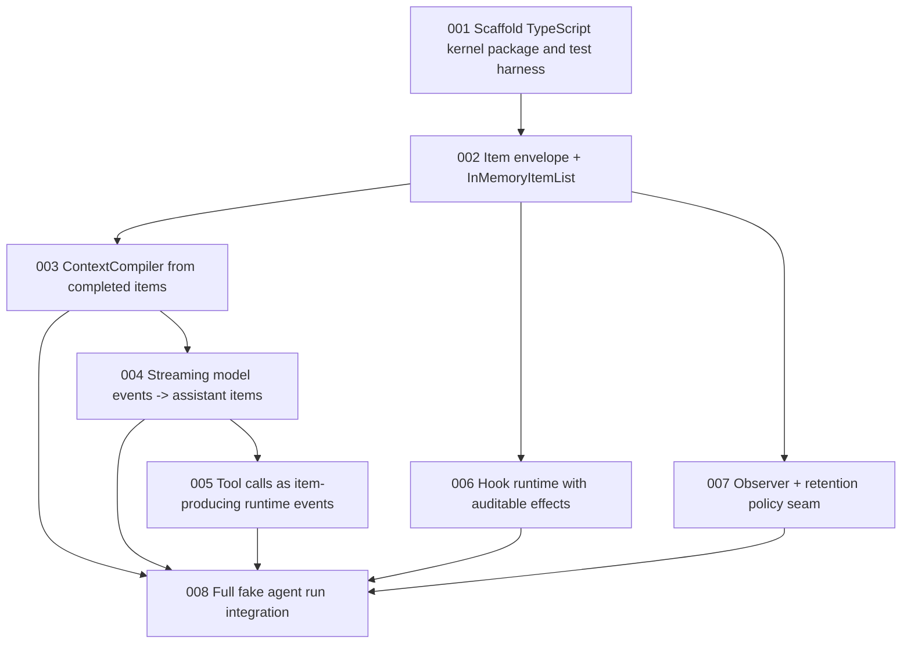

# Issue DAG: Item-First Agent Kernel

Source PRD: `docs/prd/item-first-kernel.md`

Linear project: `Zen agent`

Linear project URL: https://linear.app/alberts-house/project/zen-agent-04d56f75dcff

## Published Linear Issues

| Local ID | Linear ID | URL |
| --- | --- | --- |
| item-first-kernel-001 | ALB-72 | https://linear.app/alberts-house/issue/ALB-72/scaffold-typescript-kernel-package-and-test-harness |
| item-first-kernel-002 | ALB-73 | https://linear.app/alberts-house/issue/ALB-73/implement-item-envelope-and-inmemoryitemlist |
| item-first-kernel-003 | ALB-74 | https://linear.app/alberts-house/issue/ALB-74/compile-model-context-from-completed-items |
| item-first-kernel-004 | ALB-75 | https://linear.app/alberts-house/issue/ALB-75/convert-streaming-model-events-into-assistant-items |
| item-first-kernel-005 | ALB-76 | https://linear.app/alberts-house/issue/ALB-76/execute-tool-calls-as-item-producing-runtime-events |
| item-first-kernel-006 | ALB-77 | https://linear.app/alberts-house/issue/ALB-77/add-explicit-hook-runtime-with-auditable-effects |
| item-first-kernel-007 | ALB-78 | https://linear.app/alberts-house/issue/ALB-78/add-item-observer-and-persistence-retention-policy-seam |
| item-first-kernel-008 | ALB-79 | https://linear.app/alberts-house/issue/ALB-79/integrate-full-fake-agent-run-through-public-kernel-api |

## Issue Table

| Local ID | Linear ID | Title | Mode | Dependencies | Blocks | Review |
| --- | --- | --- | --- | --- | --- | --- |
| item-first-kernel-001 | ALB-72 | Scaffold TypeScript kernel package and test harness | AFK | none | 002, 003, 004, 005, 006, 007, 008 | manager-single-pass |
| item-first-kernel-002 | ALB-73 | Implement Item envelope and InMemoryItemList | AFK | 001 | 003, 004, 005, 006, 007, 008 | manager-single-pass |
| item-first-kernel-003 | ALB-74 | Compile model context from completed items | AFK | 002 | 004, 005, 008 | manager-single-pass |
| item-first-kernel-004 | ALB-75 | Convert streaming model events into assistant items | AFK | 002, 003 | 005, 008 | manager-single-pass |
| item-first-kernel-005 | ALB-76 | Execute tool calls as item-producing runtime events | AFK | 002, 003, 004 | 008 | manager-single-pass |
| item-first-kernel-006 | ALB-77 | Add explicit hook runtime with auditable effects | AFK | 002 | 008 | manager-single-pass |
| item-first-kernel-007 | ALB-78 | Add item observer and persistence retention policy seam | AFK | 002 | 008 | manager-single-pass |
| item-first-kernel-008 | ALB-79 | Integrate full fake agent run through public kernel API | AFK | 003, 004, 005, 006, 007 | none | manager-strict-loop |

## Mermaid DAG

## Execution Waves

### Wave 1: Foundation

- `item-first-kernel-001`
- `item-first-kernel-002`

Integration checkpoint: the repo has concrete TypeScript tooling and a tested append-only item list contract.

### Wave 2: Core Projections And Streaming

- `item-first-kernel-003`
- `item-first-kernel-004`
- `item-first-kernel-006`
- `item-first-kernel-007`

Parallel safety: `003` and `004` are serial because model event conversion depends on context vocabulary. `006` and `007` can run in parallel after `002` if they do not touch the same files.

Integration checkpoint: completed items compile into context, assistant deltas are trace facts, hooks and observers can react without owning kernel state.

### Wave 3: Tool Loop And End-To-End Run

- `item-first-kernel-005`
- `item-first-kernel-008`

Integration checkpoint: one fake model and fake tool can complete a full run through the public kernel API with item trace evidence.

## Cross-Issue Decisions

- Use an injected ID generator and clock in tests so IDs and timestamps are deterministic.
- `runId` and `turnId` are required on every item in the first implementation. Run-level lifecycle items should still carry the current turn ID or a documented initial turn ID created by the runtime.
- `visibility` is a single value in the first implementation.
- Branch/fork behavior is out of scope; `parentId` is retained as envelope capacity but not formalized beyond item causality tests.
- Completed semantic items are authoritative for model context and resume. Deltas are trace/progress facts and optional persistence candidates.
- Hook replacement/block decisions must preserve trace evidence by appending an explicit `hook.effect` or blocked/replaced item.

## Issue Briefs

### item-first-kernel-001: Scaffold TypeScript kernel package and test harness

## Agent Brief

**Category:** enhancement
**Summary:** Create the minimal TypeScript project structure and test commands for implementing the Zen kernel.

## Current Behavior

The repo is documentation-only. There is no package manifest, source tree, TypeScript config, or test runner.

## Desired Behavior

The repo has a small implementation scaffold with stable commands for formatting/typecheck/tests and an initial public entry point for the kernel.

## What To Build

Create the minimal package structure needed for implementation and TDD. Keep dependencies conservative and focused on TypeScript plus a test runner.

## Key Interfaces

- Package scripts for test/typecheck.
- Public source entry point for future kernel exports.
- Test directory and one smoke test proving the harness runs.
- `docs/agents/quality-gates.md` updated with real commands.

## Acceptance Criteria

- [ ] `package.json`, TypeScript config, and test config exist.
- [ ] A public source entry point exists.
- [ ] A smoke test runs through the configured test command.
- [ ] Quality gates document names the real commands.
- [ ] No implementation-specific agent behavior is added beyond the smoke path.

## Required Tests

- One smoke test through the public entry point.

## Required Evidence

- Commands run and passing output for install, typecheck, and tests.
- Changed files/modules summary.

## Dependencies

- Blocked by: none
- Blocks: item-first-kernel-002, item-first-kernel-003, item-first-kernel-004, item-first-kernel-005, item-first-kernel-006, item-first-kernel-007, item-first-kernel-008

## Classification

- Mode: AFK
- Risk: low
- Reversibility: reversible
- Testability: clear public harness seam
- Review intensity: manager-single-pass
- Parallel safety: serial foundation issue

## Out Of Scope

- Real agent loop behavior.
- Provider SDKs.
- UI, sandboxing, persistence implementation.

### item-first-kernel-002: Implement Item envelope and InMemoryItemList

## Agent Brief

**Category:** enhancement
**Summary:** Implement the append-only item contract and in-memory item list source of truth.

## Current Behavior

`Item` exists only in design documents. There is no runtime representation or append semantics.

## Desired Behavior

Callers can append items to an `InMemoryItemList` and retrieve a stable ordered snapshot with generated IDs, timestamps, run/turn metadata, and monotonic sequence numbers.

## What To Build

Implement the `Item` type, typed item append input shape, deterministic ID/clock injection for tests, and `InMemoryItemList`.

## Key Interfaces

- `Item`
- `ItemList`
- `InMemoryItemList`
- ID generator and clock options

## Acceptance Criteria

- [ ] Appended items receive monotonically increasing `seq`.
- [ ] Appended items include required `id`, `type`, `createdAtMs`, `runId`, `turnId`, and `payload`.
- [ ] Optional `parentId`, `causeId`, `targetId`, `visibility`, and `meta` are preserved.
- [ ] `getItems()` returns a snapshot that callers cannot use to mutate internal order.
- [ ] Tests use deterministic ID and clock injection.

## Required Tests

- Append order and `seq` assignment.
- Snapshot immutability expectations.
- Optional envelope fields preserved.
- Deterministic ID/clock behavior.

## Required Evidence

- Typecheck and unit test output.
- Notes on any envelope decision that differs from the PRD.

## Dependencies

- Blocked by: item-first-kernel-001
- Blocks: item-first-kernel-003, item-first-kernel-004, item-first-kernel-005, item-first-kernel-006, item-first-kernel-007, item-first-kernel-008

## Classification

- Mode: AFK
- Risk: low
- Reversibility: reversible before external adapters depend on it
- Testability: direct public interface tests
- Review intensity: manager-single-pass
- Parallel safety: serial core contract issue

## Out Of Scope

- Query API beyond ordered snapshots.
- Branch/fork semantics.
- Durable persistence.

### item-first-kernel-003: Compile model context from completed items

## Agent Brief

**Category:** enhancement
**Summary:** Add `ContextCompiler` that projects completed model-visible items into provider-neutral model context.

## Current Behavior

There is no model context projection. The design requires context to be derived from items rather than parallel message state.

## Desired Behavior

Completed user, assistant, and tool result items compile into model context. Lifecycle, trace-only, internal, and delta items are ignored by default.

## What To Build

Define a minimal `ModelContext` and `ContextCompiler` that walks item snapshots in sequence order and returns provider-neutral context parts.

## Key Interfaces

- `ContextCompiler`
- `ModelContext`
- Completed message/tool item payload conventions

## Acceptance Criteria

- [ ] Completed user messages appear in model context in sequence order.
- [ ] Completed assistant messages appear in model context in sequence order.
- [ ] Completed tool results appear in model context with tool call linkage.
- [ ] Assistant/tool delta items are ignored by default.
- [ ] Lifecycle and internal items are ignored by default.
- [ ] Compiler does not mutate the item list or item payloads.

## Required Tests

- Completed message compilation.
- Delta exclusion.
- Lifecycle/internal exclusion.
- Tool result linkage.
- Ordering by `seq`.

## Required Evidence

- Typecheck and unit test output.
- Example input item list and compiled context in test names or assertions.

## Dependencies

- Blocked by: item-first-kernel-002
- Blocks: item-first-kernel-004, item-first-kernel-005, item-first-kernel-008

## Classification

- Mode: AFK
- Risk: low
- Reversibility: reversible projection module
- Testability: pure public module behavior
- Review intensity: manager-single-pass
- Parallel safety: serial with model event conversion

## Out Of Scope

- Token budgeting.
- Compaction.
- Provider-specific message formatting.

### item-first-kernel-004: Convert streaming model events into assistant items

## Agent Brief

**Category:** enhancement
**Summary:** Convert provider-neutral model stream events into assistant start, delta, completed, and error items.

## Current Behavior

The design supports deltas, but no runtime maps model streaming into item facts.

## Desired Behavior

The kernel can consume an async iterable of model events and append assistant item facts where deltas are trace/progress items and completed output is authoritative.

## What To Build

Define minimal `ModelGateway`, `ModelEvent`, `ModelOptions`, and conversion behavior used by the future agent loop.

## Key Interfaces

- `ModelGateway`
- `ModelEvent`
- assistant item payloads
- model request lifecycle item payloads

## Acceptance Criteria

- [ ] Model request start/completed items are appended around model generation.
- [ ] Text deltas append `assistant.message.delta` with `targetId`.
- [ ] Completed output appends `assistant.message.completed`.
- [ ] Completed output is not reconstructed from deltas unless a fake model explicitly emits that final text.
- [ ] Model errors append `error` or assistant error item with traceable cause.
- [ ] No provider SDK is introduced.

## Required Tests

- Streamed text delta path.
- Completed item authority even when final text differs from concatenated deltas.
- Model error path.
- Model request lifecycle items.

## Required Evidence

- Typecheck and unit test output.
- Short trace example from fake model test.

## Dependencies

- Blocked by: item-first-kernel-002, item-first-kernel-003
- Blocks: item-first-kernel-005, item-first-kernel-008

## Classification

- Mode: AFK
- Risk: medium because delta semantics are architectural
- Reversibility: reversible before external adapters
- Testability: fake model async iterable
- Review intensity: manager-single-pass
- Parallel safety: avoid parallel edits with context compiler

## Out Of Scope

- Real OpenAI/Anthropic providers.
- Tool call execution.
- UI streaming.

### item-first-kernel-005: Execute tool calls as item-producing runtime events

## Agent Brief

**Category:** enhancement
**Summary:** Add provider-neutral tool execution that appends start, output delta, completed result, and error items.

## Current Behavior

Tool runtime is only described in architecture docs.

## Desired Behavior

When an assistant completed item requests tools, the kernel can execute fake tools and append auditable tool items with correct causality.

## What To Build

Define minimal tool call payloads, `ToolRuntime`, `ToolRuntimeEvent`, and conversion into item facts. Implement enough loop behavior to process one batch of fake tool calls.

## Key Interfaces

- `ToolRuntime`
- `ToolCallPayload`
- `ToolExecutionContext`
- tool item payloads

## Acceptance Criteria

- [ ] Tool call start item references the assistant/tool call cause.
- [ ] Tool output deltas append with `targetId`.
- [ ] Tool result completed item carries content and linkage to the tool call.
- [ ] Tool error item carries failure details without throwing away trace.
- [ ] Tool runtime remains provider-neutral and sandbox-free.

## Required Tests

- Successful fake tool result.
- Tool output delta path.
- Tool failure path.
- Causality via `causeId` or `targetId`.

## Required Evidence

- Typecheck and unit/integration test output.
- Example item sequence for a fake tool call.

## Dependencies

- Blocked by: item-first-kernel-002, item-first-kernel-003, item-first-kernel-004
- Blocks: item-first-kernel-008

## Classification

- Mode: AFK
- Risk: medium because it touches loop semantics
- Reversibility: reversible with fake-only implementation
- Testability: fake tool runtime
- Review intensity: manager-single-pass
- Parallel safety: serialize after model event conversion

## Out Of Scope

- Shell execution.
- Permissions, approvals, sandboxing.
- Tool registry UX.

### item-first-kernel-006: Add explicit hook runtime with auditable effects

## Agent Brief

**Category:** enhancement
**Summary:** Add hook execution points that observe or return explicit effects without mutating hidden kernel state.

## Current Behavior

Hooks are described in docs but no runtime contract exists.

## Desired Behavior

Hooks can observe items and return explicit items or block/replace decisions that the kernel records as auditable facts.

## What To Build

Define `HookRuntime`, initial hook names, hook result shapes, and integration for item append and context/model/tool points where feasible for the current kernel.

## Key Interfaces

- `HookRuntime`
- hook result types
- `hook.effect` item payload

## Acceptance Criteria

- [ ] Hooks cannot directly mutate the internal item list.
- [ ] Hook-produced items are appended through normal append semantics.
- [ ] Block or replace decisions produce visible trace evidence.
- [ ] Hook errors are represented as items or explicit errors without silent state changes.
- [ ] Tests cover at least item append and one model/tool-related hook point.

## Required Tests

- Hook observes item append.
- Hook returns a follow-up item.
- Hook block/replace decision emits `hook.effect`.
- Hook cannot mutate item list through exposed snapshot.

## Required Evidence

- Typecheck and unit test output.
- Hook trace item examples.

## Dependencies

- Blocked by: item-first-kernel-002
- Blocks: item-first-kernel-008

## Classification

- Mode: AFK
- Risk: medium because hooks can obscure behavior if poorly constrained
- Reversibility: reversible before external hook consumers
- Testability: fake hooks through public runtime
- Review intensity: manager-single-pass
- Parallel safety: can parallelize with context/model work if files do not overlap

## Out Of Scope

- Plugin loading.
- Remote hook protocols.
- Product-specific approval UI.

### item-first-kernel-007: Add item observer and persistence retention policy seam

## Agent Brief

**Category:** enhancement
**Summary:** Add an observer seam and retention policy that lets adapters persist selected items without changing the loop.

## Current Behavior

Persistence is only described as an outer adapter.

## Desired Behavior

Callers can register observers for appended items, and a small retention policy helper classifies normal vs extended persistence candidates.

## What To Build

Implement `ItemObserver` notification after append and a retention policy that keeps completed semantic/lifecycle items by default while treating delta items as extended/debug persistence.

## Key Interfaces

- `ItemObserver`
- observer registration on runtime or item list
- retention policy helper

## Acceptance Criteria

- [ ] Observers receive appended items in sequence order.
- [ ] Observer failures have explicit behavior and tests.
- [ ] Default retention includes completed semantic items.
- [ ] Default retention excludes high-volume delta items.
- [ ] Extended retention includes delta/progress items.
- [ ] The agent loop does not depend on a concrete persistence store.

## Required Tests

- Observer receives append events.
- Observer ordering.
- Observer failure policy.
- Retention classification for completed, lifecycle, delta, and internal items.

## Required Evidence

- Typecheck and unit test output.
- Retention examples in tests.

## Dependencies

- Blocked by: item-first-kernel-002
- Blocks: item-first-kernel-008

## Classification

- Mode: AFK
- Risk: low
- Reversibility: reversible adapter seam
- Testability: fake observer
- Review intensity: manager-single-pass
- Parallel safety: can parallelize after item list

## Out Of Scope

- JSONL writer.
- SQLite schema.
- Resume/loading behavior.

### item-first-kernel-008: Integrate full fake agent run through public kernel API

## Agent Brief

**Category:** enhancement
**Summary:** Provide the first complete public agent run path using fake model, fake tools, hooks, and observers.

## Current Behavior

Earlier slices create individual modules, but no complete kernel behavior is guaranteed until they are integrated.

## Desired Behavior

A caller can run the Zen kernel with an in-memory item list, fake model, fake tool runtime, optional hooks, and observer, then inspect the resulting item trace and compiled context behavior.

## What To Build

Implement the public `AgentLoop` or equivalent runtime entry point that ties together item appending, context compilation, model event conversion, tool execution, hook runtime, and observers.

## Key Interfaces

- `AgentLoop` or public `runAgent` function
- `InMemoryItemList`
- `ContextCompiler`
- `ModelGateway`
- `ToolRuntime`
- `HookRuntime`
- `ItemObserver`

## Acceptance Criteria

- [ ] A full run appends run, turn, user, model request, assistant, tool, and completion items.
- [ ] A streamed assistant response emits deltas and completed output.
- [ ] The completed assistant item remains authoritative when deltas differ.
- [ ] A model-requested tool executes and its result is visible to a follow-up model step.
- [ ] Hooks can add auditable effects without hidden state mutation.
- [ ] Observer sees the same appended item order as `ItemList`.
- [ ] The full path uses fake model and fake tool implementations only.
- [ ] The core loop remains small and readable from one primary implementation path.

## Required Tests

- Full fake run with no tool call.
- Full fake run with one tool call and final answer.
- Streamed delta authority test.
- Hook effect integration test.
- Observer ordering integration test.

## Required Evidence

- Typecheck and all test output.
- Short item trace from the integration test.
- Notes on any remaining PRD gap or deferred behavior.

## Dependencies

- Blocked by: item-first-kernel-003, item-first-kernel-004, item-first-kernel-005, item-first-kernel-006, item-first-kernel-007
- Blocks: none

## Classification

- Mode: AFK
- Risk: medium because it locks the first public runtime shape
- Reversibility: moderate; public API changes should be intentional after this
- Testability: full fake integration path
- Review intensity: manager-strict-loop
- Parallel safety: serial integration issue

## Out Of Scope

- Real provider adapters.
- Real filesystem/shell tools.
- UI.
- Durable resume.

## Open Questions

No blocking HITL questions remain for issue creation. The implementation issues carry local decisions for ID generation, `turnId`, retention, and branch/fork deferral.

## Readiness

The DAG is ready for Linear publication and then `afk-implementation-manager`.
