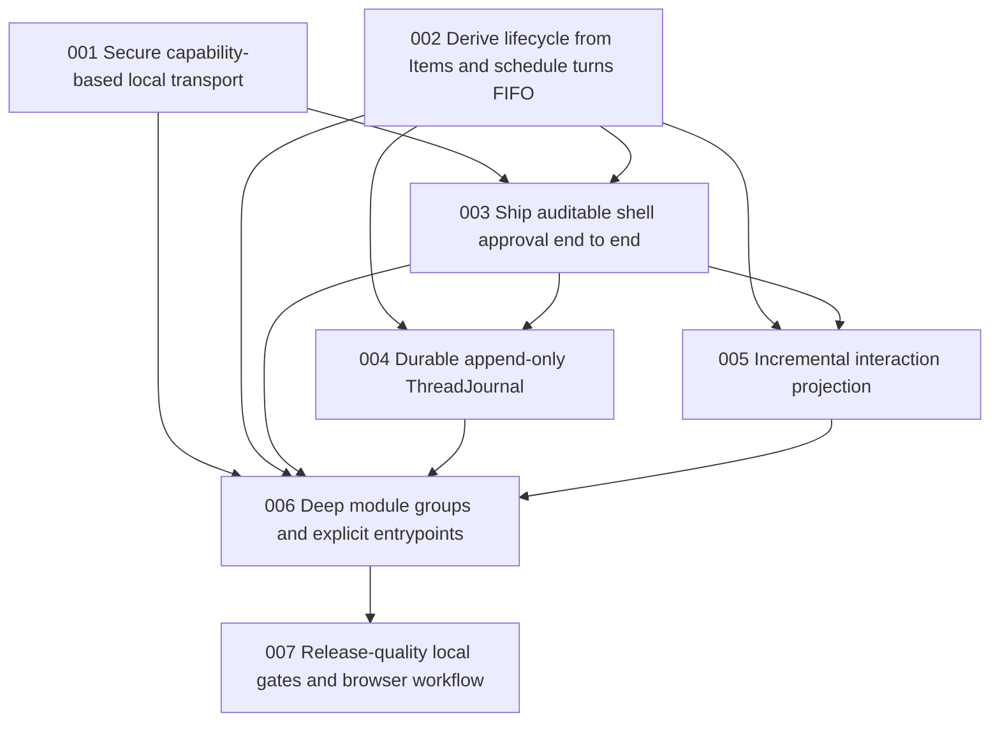

# Issue DAG: Long-Term Optimization

Source PRD:
[`docs/prd/long-term-optimization.md`](../prd/long-term-optimization.md)

Canonical tracker:
[`docs/implementation/long-term-optimization-tracker.md`](long-term-optimization-tracker.md)

## Program Rules

- All issues are AFK.
- All issues use `manager-strict-loop`.
- Breaking changes are allowed for every issue.
- Every implementation issue uses tracer-bullet TDD where a behavior seam
  exists.
- The manager owns architecture and issue decisions. Each worker implements one
  issue only.
- The original worker implements each issue. A fresh-context reviewer reviews
  without edits. Findings return to the original worker. A brand-new reviewer
  reviews the fix. The loop repeats until no blocking or reasonable
  non-blocking suggestions remain.
- Worker rounds and reviewer findings are append-only in the issue's dedicated
  `docs/implementation/long-term-optimization-<NNN>-evidence.md` document.

## Issue Table

| Local ID | Title | Mode | Dependencies | Parallel-Safe With |
| --- | --- | --- | --- | --- |
| long-term-optimization-001 | Secure capability-based local transport | AFK | none | 002 |
| long-term-optimization-002 | Derive lifecycle from Items and schedule turns FIFO | AFK | none | 001 |
| long-term-optimization-003 | Ship auditable shell approval end to end | AFK | 001, 002 | - |
| long-term-optimization-004 | Replace snapshot rewrites with durable append-only ThreadJournal | AFK | 002, 003 | 005 |
| long-term-optimization-005 | Make interaction projection incremental and client lifecycle single-owner | AFK | 002, 003 | 004 |
| long-term-optimization-006 | Enforce deep module groups and explicit entrypoints | AFK | 001-005 | - |
| long-term-optimization-007 | Establish release-quality local gates and browser workflow | AFK | 006 | - |

## DAG

## Execution Waves

- Wave 1: 001 + 002 in parallel, then integrate and run full current gates.
- Wave 2: 003.
- Wave 3: 004 + 005 in parallel, then integrate and run full current gates plus
  new targeted checks.
- Wave 4: 006.
- Wave 5: 007.
- Final: two fresh reviewers in parallel (Standards and Spec), fix loop via
  owning workers/integration worker, then full `npm run check`.

## Issue Briefs

### long-term-optimization-001: Secure capability-based local transport

**Mode:** AFK

**Review:** `manager-strict-loop`

**Breaking changes:** allowed

#### Dependencies

None. Parallel-safe with 002.

#### Scope

HTTP transport, Node HTTP client, app-server/web CLIs, Vite trusted proxy,
transport tests.

#### Acceptance

- [ ] Requests and SSE without/mismatching capability receive 401 and no app
      data.
- [ ] Correct capability supports request and ordered SSE notifications.
- [ ] No wildcard CORS/OPTIONS authorization path remains; direct cross-origin
      browser access is unsupported.
- [ ] Loopback is default; remote bind requires explicit opt-in.
- [ ] Generated/provided tokens never appear in protocol error bodies or
      routine logs; standalone CLI has an explicit one-time handoff mechanism.
- [ ] Web dev path works through same-origin proxy injection without exposing
      token to browser code.

#### Tests

Tests first through public transport interfaces, including request, SSE, proxy
smoke, and token redaction.

### long-term-optimization-002: Derive lifecycle from Items and schedule turns FIFO

**Mode:** AFK

**Review:** `manager-strict-loop`

**Breaking changes:** allowed

#### Dependencies

None. Parallel-safe with 001.

#### Scope

ThreadManager/AppServer lifecycle and protocol projection tests; no
persistence/security/UI work.

#### Acceptance

- [ ] Two same-thread starts are queued FIFO and model execution max concurrency
      is one.
- [ ] Two different threads can execute concurrently.
- [ ] queued, started, completed, failed, canceled/repaired facts are Items.
- [ ] ThreadSnapshot.turns, itemIds, errors, and ThreadStatus are derived from
      Items.
- [ ] retry joins FIFO; interrupt targets active turn and queue continues.
- [ ] startup converts nonterminal queued/running turns into recoverable failed
      facts.
- [ ] no mutable turn list remains as competing source of truth.

#### Tests

Tests first through ThreadManager/AppServer public interfaces, including races.

### long-term-optimization-003: Ship auditable shell approval end to end

**Mode:** AFK

**Review:** `manager-strict-loop`

**Breaking changes:** allowed

#### Dependencies

001 and 002.

#### Scope

tool/approval runtime, AppServer protocol, provider runtime, Web/TUI/session
approval controls, tests.

#### Acceptance

- [ ] Real shell adapter cannot execute until `approveOnce` for that request.
- [ ] `decline` yields first-class `approval.resolved` and `tool.error` facts
      without starting process.
- [ ] `approval.requested` and `approval.resolved` are first-class Items linked
      to tool call/run/turn.
- [ ] resolution validates approvalId/threadId/turnId and rejects stale,
      duplicate, or mismatched decisions.
- [ ] interrupt removes pending approval and terminates the Turn without leaking
      broker entries.
- [ ] Web exposes Approve/Decline controls; TUI exposes equivalent
      commands/actions.
- [ ] no `approveForSession`/`cancel` decision remains.

#### Tests

Tests first through AppServer plus UI/session public interfaces; include abort
and mismatch races.

### long-term-optimization-004: Replace snapshot rewrites with durable append-only ThreadJournal

**Mode:** AFK

**Review:** `manager-strict-loop`

**Breaking changes:** allowed

#### Dependencies

002 and 003. Parallel-safe with 005.

#### Scope

persistence seam and adapter, AppServer/ThreadManager commit/flush integration,
persistence tests. No UI or module moves.

#### Acceptance

- [ ] New versioned per-thread JSONL format; legacy snapshot compatibility
      intentionally removed.
- [ ] Thread creation is durable before successful response.
- [ ] Each Item is serialized once and queued only on its thread, so one slow
      thread does not block another.
- [ ] terminal lifecycle notification is published only after that thread
      flushes successfully.
- [ ] close flushes all threads; failure is sticky and subsequent operations
      return explicit persistence error.
- [ ] truncated final record is recoverable; interior corruption is surfaced
      with file/record context and does not silently erase other threads.
- [ ] a 500-delta regression test proves O(n) record/byte behavior rather than
      full-snapshot O(n²).

#### Tests

Tests first using public journal/AppServer interfaces and real temporary files.

### long-term-optimization-005: Make interaction projection incremental and client lifecycle single-owner

**Mode:** AFK

**Review:** `manager-strict-loop`

**Breaking changes:** allowed

#### Dependencies

002 and 003. Parallel-safe with 004.

#### Scope

shared projection, WebUiClient/AgentInteractionSession, React workspace
hook/lifecycle, TUI presentation consumers, tests. No persistence or module
moves.

#### Acceptance

- [ ] ordered item append updates projection without
      sorting/filtering/rebuilding all prior Items.
- [ ] completed assistant/tool facts authoritatively replace progress views;
      shell/approval grouping remains correct.
- [ ] out-of-order/replacement notification path remains deterministic.
- [ ] Web client has exactly one upstream subscription;
      reconnect/disconnect/unmount release previous streams and listeners.
- [ ] React uses a stable external-store subscription and does not manually
      double-subscribe.
- [ ] Web and TUI consume the same projection interface.
- [ ] a 1k/5k item regression test demonstrates near-linear total processing and
      bounded listener calls.

#### Tests

Tests first through projection/client/session public interfaces; add focused
React lifecycle test.

### long-term-optimization-006: Enforce deep module groups and explicit entrypoints

**Mode:** AFK

**Review:** `manager-strict-loop`

**Breaking changes:** allowed

#### Dependencies

001-005.

#### Scope

source moves/imports/entrypoints, package exports/build config, acceptance
harness relocation, architecture docs, boundary tests. Behavior changes are out
of scope.

#### Target Groups

kernel; product runtime; Node adapters; presentation; TUI/CLI.

#### Acceptance

- [ ] root entrypoint exports kernel only.
- [ ] explicit subpath entrypoints expose product runtime, Node adapters, and
      presentation.
- [ ] kernel imports no product, persistence, transport, provider, shell, or UI
      implementation.
- [ ] Web no longer imports arbitrary `../../src` files; it consumes
      presentation/product interfaces through an explicit entrypoint/alias.
- [ ] dogfood/acceptance implementation is outside production `src` and absent
      from production declarations.
- [ ] dependency-direction test and all existing behavior tests/builds pass.

#### Test Feedback Loop

TDD alternative: characterization/build/boundary feedback loop before and after
mechanical moves.

### long-term-optimization-007: Establish release-quality local gates and browser workflow

**Mode:** AFK

**Review:** `manager-strict-loop`

**Breaking changes:** allowed

#### Dependencies

006.

#### Scope

package scripts/dependencies, lint/format/coverage/browser config and tests,
README and canonical quality docs.

#### Acceptance

- [ ] `npm run check` runs format check, ESLint with TypeScript and React Hooks
      rules, core/Web typechecks, Vitest, Node build, Web build, coverage, and
      Playwright.
- [ ] coverage thresholds for kernel/product/presentation are at least 85%
      lines/functions/statements and 80% branches.
- [ ] Playwright proves real same-origin proxy transport, streamed assistant
      output, pending shell approval, approve/decline, completion, reconnect,
      and thread resume using a deterministic fake model/tool fixture.
- [ ] brittle source-string Web smoke assertions are removed or replaced by
      behavioral tests.
- [ ] fixed-delay waits in touched integration/UI tests are replaced with
      condition/event-driven waits.
- [ ] `docs/agents/quality-gates.md` and README list current commands;
      local-only/no-remote status is explicit.
- [ ] `npm audit` has zero known vulnerabilities.
