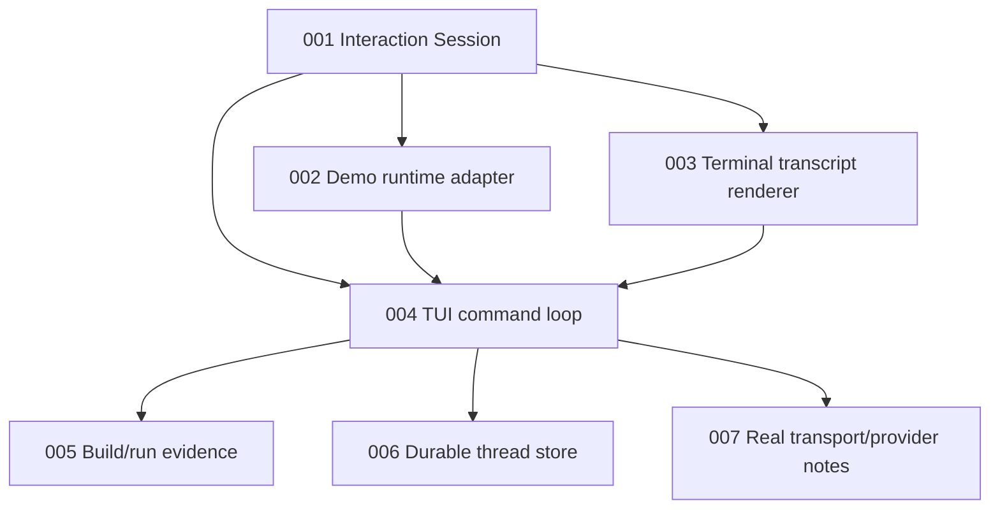

# Issue DAG: Usable Agent Interface

Source PRD: `docs/prd/usable-agent-interface.md`

## Issue Table

| Local ID | Title | Mode | Depends On | Parallel Safety |
| --- | --- | --- | --- | --- |
| usable-agent-interface-001 | Add reusable interaction Session Module | AFK | none | serializes product interaction seam |
| usable-agent-interface-002 | Add demo runtime adapter for TUI product path | AFK | 001 | safe with disjoint files |
| usable-agent-interface-003 | Add terminal transcript renderer | AFK | 001 | safe with disjoint files |
| usable-agent-interface-004 | Add line-oriented TUI command loop | AFK | 001, 002, 003 | serializes runnable integration |
| usable-agent-interface-005 | Add build/run packaging and evidence | AFK | 004 | integration checkpoint |
| usable-agent-interface-006 | Add durable thread store | AFK | 004 | next productization wave |
| usable-agent-interface-007 | Add real transport/provider planning notes | AFK | 004 | next productization wave |

## Mermaid DAG

## Execution Waves

- Wave 1: `usable-agent-interface-001`.
- Wave 2: `usable-agent-interface-002` and `usable-agent-interface-003`.
- Wave 3: `usable-agent-interface-004`.
- Wave 4: `usable-agent-interface-005`.
- Wave 5: `usable-agent-interface-006` and `usable-agent-interface-007`.

This implementation round should complete Waves 1-4 first. Wave 5 is product
follow-up work and should not block the first usable TUI.

## Issue Briefs

### usable-agent-interface-001: Add reusable interaction Session Module

## Agent Brief

**Category:** enhancement
**Summary:** Add a product-facing Session Module over App Server protocol and timeline state.

## Current Behavior

UI adapters must coordinate App Server requests, subscriptions, and state
projection themselves.

## Desired Behavior

TUI and future Web clients can use one Session Module to start threads, submit
turns, observe state, and read timeline rows without importing kernel internals.

## What To Build

Add an `AgentInteractionSession` Module that:

- Accepts an `AppServerClient`.
- Starts a thread on demand.
- Subscribes to App Server notifications.
- Maintains projected timeline state.
- Exposes current state, timeline rows, and submit/new-thread methods.

## Key Interfaces

- `AgentInteractionSession`
- `AgentInteractionSessionOptions`
- `AgentInteractionSnapshot`

## Acceptance Criteria

- [ ] Starting the session creates a current thread.
- [ ] Submitting a message updates state from App Server notifications.
- [ ] The Module does not import kernel internals.
- [ ] Tests exercise behavior through `AppServerClient`.

## Required Tests

- Session start and submit behavior test.
- State projection test via App Server notifications.

## Required Evidence

- `npm run typecheck`
- `npm test`

## Dependencies

- Blocked by: none
- Blocks: usable-agent-interface-002, usable-agent-interface-003, usable-agent-interface-004

## Classification

- Mode: AFK
- Risk: medium
- Reversibility: reversible
- Testability: clear seam
- Review intensity: manager-single-pass
- Parallel safety: serializes product interaction seam

## Out Of Scope

- Terminal input handling.
- Durable storage.
- Real provider integration.

### usable-agent-interface-002: Add demo runtime adapter for TUI product path

## Agent Brief

**Category:** enhancement
**Summary:** Add a demo App Server factory that exercises normal and tool turns.

## Current Behavior

The default fake runtime returns a single generic assistant response.

## Desired Behavior

The TUI can demonstrate a useful agent trace with normal assistant output and a
fake tool cycle while still using real App Server and Item paths.

## What To Build

Add a demo runtime factory that:

- Produces a response based on the latest user message.
- Requests a fake tool call when the input asks for a tool.
- Produces a final assistant response after the fake tool result.
- Provides a fake tool runtime with auditable tool result/error items.

## Key Interfaces

- `createDemoAppServer`
- `createDemoThreadRuntime`

## Acceptance Criteria

- [ ] Normal message produces an assistant response.
- [ ] Tool message produces tool call and tool result rows.
- [ ] The demo runtime is replaceable by future real adapters.

## Required Tests

- App Server integration test for normal and tool turns.

## Required Evidence

- `npm run typecheck`
- `npm test`

## Dependencies

- Blocked by: usable-agent-interface-001
- Blocks: usable-agent-interface-004

## Classification

- Mode: AFK
- Risk: low
- Reversibility: reversible
- Testability: clear seam
- Review intensity: manager-single-pass
- Parallel safety: safe with disjoint files

## Out Of Scope

- Real provider calls.
- Permission policy.

### usable-agent-interface-003: Add terminal transcript renderer

## Agent Brief

**Category:** enhancement
**Summary:** Render projected timeline rows as stable terminal text.

## Current Behavior

Timeline rows exist for Web state, but there is no terminal-friendly renderer.

## Desired Behavior

TUI can print a readable transcript for user, assistant, tool, approval, and
trace rows.

## What To Build

Add a renderer that converts timeline rows and session status into terminal
lines with stable prefixes.

## Key Interfaces

- `renderTerminalTranscript`
- `renderTerminalTimelineRow`
- `renderTerminalStatus`

## Acceptance Criteria

- [ ] User and assistant rows render as readable chat lines.
- [ ] Tool call/result/error rows render distinctly.
- [ ] Approval rows render distinctly without implementing permission decisions.
- [ ] Renderer is pure and unit-tested.

## Required Tests

- Renderer tests for message, tool, error, approval, and trace rows.

## Required Evidence

- `npm run typecheck`
- `npm test`

## Dependencies

- Blocked by: usable-agent-interface-001
- Blocks: usable-agent-interface-004

## Classification

- Mode: AFK
- Risk: low
- Reversibility: reversible
- Testability: clear seam
- Review intensity: manager-single-pass
- Parallel safety: safe with disjoint files

## Out Of Scope

- Full-screen terminal UI.
- ANSI styling.

### usable-agent-interface-004: Add line-oriented TUI command loop

## Agent Brief

**Category:** enhancement
**Summary:** Add a minimal runnable terminal interaction loop.

## Current Behavior

There is no command a user can run to talk to Zen.

## Desired Behavior

`npm run tui` starts a terminal loop, creates a thread, accepts messages, and
prints the resulting transcript.

## What To Build

Add a Node readline-based TUI adapter that supports `/help`, `/status`, `/new`,
`/exit`, and ordinary message submission.

## Key Interfaces

- `runTui`
- CLI entry point
- `AgentInteractionSession`

## Acceptance Criteria

- [ ] `npm run tui` starts the TUI after build.
- [ ] `/help`, `/status`, `/new`, and `/exit` work.
- [ ] Ordinary messages submit turns.
- [ ] Tool messages demonstrate tool rows.
- [ ] TUI does not import kernel internals.

## Required Tests

- Unit tests for command handling where practical.
- Build check for CLI entry.

## Required Evidence

- `npm run typecheck`
- `npm test`
- `npm run build`
- TUI transcript smoke output.

## Dependencies

- Blocked by: usable-agent-interface-001, usable-agent-interface-002, usable-agent-interface-003
- Blocks: usable-agent-interface-005, usable-agent-interface-006, usable-agent-interface-007

## Classification

- Mode: AFK
- Risk: medium
- Reversibility: reversible
- Testability: mostly unit plus smoke
- Review intensity: manager-single-pass
- Parallel safety: serializes runnable integration

## Out Of Scope

- Durable storage.
- Full-screen UI.
- Approval prompts.

### usable-agent-interface-005: Add build/run packaging and evidence

## Agent Brief

**Category:** enhancement
**Summary:** Add build scripts and final evidence for the TUI product slice.

## Current Behavior

The repo typechecks and tests TypeScript, but does not emit runnable package
output.

## Desired Behavior

The TUI entry point can be built and run from package scripts, and evidence
proves the product path.

## What To Build

Add build config, package scripts, final evidence, and smoke transcript.

## Key Interfaces

- `package.json`
- `tsconfig.build.json`
- `docs/implementation/usable-agent-interface-evidence.md`

## Acceptance Criteria

- [ ] Build emits runnable JS.
- [ ] Evidence records commands and results.
- [ ] Evidence includes product gaps for durable store and real adapters.

## Required Tests

- Full repo gates.
- Build gate.

## Required Evidence

- `npm run typecheck`
- `npm test`
- `npm run build`
- TUI smoke transcript.

## Dependencies

- Blocked by: usable-agent-interface-004
- Blocks: none

## Classification

- Mode: AFK
- Risk: low
- Reversibility: reversible
- Testability: clear integration gate
- Review intensity: manager-strict-loop
- Parallel safety: integration checkpoint

## Out Of Scope

- New product behavior.

### usable-agent-interface-006: Add durable thread store

## Agent Brief

**Category:** enhancement
**Summary:** Persist thread snapshots so TUI sessions can be resumed.

## Current Behavior

Threads are in-memory for one process.

## Desired Behavior

Threads can be saved, listed, read, and resumed from a local store.

## What To Build

Add a local JSON thread store and App Server integration for listing/resuming.

## Key Interfaces

- `ThreadStore`
- `FileThreadStore`
- thread list/resume protocol requests

## Acceptance Criteria

- [ ] Completed turns are persisted.
- [ ] TUI can list or resume a prior thread.
- [ ] Store serialization is validated.

## Required Tests

- Store read/write tests.
- Resume behavior tests.

## Required Evidence

- `npm run typecheck`
- `npm test`

## Dependencies

- Blocked by: usable-agent-interface-004
- Blocks: none

## Classification

- Mode: AFK
- Risk: medium
- Reversibility: reversible
- Testability: clear seam
- Review intensity: manager-single-pass
- Parallel safety: next productization wave

## Out Of Scope

- Database storage.
- Multi-user auth.

### usable-agent-interface-007: Add real transport/provider planning notes

## Agent Brief

**Category:** docs
**Summary:** Document the next real App Server transport and provider adapter steps.

## Current Behavior

The product path is in-process and demo-runtime only.

## Desired Behavior

The repo records the next implementation plan for transport and real provider
integration without blocking the TUI MVP.

## What To Build

Add a short productization note covering transport, provider adapter, tool
runtime, and Web-client migration order.

## Key Interfaces

- `docs/implementation/usable-agent-interface-evidence.md`

## Acceptance Criteria

- [ ] Notes distinguish implemented TUI MVP from future durable/real runtime work.
- [ ] Notes preserve the App Server protocol as the UI seam.

## Required Tests

- Documentation only; full gates if touched with code.

## Required Evidence

- Final evidence document.

## Dependencies

- Blocked by: usable-agent-interface-004
- Blocks: none

## Classification

- Mode: AFK
- Risk: low
- Reversibility: reversible
- Testability: documentation review
- Review intensity: manager-single-pass
- Parallel safety: next productization wave

## Out Of Scope

- Implementing provider or transport.

## Open Questions

- None blocking for Waves 1-4.

## Readiness Recommendation

Waves 1-4 are ready for direct implementation. Wave 5 should be released after
the TUI MVP is verified.
